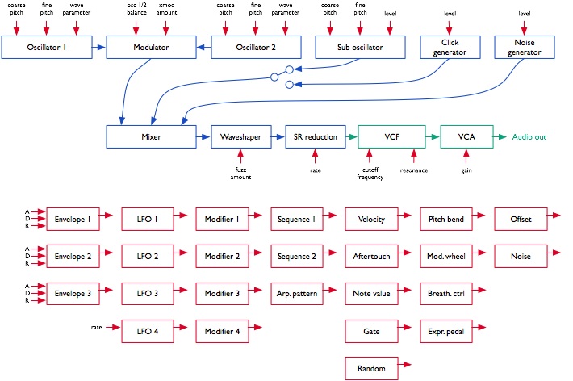

Getting started
---------------

### Overview

You have successfully built Ambika, Congratulations!

Ambika is a multi-voice hybrid synthesizer. You can play it as a 6-voice
polysynth, an ensemble of 6 monosynths, or anything inbetween due to its
easily configurable voicing architecture.

The sound generation is hybrid, combining the warmth and sonic character
of a true 4-pole analog filter, with the large array of waveforms
offered by digital wavetables, fm and phase modulation. The digital
control of the analogue filter and VCA also means a very large palette
of modulation possibilities.

Some of the key features of Ambika include:

-   6 voices with individual outputs.
-   2 digital oscillators per voice, with 36 oscillator
    algorithms/wavetables.
-   1 sub-oscillator, also configurable as a transient generator.
-   Pre-filter overdrive and bit-crushing effect.
-   Analog 4-pole filter (or 2-pole multimode filter depending on the
    type of voicecard used) and VCA.
-   3 ADSR envelopes, 3 patch-level LFOs, 1 voice-level LFO.
-   Modulation matrix with 14 slots and 4 modulation modifiers.
-   1 arpeggiator, 1 note sequencer and 2 step sequencers per part.
-   Flexible mapping of the 6 voices. A single patch with 6
    voice-polyphony, 6 independent mono parts, 2 layered patches with
    3-voices polyphony, a 3-voice unison bass line on the lower half of
    the keyboard with a 3-voice unison lead on the upper half... all are
    possible!
-   SD-card storage allows the storing of a life-long of patches,
    programs and multis, along with the history of editing operations
    for undo/redo.

### Connections

The following connectors are available on the rear panel:

-   **1**: SD-card slot. Insert here a SD-card (SDHC supported), FAT16
    or FAT32 formatted. At the exception of system settings, everything
    Ambika needs to store goes on the SD-card. A capacity of at least
    256 MB is recommended.
-   **2**: MIDI in connector. This input should be connected to the MIDI
    output of a computer MIDI interface, master keyboard, sequencer...
-   **3**: MIDI out connector. This output is by default used as a
    MIDI-thru, but you can also use it to transmit the notes generated
    by the Ambika sequencer, arpeggiator ; or to do SysEx dumps of
    patches.
-   **4**: Mix line output. This audio output contains a mix of all
    voices.
-   **5**, **6**, **7**, **8**, **9**, **10**: Individual outputs.
-   **11**: AC power jack. Use a 9V AC, 1A power source. Higher voltage
    will cause more heating of the voltage regulators and shorten the
    lifespan of the module.

### Some terminology...

A **voice** is a physical monophonic sound production device, consisting
of digital oscillators, CV sources, an analog VCF and a VCA. A **voice**
is only capable of producing a single-note sound. Ambika contains 6
voices, each of them being a physically different circuit board.

A **part** is one or many voices sharing the same synthesis settings.
Ambika can manage up to 6 parts. Each part stores its own synthesis,
arpeggiator and sequencer settings. Each part listens to a MIDI channel,
and is assigned a range of keys on the keyboard.

Each of the 6 voices in Ambika needs to be linked to (assigned to) a
part. This is a bit like showing each musician (voice) in an orchestra
which staff they must play on a musical score! If you assign the 6
voices to the same part, Ambika will behave like a classic monotimbral
polysynth. If you assign each voice to a different part, Ambika will
behave like 6 independent monophonic synths. If you want to play a
bassline on the lower part of the keyboard, and a brass riff on the
upper part of the keyboard, you need to use two parts: one part with 1
voice for the bass, and a second part with 5 voices for the brass sound.

A **patch** is a specific combination of synthesis settings stored into
a part.

A **program** consists of a **patch**, and additional
sequencer/arpeggiator settings.

A **multi** stores 6 **programs** (one for each **part** of Ambika)
along with the mappings between voices, parts, midi channels and
keyboard range. This is a complete snapshot of the Ambika configuration!

### Controls and navigation

-   The 2x40 characters LCD display **D** displays, most of the time,
    the name and values of the 8 synthesis parameters accessible by the
    8 potentiometers **P**. The parameters are organized as two rows of
    4 parameters.
-   The clickable encoder **E** is used to scroll between
    parameters/pages, or to fine-tune the value of a parameter.
-   The 8 LEDs **L1**...**L8** indicate which page is active.
-   The 8 switches **S1**...**S8** are used to display synthesis pages.
    For example, **S1** shows the oscillators and mixer page ; **S2**
    shows the filter page, etc.
-   The part and voice LEDs **LP1**...**LP6** indicate which part is
    active (green lights), and which voicecards are currently playing
    notes (yellow lights).
-   The status LED **LS** is used to visualize the rate of a LFO or the
    beats in a sequence -- depending on which module you are editing.

### Controls

#### Editing parameters

The Ambika parameters are organized in **pages**. To jump to a page,
press one of the 7 switches **S1**...**S7**. Some pages share the same
switch ; and you will need to repeatedly press a switch to cycle between
those pages. The active page is indicated by the LEDs **L1**...**L7**
next to the navigation switches.

The following table lists which page is associated with each switch:

|Switch|Pages|
|---|---|
| **S1** | Oscillators, Mixer |
| **S2** |  Filter |
| **S3** |  Envelopes and LFOs, voice LFO |
| **S4** |  Modulation matrix |
| **S5** |  Keyboard & tuning, sequencer & arpeggiator, sequence editor |
| **S6** |  Voice and parts mappings, Tempo/clock |
| **S7** |  Performance, knob assignments |

Each page displays up to eight related synthesis parameters. Each
parameter can be edited by turning the knob sitting at its top (for the
first row of the display) or at its bottom (for the second row of the
display).

Here is an example:

After having powered up the unit, press **S1** to bring the oscillators
page. **L1** lights up in green, and the LCD display shows the following
parameters:

     Wave  saw|para   0|rang    0|tune   0
     wave squa|para  32|rang  -12|tune  12

You can use the first row of knobs to edit the shape, parameter, range
and detune of the first oscillator ; and the second row of knobs to edit
the shape, parameter, range and detune of the second oscillator. Observe
that when you are turning a knob, the explicit name of the parameter is
temporarily shown on the screen:

     oscillator 1       |waveform        saw
     wave squa|para   32|rang  -12|tune   12

After a short delay, the four names and values are shown again.

Press **S1** again to bring the mixer page. **L2** lights up in yellow,
and the LCD display shows the following parameters:

     Mix    32|nois    0|sub     0|wave squ1
     xmod  off|amnt   31|fuzz    0|crsh    0

Press **S1** again to get back to the oscillators page.

#### Using the encoder

When Ambika displays a parameters page, the rotary encoder can be used
to scroll through the parameters. The name of the active parameter is
capitalized. For example, oscillator 1 range is here the active
parameter:

     wave  saw|para    0|Rang    0|tune    0
     wave squa|para   32|rang  -12|tune   12

Rotate the encoder clockwise to make **tune** the active parameter,
rotate the encoder counter-clockwise to make **para** the active
parameter. If you continue rotating the encoder clockwise, the next page
will become active.

Once a parameter is selected (capitalized), click the encoder to edit
it. The full name of the parameter is displayed on the screen. The
encoder can now be used to increment/decrement the parameter value. Once
the value has been set, click the encoder again.

Knob and encoder editing can be combined. Use a knob to rapidly adjust
the value of a parameter, and then, while the parameter name is still
displayed on the screen, use the encoder to fine-tune the value.

<b>Shortcut.</b> Hold the <b>S8</b> switch while turning the encoder to
increment/decrement values by 8 instead of 1.

Reference
---------

This section describes in details each page and parameter of Ambika.

### Voice allocation

This page, accessible by the **S6** switch, serves two purposes:

-   Selecting the current part.
-   Assigning voices to a part.

     Part    1|chan    1|low    C-|high   G9
     voicecard| [1]  [2]  [3]   4    5    6

The first knob on the upper row is used to select a part. Notice how the
**LP1**...**LP6** LEDs indicate by a green light which part is active.
All settings on all the other pages apply to the part indicated by this
green light.

**chan (channel)** sets the MIDI channel the active part responds to.
Use **omni** if you want a part to respond to notes from all MIDI
channels. Several parts can share the same MIDI channel. This is useful
for controlling two patches from the same MIDI controller, in split or
dual mode.

**low** and **high** set the range of MIDI notes the active part
responds to. This can be used to create keyboard splits: set the range
of part 1 to C- .. B3 and the range of part 2 to C4 .. G9 ; and set both
part 1 and part 2 to listen to the same MIDI channel. The result is that
part 1 is played on the lower half of the keyboard and part 2 on the
upper half.

The lower part of the screen displays which voices are assigned to the
active part. For example, in the display capture shown above, voices 1,
2 and 3 are assigned to part 1. Use the second knob on the lower row to
assign/deassign voice 1 and 2 to the active part. Use the third and
fourth knobs to assign/deassign voices 3/4 and voices 5/6.

Note that you can assign to a part only voices which are not currently
in use by another part. For example, when Ambika boots, voices 1, 3 and
5 are assigned to part 1 ; and voices 2, 4, 6 are assigned to part 2.
You will notice that it is not possible to assign voices 2, 4, 6 to part
1 before having de-assigned them from part 2. It might not be
convenient, but a voice can only be used by one part, so this constraint
has to be enforced!

Assigning/de-assigning a voice causes quite a bit of data shuffling
between the processors running each voicecard, and this causes
interruptions/reset notes. Don't do that during a live performance!

<b>Shortcut</b> Hold the <b>S1</b> switch while turning the encoder to
change the active part. This works on any page!

### Synthesis

Finally, let's get to the real thing! Each voice of Ambika is built
according to the diagram drawn below. Obviously, it would be tedious to
edit the settings of each individual voice... Instead, you edit parts
and all the voices assigned to a part automatically inherit its
settings!

Here is a day (or rather a millisecond) in the life of a voice's signal:

-   The oscillators 1 and 2 generate digital waveforms, which are
    digitally combined together using one of the following operations:
    mix, sync and mix, multiply (ring-modulation), xor, mix and fold,
    mix and bit-reduce.
-   The sub-oscillator (whose pitch is linked to oscillator 1's) is
    added.
-   The click generator generates a short transient/click at the
    beginning of the note. Note that the sub-oscillator and the click
    generator cannot be used at the same time. It's bassy-beefy or
    clicky, not both.
-   The output of the modulator, the sub-oscillator/click-generator and
    a controllable amount of white noise are summed together. You can
    adjust the balance of each ingredient.
-   A controllable amount of fuzzy overdrive is applied to the signal.
-   The resulting signal is sample-reduced by a controllable amount.
-   The resulting signal is converted to the analog domain by a 12-bit
    DAC and fed into an analog VCF and VCA.

Each of these sound generation and modification modules have parameters
which can be controlled by any of the modulation sources listed below.
However, some connections are already "hardwired" (or rather "softwired"
in the firmware):

-   The oscillators' pitch always tracks the note played on the
    keyboard. However, this can be disabled by applying a negative
    modulation (amount: -63) from note to oscillator pitch.
-   The filter cutoff frequency always tracks the note. Again, this can
    be disabled or attenuated by applying a negative modulation from
    note pitch to cutoff frequency. The rationale behind this choice is
    that most of the time, you want 1:1 tracking, so this frees up a
    slot in the modulation matrix for something more interesting!
-   Lfo 2 and Envelope 2 are always connected to the filter, their
    modulation amount being controlled by dedicated parameters on the
    **filter** page.

Besides this, it is up to you to route modulations to parameters. By
default, the following routings are wired:

|Source|Destination|Amount|
|---|---|---|
| Env 1       |Oscillator 1 parameter      |0|
| Env 1       |Oscillator 2 parameter      |0|
| Lfo 1       |Oscillator 1 pitch          |0|
| Lfo 1       |Oscillator 2 pitch          |0|
| Lfo 2       |Oscillator 1 parameter      |0|
| Lfo 2       |Oscillator 2 parameter      |0|
| Lfo 3       |Mixer balance               |0|
| Lfo 4       |Filter cutoff               |0|
| Seq 1       |Filter cutoff               |0|
| Seq 2       |Mixer balance               |0|
| Envelope 3  |VCA gain                    |100%|
| Velocity    |VCA gain                    |25%|
| Pitch-bend  |Oscillator 1+2 pitch        |2 semitones|
| Lfo 4       |Oscillator 1+2 fine pitch   |2 semitones|

Let us now review the different synthesis parameters.

#### Digital oscillators (S1)

     Wave  saw|para    0|rang    0|tune    0
     wave squa|para   32|rang  -12|tune   12

Each row displays the settings of an oscillator. The parameters are the
following:

-   **wave (waveform)**: Oscillator waveform family. Contrary to most
    synthesizers in which waveforms are static, the Ambika waveforms are
    dynamic and can be continously morphed -- this is why it is more
    correct to refer to "waveform families" instead of "waveforms".
-   **para (parameter)**: Morphing parameter. This morphs the selected
    waveform into many variations.
-   **rang (range)**: Oscillator pitch, from -36 semitones to 36
    semitones (relative the pitch of the MIDI note played on the
    keyboard).
-   **tune (tune)**: Oscillator fine tune, from -0.5 semitone (-64) to
    0.5 semitone (+64).

The following is a list of all the available waveform families, with
some applications and a description of what adjusting the **parameter**
setting actually does.

##### **none**: silence

This simply switches off the oscillator. Switching the oscillators off
is useful if you want to use the sine-wave produced by the filter's
self-oscillation as the sole sound source.

##### **saw**: sawtooth

This waveform is perfect for basses and brass sounds. The parameter
controls the waveshapping - when its value is increased, an increasingly
large section of the waveform is shifted up. This waveform is
band-limited. Thus, only a limited amount of aliasing artifacts will be
heard when playing high-pitched notes.

##### **square**: square wave

The parameter controls the pulse-width. This waveform is perfect for
simulating a clarinet, for basses, "hollow" sounds or Depeche Mode-like
leads. This waveform is band-limited and only a limited amount of
aliasing will be heard when playing high-pitched notes.

You will observe that there is a slight difference in sound when moving
the parameter from 0 to 1. To offer the best sound quality, the pulse
width = 50% flavor is read straight from a wavetable at full sample
rate, while the pulse width > 50% flavor is obtained from two
dephased sawtooth waves, evaluated at half the sample rate. For bass
sounds, for which aliasing is not going to be a problem, it is
recommended to use **pwm** instead of **square** to get a beefier sound.

##### **triang**: triangle wave

A pure waveform, which serves as a good basis for flute or
soundchip-like leads. The parameter controls a kind of waveshapping,
clipping the bottom of the waveform. This waveform is band-limited and
will still sound fine above C5.

##### **sine**: sine wave

A pure and chaste sine wave lost her virginity. At some point she
started listening to Nine Inch Nails.

##### **zsaw**: phase-distortion sawtooth with filter sweep

This waveform uses phase distortion to recreate a low-pass filtered
sawtooth by progressively "pinching" the phase of a sine wave. The
parameter controls the brightness of the sound: from a sine wave to a
sawtooth, then from a sawtooth to a sawtooth gone through an ugly
transistor amp. Good for dirty bass guitar sounds or clavinets.

##### **lpzsaw**, **pkzsaw**, **bpzsaw**, **hpzsaw**: resonant filter sweeps on a sawtooth wave.

    
    
    

This waveform family directly simulates the sound of a sawtooth wave
processed by a low-pass, peaking, band-pass, or high-pass resonant
filter. The parameter controls the cutoff frequency of the filter.

##### **lpzpulse**, **pkzpulse**, **bpzpulse**, **hpzpulse**: resonant filter sweeps on a trapezoidal wave.

    
    
    

This waveform family simulates the sound of a trapezoidal pulse wave
processed by a low-pass, peaking, band-pass, or high-pass resonant
filter. The parameter controls the cutoff frequency of the filter.
**pkzpulse** is particularly good at recreating the dirty, saturated
sound, of a sawtooth filtered by the least academic of the 2-pole analog
filters.

##### **ztriangle**: mystery...

This waveform vaguely evokes two hardsync'ed oscillators -- the
parameter controlling their frequency ratio. It may or may not have been
used in the Casio CZ-101.

##### **pad**: swarm of 4 buzzing detuned sawtooth waves

As the name implies, this waveform made of four stacked sawtooth waves
is useful for pads (when a copious amount of filtering is applied) or
for buzzing trance leads. The parameter controls the amount of detuning
between the four waves. Note that no bandlimiting is happening here, so
this thing doesn't sound quite good above C5... but it's doing a perfect
job in the bass range!

##### **fm**: minimal 2-operators FM

The parameter controls the modulation strength. This oscillator provides
the base material for metallic sounds, bells, metallophones, or the next
386 DX hit.

When the fm oscillator is selected, the **range** parameter plays a slightly different role than usual: instead of controlling the main pitch of the note, it controls the modulator frequency, and has a drastic impact on the timbre.

##### **8bits**: bitwise anarchy

A palette of 8-bits sounding waveforms obtained by applying bitwise
operations to a basic sawtooth wave (something now known as
"biscuiting").

##### **pwm**: my first Arduino synth

This waveform is a shamelessly naive square wave. The parameter controls
the pulse-width. Contrary to **square**, this waveform stinks aliasing -
but for notes below C2 it is not a real problem: it becomes much more
aggressive and "in your face" than **square**.

##### **noise**: filtered noise generator

The parameter controls the frequency of a simple 1-pole
low-pass/high-pass filter in which is sent white noise. From 0 to 63,
high-frequency content is progressively added. From 63 to 127,
low-frequency content is progressively removed. Perfect as a raw
material for percussions or sound effects.

##### **vowel**: low-tech formant synthesis

Changing the parameter will sweep between different vocal-like sounds
(14 vowels and 2 consonants).

##### Wavetables

The remaining waveform families are wavetables -- collection of single
cycle waveforms, synthetic or sampled from real instruments. The
parameter is used to smoothly "scan" the wavetable. For example, if a
wavetable has 2 waveforms, parameter = 0 plays the first waveform ;
parameter = 127 plays the second ; and parameter = 64 plays a mix of
both. Wavetables can contain up to 16 waves.

    
    
    
    
    
    
    
    
    
    
    
    
    
    
    

|Wavetable name |   Description |
|---|---|
| male |Vocal formants, best played in the lowest octaves|
| female|Vocal formants, best played in the medium octaves|
| choir|Depeche mode-like vocal sound|
| tampura|Single cycle waveforms from an indian tampura note|
| bowed|Transwave extracted from a cello sample|
| cello|Transwave extracted from a less dramatic cello sample|
| vibes|Transwave extracted from a vibraphone sample|
| slap |Transwave extracted from a slap bass sample|
| epiano|Various single cycle waveforms extracted from electric piano samples|
| organ|Various combinations of sine waves, as produced by drawbars organs|
| waves|16 basic waveforms, ready to be morphed into one another|
| digital|Abstract, PPG-wave style wavetable|
| drone 1|Abstract, PPG-wave style wavetable|
| drone 2|Abstract, PPG-wave style wavetable|
| metallic|Single cycle waveforms from classic D50 patches|
| bell|A Depeche mode classic|
| wavquence|Individually addresses each single cycle waveform|

The last wavetable contains all the single cycle waveforms in memory. It
is not recommended to scan the parameter with LFOs or envelopes ; but
rather to control this from the step sequencer or a random modulation
(for the infamous *a new sound at each note* effect).

#### Mixer (S1)

     Mix    32|nois    0|sub     0|wave squ1
     xmod  sum|amnt   31|fuzz    0|crsh    0

-   **mix (osc mix)**: Balance between oscillator 1 and 2.
-   **nois (noise)**: Noise level.
-   **sub (sub osc)**: Sub oscillator/transient generator level.
-   **wave (waveform)**: Sub oscillator/transient generator waveform
    (see below).
-   **xmod (crossmod)**: Cross-modulation method used to combine the
    sound of oscillators 1 and 2.
-   **amnt (amount)**: Cross-modulation amount.
-   **fuzz**: Amount of overdrive/fuzz applied to the signal.
-   **crsh (crush)**: Amount of sample rate reduction (sometimes known
    as bitcrushing) applied to the signal.

Here is a list of sub-oscillator/transient generator waveforms. The
first 6 settings correspond to the sub-oscillator, which is an
oscillator of its own, playing always one or two octave lower than the
oscillator 1. The next settings disable the sub-oscillator and enable
various flavors of transient generators, which will produce a short,
clicky sound at the beginning of the note:

-   **sq1** square sub-oscillator, 1 octave below osc. 1
-   **tr1** triangle sub-oscillator, 1 octave below osc. 1
-   **pl1** 25% pulse sub-oscillator, 1 octave below osc. 1
-   **sq2** square sub-oscillator, 2 octaves below osc. 1
-   **tr2** triangle sub-oscillator, 2 octaves below osc. 1
-   **pl2** 25% pulse sub-oscillator, 2 octaves below osc. 1
-   **click** produces a discrete click which can emphasizes the
    percussiveness of a note.
-   **glitch** produces a sound similar to that of a skipping CD.
-   **blow** is a burst of noise with a slow attack.
-   **metal** adds a metallic sounding, high-pitched click.
-   **pop** adds a low-pitched discontinuity, useful for spicing up a
    kick drum.

The **crossmod** parameter controls how oscillator 1 and oscillator 2
are blended together. The different modulation modes are:

|Mode|Description|What does the *xmod* parameter controls?|
|---|---|---|
| off|Mixing: Oscillators 1 and 2 are mixed together|nothing|
|sync|Mixing and sync: Oscillators 1 and 2 are mixed together, with oscillator 2's waveform phase-synced to oscillator 1's|nothing|
|ring|Ring modulation: Oscillators 1 and 2 are mixed together, and simultaneously sent to a ring-modulator | balance between the original mixed signal and the ring-modulated signal|
|xor|Xor modulation: Oscillators 1 and 2 are mixed together, and simultaneously sent to a digital XOR cross-modulator|balance between the original mixed signal and the XOR signal|
|fold|Foldback distortion: Oscillators 1 and 2 are mixed together, and sent to a foldback distortion|Amount of foldback distortion|
|bits|Bit reduction: Oscillators 1 and 2 are mixed together, and sent to a bit depth reducer|Amount of quantization noise|

#### Filter (S2)

     Freq   96|reso    0           mode   lp
     env2   24|lfo2    0

-   **freq (frequency)**: Filter cutoff frequency.
-   **reso (resonance)**: Filter resonance.
-   **mode (mode)**: Filter mode (low-pass / band-pass / high-pass).
    Note that this setting takes effect only if the SVF filter board is
    installed. With the standard SMR-4 filter board, the filter is
    always a low-pass no matter the position of this setting!
-   **env2 (env2->vcf)**: Modulation amount from envelope 2 to VCF.
    If you want to set a negative modulation amount, you can patch env2
    to the VCF in the modulations section and ignore this parameter.
-   **lfo2 (lfo2->vcf)**: Modulation amount from LFO 2 to VCF. Again,
    if you want to set a negative modulation amount, you can patch the
    LFO 2 to the VCF in the modulations section and ignore this
    parameter.

#### Envelopes and LFOs (S3)

Ambika has three ADSR envelopes, three **part LFOs** and one **voice
LFO**.

A **part LFO** is shared among all voices assigned to a part and is used
for creating global sweeps, tremolo effects, etc.

A **voice LFO** is specific to each voice, and there will actually be a
small amount of detuning/dephasing between them, for a richer sound.

Consider the example of a guitarist playing a guitar through a tremolo
pedal, and applying a vibrato on a particular note. If you want to
program something similar, you will use the **voice LFO** for the
vibrato (because it is slightly different and desynchronized for each
individual note) ; and you will use a **part LFO** for the tremolo,
since it uniformly affects all the notes. Another example: you have
found the perfect combination of LFOs to create a trancey gated strings
sound. The last thing you want is to have each note of the chord
triggered at a slightly different instant due to difference in timings
when the chord is played. You need a **part LFO** for the gating effect.
A **voice LFO** is good for richness and randomness, a **part LFO** is
good for sync'ing things up.

As a result, only the **voice LFO** can be controlled in the modulation
matrix (because it can be controlled by velocity, aftertouch, etc. --
all kind of things that might be different for each played note) ; and
only the **part LFOs** can be synchronized to tempo.

This **part LFO** vs **voice LFO** distinction sounds confusing, and
there is actually little documentation about it. Most classic analog
synthesizers do not have one LFO circuit per voice, so their behaviour
is accurately simulated by the use of **part LFOs**. Some VAs, like the
access Virus, use **voice LFOs**. On the Waldorf Blofeld, each LFO is a
**voice LFO** by default and can be turned into a **part LFO** through
the use of the **sync** setting.

     Lfo/eg  1|rate   24|wave  tri|trig free
     attk    0|deca   40|sust   20|rele   60

-   **lfo/eg**: Selects the LFO / envelope generator to edit. The
    settings shown on the page are relative to the selected LFO / EG. If
    you are wondering if there is such thing as a "filter envelope" and
    "VCA envelope"... Yes, by default env2 is mapped to cutoff and env3
    to the VCA ; but this can be changed in the modulation matrix by
    patching pranksters.
-   **rate**: LFO rate. The first values (1/1 to 1/96) are note values
    relative to the global tempo (or to an external MIDI clock). For
    example, if set to 1/4, the LFO will play one cycle every quarter
    note. The other values are increasing frequencies, from 0.06 Hz (0)
    to 100 Hz (127).
-   **wave (waveform)**: LFO waveform. A list of LFO waveforms is given
    below.
-   **trig (trigger)**: LFO/envelope synchronization mode. **free**
    leaves the LFO free-running. **env->lfo** resets the phase of the
    LFO everytime a new note is played. **lfo->env** retriggers the
    corresponding envelope generator everytime the LFO completes a
    cycle.
-   **attk (attack)**: Envelope attack time, from 1ms to 66s.
-   **deca (decay)**: Envelope decay time (same times as for attack).
-   **sust (sustain)**: Envelope sustain level.
-   **rele (release)**: Envelope release time (same times as for
    attack).

Here is a list of LFO waveforms:

-   **tri**: Triangle.
-   **sqr**: Square.
-   **s&h**: Sample & hold (random value).
-   **ramp**: Ascending ramp (use a negative modulation amount in the
    modulation matrix to get a descending ramp modulation).
-   **sine** to **stp2**: Wavetable LFOs. These LFOs are read from a
    wavetable containing many interesting waveshapes.

#### Voice LFO (S3)

              rate   24|wave  tri          
                                        _  

-   **rate**: LFO rate. The **voice lfo** cannot be synchronized to the
    tempo. The frequency ranges from 0.06 Hz (0) to 100 Hz (127).
-   **wave (waveform)**: LFO waveform.

#### Modulation matrix and modifiers (S4)

     Modul.  1|srce env1|dest prm1|amnt    0
     modif.  1|in1  lfo1|in2  lfo2|oper  off

The upper part of this page allows the routing of up to 14 modulation
sources to synthesis parameters. The first knob is used to select one of
the 14 virtual "modulation patchcords", while the other knobs on the
first row are respectively used to edit its source (**srce**),
destination (**dest**), and the attenuation amount (**amnt**).

For example, this line:

     Modul.  4|srce env3|dest  vca|amnt   63

Indicates that the third envelope is routed to the VCA gain.

The modulation sources are the following:

1.  **env1**, **env2**, **env3**: ADSR envelopes.
2.  **lfo1**, **lfo2**, **lfo3**: Part LFOs (bipolar).
3.  **lfo4**: Voice LFO.
4.  **mod1**, **mod2**, **mod3**, **mod4**: Modifiers (see next
    section).
5.  **seq1**, **seq2**: Step sequences 1 & 2.
6.  **arp**: Arpeggiator gate pattern.
7.  **velo**: Note velocity.
8.  **aftr**: Note aftertouch.
9.  **bend**: Pitch-pend wheel (bipolar).
10. **mwhl**: Modulation wheel.
11. **whl2**: Modulation wheel 2, Joystick negative Y axis or Breath
    controller.
12. **pdal**: Expression pedal.
13. **note**: MIDI note number (bipolar).
14. **gate**: Keyboard gate (null when the key is released).
15. **nois**: White noise sampled at 1kHz.
16. **random**: Random value, updated every time a note is retriggered.
17. **[256]{style="text-align:center;"}** to
    **[4]{style="text-align:center;"}**: Boring constant values.

The modulation destinations are the following:

1.  **prm1**, **prm2**: Oscillator 1&2 parameters.
2.  **osc1**, **osc2**: Oscillator 1&2 pitch.
3.  **\~1+2**: Oscillator 1&2 coarse pitch.
4.  **vibr**: Oscillator 1&2 fine pitch.
5.  **mix**: Oscillator balance.
6.  **xmod**: Oscillators cross-modulation amount. This has no effect
    when the **off** or **sync** mixing modes are selected.
7.  **nois**: Noise amount.
8.  **sub**: Sub-oscillator amount.
9.  **fuzz**: Fuzz amount.
10. **crsh**: Sample-rate reduction amount.
11. **freq**: Filter cutoff.
12. **reso**: Filter resonance.
13. **attk**: Envelopes attack time.
14. **deca**: Envelopes decay time.
15. **rele**: Envelopes release time.
16. **lfo4**: **Voice LFO** rate.
17. **vca**: VCA gain.

One thing that requires a bit of clarification is the notion of
**bipolar** modulation source. Let's take an example. We have a triangle
LFO mapped to the filter cutoff, with a modulation amount of 30. If the
cutoff is set to 80, the actual value of the cutoff will oscillate
between 50 (80-30) and 110 (80+30). On the other hand, if we have an
envelope mapped to the cutoff with a modulation amount of 20, the cutoff
will go from 80 to 120 (80 + 2 \* 20), then down to 80 after the
release. This is something to remember if you want to do PWM for
example. If you set the PWM modulation amount to 40, you also have to
set the oscillator parameter value to 40, so it will oscillates between
40-40 = 0 and 40+40=80. Otherwise, it will spend half of the time stuck
at 0. But this makes things nicer for vibrato, tremolo, wah-wah or growl
effects!

LFOs, pitch-bend and MIDI note number modulations are bipolar. If you
are used to electronics/Modular speak, it is equivalent to say that the
LFOs are always "AC-coupled" instead of "DC-coupled".

Another thing worth noting is that the modulation amount of the last
patch in the modulation matrix is always attenuated by the modulation
wheel. Let us say that you have connected patch 14 from LFO 4 to the
oscillators fine pitch (actually this is done by default in the init
patch!):

     Modul. 14|srce lfo4|dest vibr|amnt   16

This modulation will be applied with an amount proportional to the
mod-wheel position - by default it will not be active until you start
moving the modulation wheel, and to get it at full strength, you will
have to push the modulation wheel to the max. In the modular synth
world, you would have obtained the same effect by patching the LFO at
the signal input of a VCA, the joystick at the control input of the VCA,
and routed the resulting signal to the exponential FM input of the VCO.
Pheww!

The lower page of the modulation/modifiers page allows the combination
of up to 4 pairs of modulation sources to create new modulation signals.
The first knob on the bottom row is used to select one of the 4
modulation modifiers, while the other knobs on the lower row are
respectively used to edit the two inputs of the modulation modifier
(**in1** and **in2**), and the operation (**oper**) to apply.

     modif.  1|in1  lfo1|in2  lfo2|oper prod

In the example above, the modulation source **mod 1** is defined as the
product of **lfo1** and **lfo2**. The following operations are
available:

-   **off** no operation.
-   **add** adds the values of the two modulation sources.
-   **prd** computes the product of the two modulation sources.
-   **attn** computes the product of a bipolar version of the first
    source, and the second source.
-   **max** takes the maximum of the two sources.
-   **min** takes the minimum of the two sources.
-   **xor** computes the bitwise XOR of the two sources.
-   **greater or equal** outputs a large value if source 1 is above
    soure 2, 0 otherwise.
-   **less or equal** outputs a large value if source 1 is below soure
    2, 0 otherwise.
-   **qtz** outputs the value of in1 quantized into a number of levels
    defined by in2. For example, if you set a constant value (say = 4)
    as in2, the modulation source in1 will be quantized into 4 discrete
    steps, as if it was processed through a bit-reducer! This is useful
    for creating pseudo S&H effects.
-   **lag** outputs the value of in1 filtered by a lowpass filter whose
    cutoff frequency is set by in2. For example, if you use a constant
    value (say = 4) as in2, the modulation source in1 will be strongly
    low-pass filtered. This is very useful for smoothing a square or S&H
    lfo!

### Keyboard and sequencing

#### Keyboard and tuning (S5)

     Volu  120|mode poly|lega  off|port    0
     octv    0|tune    0|sprd    0|raga equa

-   **volu (volume)**: Part volume. Note that the volume attenuation is
    done by scaling the value of the VCA control signal - causing a
    potential loss of resolution in the shape of the VCA envelope.
-   **mode**: Polyphony handling. When this is set to **mono**, all
    voices assigned to this part are simultaneously played in unison,
    and you cannot play chords (only the most recently played note is
    heard). When this is set to **poly**, the notes you play are
    dispatched to the voicecards. Obviously, the polyphony is limited by
    the number of voices assigned to the edited part! Finally, **2x
    unison** works like the polyphony mode except that every time you
    play a note, it is played by 2 voices - this effectively divides the
    polyphony by two.
-   **lega (legato)**: Legato mode on/off. This setting has an effect
    only in **mono** mode. This option specifies how the part will
    interpret overlapping notes. When **legato** is off, the envelope
    retriggers everytime a new note is played, and the portamento is
    always applied. When **legato** is on, the envelope retriggers only
    when the new note does not overlap with the previous one, and the
    portamento triggers only on overlapping notes.
-   **port (portamento)**: Portamento time. This setting has an effect
    only in **mono** mode.
-   **octv (octave)**: Octave shift. Use this to transpose a part by a
    given number of octaves. Note that if a note is playing when while
    this setting is changed, it won't be affected.
-   **tune**: Part tuning. Changes the tuning of the part by +/- 1
    semitones.
-   **sprd (spread)**: Voice detune. Use this setting to introduce an
    artificial detuning between all the voices allocated to this part.
    This can be used to create very thick leads or basses in **mono**
    mode, or to add more depth to strings/pads sounds in **poly** mode.
-   **raga**: Scale/keyboard mapping.

The different scales/keyboard mappings are:

| Name | Description |
| ---- | ----------- |
| **equal** | Equal temperament |
| **just** | Just intonation (frequency ratios to C are rational numbers) |
| **pythagorean** | Pythagorean scale |
| **1/4 eb** | E and B are 1/4 tone lower |
| **1/4 e** | E is 1/4 tone lower |
| **1/4 ea** | E and A are 1/4 tone lower |
| **bhaira** ... **rasia** |  A bunch of ragas of the [Maihar gharana](http://en.wikipedia.org/wiki/Maihar_gharana) . Note that it is not possible to play notes outside of the raga - if you attempt to do so, the previously played note will be retriggered. The suggested mode of operation is to find out which keys are active in the raga, and improvise with them! |

#### Sequencer and arpeggiator settings (S5)

Each part of Ambika has a sequencer / arpeggiator. The sequencer
consists of:

-   2 step-sequences, up to 32-step long, which can be freely routed to
    any modulation source in the modulation matrix.
-   1 note pattern, up to 32-step long.

All parts follow the same global clock, which can be set to a fixed BPM
or synchronized to an external MIDI clock. However, since polyrythmy can
be fun, each part can be synchronized to a different subdivision of the
MIDI clock and use a different step-sequence / pattern length.

3 sequencing modes are available - they define how notes played on the
keyboard are translated into the notes played by the voices:

-   **step seq**: Only the step sequencers (modulation sources) are
    running. The arpeggiator and note pattern are disabled - thus only
    notes actually played on the keyboard are heard.
-   **arpeggio**: The notes played on the keyboard are not directly
    heard, instead, they are arpeggiated.
-   **pattern**: Holding a key triggers the note pattern programmed in
    the sequencer. The pattern is played at its original pitch if the
    held key is C4 (midi note \#60). Otherwise, the pattern is
    transposed.

     A/sq step|dire   up|rang    1|patt    1
     grid 1/16|len1   16|len2   16|lenp   16

-   **a/seq (arp/seq)**: Arpeggiator/sequencer mode.
-   **dire (direction)**: Arpeggiator direction. The available options
    are up, down, up and down, random, played (which follows the order
    in which the notes have been played on the keyboard) and chord
    (which retriggers the whole chord at each step).
-   **rang (range)**: Arpeggiator direction.
-   **patt (pattern)**: Arpeggiator rythmic pattern.
-   **grid**: Step duration. The default setting, 1/16 (one sixteenth
    note or one semiquaver per step) corresponds to the default setting
    of Roland's x0x boxes. For programming a pattern in triplets, use
    1/12 and set the pattern duration to 12 steps. You can also use this
    for programming SID-style rapid-fire arpeggios.
-   **len1 (seq1 len)**: Length (in steps) of the first step sequence.
-   **len2 (seq2 len)**: Length (in steps) of the second step sequence.
-   **lenp (patt len)**: Length (in steps) of the note pattern.

Let us now discuss the most devilish, confusing thing about Ambika
sequencer: sequencer memory sharing. Ambika only has memory for 16-steps
long patterns. Yet, the **len1**, **len2**, **lenp** lengths can go up
to 32. How is it possible? Simply by reusing steps from one pattern into
the other!

For example, if you set the step sequence 1 length to 18, the last 2
steps of step sequence 1 and the first 2 steps of step sequence 2 will
store the same value. If you set the step sequence 1 and 2 length to 32,
the last 16 steps of step sequence 1 will be the first 2 steps of step
sequence 2 and reciprocally. When you set the notes sequence length to
18, the first 4 steps of step sequence 1 will be scrambled with
apparently random data from the note sequence.

So remember: as soon as one of sequence 1 or sequence 2 exceeds 16 steps
they will scramble each other ; and as soon as the note sequence exceeds
16 steps it will scramble the step sequences. Whether you will prudently
avoid using the scrambled sequence or take creative advantage of this
scrambling is up to you!

#### Sequence editor (S5)

This page shows the note pattern and the step sequences 1 & 2.

       | note |velocity |stepseq 1|stepseq 2
     01|. C4  |.   o100 |.    255 |.      0

-   The first column displays the step number. Use the encoder to scroll
    through the sequence.
-   The second column displays the note number, editable by the first
    knob of the upper and lower rows.
-   The third column displays the note velocity, editable by the second
    knob of the upper and lower rows. Turn the knob completely
    counter-clockwise to mute a step, and completely clockwise to enter
    a note at full velocity. Turn the knob to a middle position to enter
    a tie/slide.
-   The fourth and fifth columns display the value of the step sequence
    1 and 2, editable by the third and fourth knobs of the upper and
    lower rows.

What about the dots shown in some columns? They indicate the start of
the sequence. For example, if the note sequence is 16 steps long, but
the step sequence 1 is only 5 steps long, you will see a dot on step 6,
11 and 15 to remind you that the step sequence 1 "cycles" over 5 steps
only.

Trivia: the longest non-repeating pattern you can build with Ambika is
20677 steps long (set sequence 1 to 23 steps ; sequence 2 to 29 steps ;
and the note sequence to 31 steps). With a clock speed of 1/16 and a BPM
of 86, the sequence would last for 1 hour!

### Multi settings

These settings are not related to a specific part. They are saved (along
with each part's individual settings) in a multi.

#### Clock settings (S6)

     Bpm   120|groo swin|amnt    0|ltch   0
                                          _

-   **bpm** is the master tempo, in beats per minute. Use **ext** to
    sync to an external MIDI clock source.
-   **groo (groove)**: groove template. The options are **swing**
    (uneven distribution of pairs of 1/8th notes), **shuffle** (uneven
    distribution of pairs of 1/16th notes), **push** (push the beat),
    **lag** (sloppy drummer!), **human** (humanization) and **monkey**
    (humanization + shuffle). This setting only has an effect when
    **amnt** is set to a non-zero value.
-   **amnt (amount)**: amount of groove to apply.
-   **ltch (latch)**: clock latch release time. This parameter controls
    the number of beats during which the internal clock continues
    running after you have released all keys. This allows the internal
    arpeggiator or sequencer to "keep counting" for a while after you
    have released all keys from the keyboard. When this setting is set
    to 0 and the arpeggiator is **on**, every time you release the keys
    to play a new chord, the internal clock stops and the
    arpeggiator/sequencer is restarted. You might like this effect (many
    vintage synths work this way), but it might sound a bit strange to
    have the "flow" of the sequence broken at each chord change. When
    the clock latch is set to 1 beat, the "flow" of the clock and
    arpeggiator are preserved as long as your chord changes are spaced
    by less than 1 beat.

#### Performance page (S7)

     Para    0|freq   96|para    0|freq   96
     env2   27|volu  120|env2   24|volu  120

This page allows 8 parameters from different pages and for different
parts to be displayed together on the same page. Observe that when a
parameter is edited, the part number part is shown on screen:

     pt 1 oscillator 1  |waveform        saw
     wave squa|para   32|rang  -12|tune   12

A particular quirk of this page is the specific function assigned to the
encoder. Press it to simultaneously send a **C4** note to all parts.
Press it again to send a note off message to all parts. This allows
Ambika to be used without a MIDI keyboard. While a note is being played
through this mean, you can turn the encoder to transpose all parts up
and down.

To select the parameters/parts shown on the performance page, press
**S7** again to bring the customization page:

     performance page customization
     knob 1|part 1|oscillator 1 parameter

Use the first knob to select the index of the knob you want to
customize. Use the second knob to select a part number. Use the third
and fourth knobs, or the encoder, to scroll through the list of
parameters.

### The library

Everything related to loading/saving patches, multi, etc. is done on
this page. The data is stored on a SD card (SDHC cards are supported)
formatted in FAT16 or FAT32 format, inserted at the back of Ambika. In
case the SD card is incorrectly formatted, incorrectly inserted, or
damaged, the following text will be displayed every time you try to
display the library page:

     /!\ SD card I/O error
                                          ok

Press **S8** to continue and try blowing on the SD card connectors.

If the card is correctly inserted and formatted, the main library page
will be displayed:

     pt 1 program  .A000 junon
      |   init|send|save|versions  more|exit

The first row displays the following information:

-   **pt 1 program** is the current "object", that is to say the kind of
    thing you want to load/save from/to the memory card. In this case,
    you will be browsing the list of programs and they will be loaded
    into part 1.
-   **A000** indicates the bank and object number. Banks are identified
    by a letter from A to Z ; objects are identified by a number from
    000 to 127. The dot before **A000** indicates that the version in
    memory is different from the version stored on the card.
-   **junon** is the object (here a program) name.

The second row is a list of commands. Each command is associated with a
switch. For example, **S2** performs the **init** command, **S3** the
**send** command, and **S8** the **exit** command. To quit the library
page, you thus have to press **S8** (**exit** command).

#### Selecting an object

Press **S1** to repeatedly cycle through the different types of items
that can be loaded/written from/to the memory card:

-   **pt N patch** will load/save all the sound synthesis settings, but
    not the sequencer/arpeggiator parameters of the Nth part.
-   **pt N sequence** will load/save all the sequencer/arpeggiator
    settings of the Nth part.
-   **pt N program** will load/save all the settings of the Nth part
    (synthesis, arpeggiator and sequencer).
-   **multi** will load/save all the settings of all parts.

Remember that you can hold **S1** while turning the encoder to change
the active part.

Ambika can store 3328 (26 banks of 128)
patches/sequences/programs/multis.

#### Loading programs/multis/sequences/patches

Turn the encoder to move to the previous/next program. Remember that you
can hold **S8** while turning the encoder to scroll faster in the list.
To change the current bank:

-   Click the encoder. The bank letter starts blinking.
-   Turn the encoder to select a bank.
-   Click the encoder when you are done.

#### Reinitializing programs/multis/sequences/patches

Press **S2** (**init** command) to reinitialize or randomize the select
object. This brings the following confirmation page:

     pt 1 program             [  randomize ]
                                  yes | no

Turn the encoder to select an action (randomize will replace all
settings by random values; while initialize will replace all settings by
the values they had at startup). Press **S7** to confirm, or **S8** to
cancel the initialization.

#### Dumping programs/multis/sequences/patches as SysEx

Press **S3** (**send** command) on the library page to send the selected
object on the MIDI output, encoded in SysEx messages. Note that programs
are sent as 2 messages (1 block with synthesis settings and 1 block with
part settings) ; and multi are sent as 13 messages ; so you need to set
your SysEx Librarian program to receive many messages.

#### Saving programs/multis/sequences/patches

After having selected with **S1** which object type you want to save
(multi, program, etc.), press **S4** (**save** command).

     pt 1 program  .A000 junon
                                save|cancel

Before saving a program/multi/sequence/patch, its bank letter, number
and name must be set. Use the encoder to increment/decrement the value
or letter at the cursor. To move the cursor, click the encoder, turn it
to move the cursor, and click it again.

When you are done, press **S7** (**save** command). If you want to
cancel the operation, press **S8** (**cancel** command).

A warning will be displayed in case the memory card is damaged, full,
incorrectly formatted, or just needs a little blow on its connectors.

Note that when a patch is overwritten, a backup copy of the previous
version is kept. You can use a SD-card reader on your personal computer
to remove the latest version of the patch and restore the backup copy
(Sorry... Ambika does not come with its own version of Norton
Commander).

#### Clipboard and version manager.

Press **S5** (**versions** command) to bring the version manager.

     pt 1 program         version   0
     copy|swap|paste      << | >> |keep|exit

The following commands are available for the select object (**part 1
program** in the example given above):

-   **copy** (**S1**) copies the current item to a *clipboard*. You can
    use it to temporarily hold in memory a version of a patch, or to
    copy a patch from one part to another.
-   **swap** (**S2**) exchanges the content of the *clipboard* with the
    current item. This allows you to quickly go back and forth between
    two versions of a patch.
-   **paste** (**S3**) replaces the current item by the content of the
    *clipboard*. Note that there are actually 4 clipboards, one for
    patches, one for multis, one for programs and one for sequences.
-   **<<** (**S5**) reverts the current
    item to its previous content. This works like the *undo* function
    available on most computer software. For example, if you create an
    amazing patch, and then load by mistake a preset on top of it, you
    can use this function to go back in time and retrieve your creation.
-   **>>** (**S6**) works like a redo
    command. You can use it to cancel an undo command and move forwards
    in the versions list.
-   **keep** (**S7**) saves the state of the current item on the undo
    stack, so that you can get back to it at a later point in time.
-   **exit** (**S8**) exits the version manager.

### System preferences

From the library page:

     pt 1 program  .A000 junon
      |   init|send|save|versions  more|exit

Press **S7** to display more commands:

     pt 1 program  .A000 junon
     pref|>ini|about               more|exit

Press **S1** to bring the system preferences page:

     Inpt ....|outp thru
     help   on|snap  off|leds   on|auto   on

The following system preferences can be edited:

-   **inpt (inpt filtr)**: Input filter. By default, all MIDI messages
    are accepted by Ambika (....). Any combination of **SysEx** (...s),
    **Program changes** (..p.), **NRPN** (.n..) or **Patch editing
    control changes** (c...) can be disabled. With all filters active
    (cnps) Ambika only responds to basic MIDI messages.
-   **outp (outp mode)**: MIDI output mode. The following output modes
    are available: **thru** (the MIDI output forwards all incoming
    messages, and only those), **sequencer** (the MIDI output sends the
    note generated by the arpeggiator and sequencer), **controllr** (the
    MIDI output sends NRPN messages reproducing all editing operations
    performed on Ambika), **full** (the MIDI output sends all incoming
    messages along with NRPN reproducing all editing operations).
-   **help**: Whether the long name of the edited parameter should be
    displayed. Once you are familiar with Ambika, you might find it more
    convenient to have the help text never shown.
-   **snap**: Enables potentiometers' "snap" mode. This mode makes it
    less likely to accidentally change a parameter value when switching
    pages. Suppose you are tweaking the filter resonance with **P2** --
    you rotate it all the way down to 0. Then you switch to the
    oscillators page to adjust the oscillator 1 parameter. If the
    current value of the parameter is set to 64, you'll hear a
    discontinuity, since the value of the parameter will instantly jump
    to 0 or 1 when you start touching the pot. When **snap** is on,
    things will happen differently: rotating the pot will have no effect
    until the position of the pot actually reflects the current value of
    the parameter. After that, the parameter value will track the
    potentiometer's position. Another way to explain it: when **snap**
    is **on** you have to move the pot to "grab" the current parameter
    value before the parameter is modified.
-   **leds**: Disables the voicecard LEDs, in case you consider that
    synths should not be used as Diwali decorations. Note that you need
    to reboot the unit for this setting to take effect!
-   **auto (auto backup)**: Enables or disables the backup copy created
    on the memory card whenever an item is overwritten. Disabling it
    will make saving faster.

It is also possible to save the current multi so that it is reloaded
every time Ambika starts up. This is very useful for saving your MIDI
settings and favorite split/voice allocation parameters!

     pt 1 program  .A000 junon
     pref|>ini|about               more|exit

On this library page, press **S2** to select the
**[ini]{style="text-align:right;"}** command.

     (?) use current multi as default?
                                   yes | no

Press **S7** to confirm. The unit will freeze for a few seconds to write
the current multi to its non-volatile memory.

### Firmware update

#### Firmware update through the SD-card

From the library page:

     pt 1 program  .A000 junon
      |   init|send|save|versions  more|exit

Press **S7** to display more commands:

     pt 1 program  .A000 junon
     pref|>ini|about               more|exit

Press **S3** to bring the **about** page:

     ambika    v1.0|port 1 device 1     v1.0
     upgrade       |upgrade             exit

The first half of the screen displays the version of the OS running on
the motherboard. If a firmware update file named `AMBIKA.BIN` is present
on the memory-card, pressing **S1** (**upgrade** command) will load it
to upgrade the main processor.

Ambika contains seven **ports** to which **devices** are attached. The
first 6 ports (port 1 to port 6) are used for connecting the voicecards
; the last port (port 7) is used for connecting additional controllers
or I/O connectors. The second half of the screen on the **about** page
shows the device type and OS version number for a selected port. Use the
encoder to scroll through the ports. When no device is attached to a
port (or when the device firmware has been corrupted), a '?' is shown in
place of the device type. If a firmware update file named `VOICE$.BIN`
(where \$ is the port number) is present on the memory card, pressing
**S4** (upgrade command) will load it to upgrade the voicecard
processor.

#### Emergency firmware update

If for some reason Ambika is "bricked" -- this can happen if the SD card
is damaged, if the firmware update file has been incorrectly copied to
the card, or if the power has been disconnected during the firmware
upgrade procedure -- there is still a way of initiating a firmware
update:

Press **S8** while powering up Ambika to force the firmware to be
reloaded from the SD-card. During loading, the unit displays the number
of bytes loaded (the firmware takes up to 60kbytes):

    SD update...
    4096

Press **S7** while powering up Ambika to put the unit in MIDI firmware
upgrade mode. In this mode, the unit is waiting for the firmware to be
sent as SysEx blocks over MIDI. A .syx or .mid file with the latest data
is available on the Mutable Instruments website. While receiving blocks
of MIDI data, the unit displays the number of bytes loaded (the firmware
takes up to 60kbytes):

    Syx update...
    4096

If you want to use a dedicated SysEx transfer tool, we recommend
Elektron's C6 tool available for both Windows and OS X, configured with
a 250ms delay between blocks.

#### Resetting the unit to factory settings

Most of the data held by Ambika is stored on the SD card, with one
exception: the **boot configuration**, which is stored on the main
processor's non-volatile memory. The **boot configuration** is the set
of settings loaded when the unit is powered on. To restore the default
factory **boot configuration**, keep the **S1** key while powering the
unit. The unit will freeze for a few seconds to retrieve and write the
factory defaults.

Dirty technical details
-----------------------

### MIDI implementation

#### Basics

A MIDI implementation chart is [available
here](https://docs.google.com/spreadsheet/pub?hl=en_US&hl=en_US&key=0Ai4xPbRS5YZjdG1mWmRJSzRkWG51ZnFDS3d2Q1JHVlE&output=html).

#### Program changes

Program change messages are used to load either:

-   a **program** (that is to say sound synthesis settings + keyboard
    mapping/sequencer parameters). All parts set to listen to the
    channel on which the program change message is sent will load the
    program.
-   a **multi**. In this case, all parts are affected.

The MIDI banks 0-25 are used to load program banks **A** to **Z**. The
MIDI banks 26-51 are used to load multi banks **A** to **Z**. For
example, to load the multi 002 in the **B** bank, send a control change
0 (bank select) with a value of 27 to select multi bank **B**, and a
program change 2. To load the program 120 in the **D** bank, send a
control change 0 (bank select) with a value of 3, and a program change
120.

#### External clock reception

Keep in mind that the tempo must be set to **ext** to receive an
external MIDI clock! Otherwise Ambika continues running with its own
internal clock.

#### Control changes

The Modulation Wheel, Breath Controller and Foot Pedal CCs ; along with
aftertouch messages might not affect the sound unless they are patched
to a modulation destination in the modulation matrix. If you want these
sources to control the intensity of a LFO, it is recommended to do it
through a modifier. Here is an example of patching:

     Modul.  8|srce mod1|dest   mix|amnt   63
     modif.  1|in1  lfo2|in2   whl2|oper attn

Mod1 is defined as "LFO2 attenuated by the modulation wheel 2", and this
modulation is applied to the oscillators balance.

Please refer to the **CC** page of the MIDI implementation chart given
above to see the list of synthesis parameters controllable by CC.
Editing a synthesis parameter by CC is fool-proof: values between 0 and
127 are translated into the full range of the parameter; so that 0
always means the minimum value taken by the parameter, and 127 its
maximum value. This might cause a resolution loss for parameters with a
wide range above 127.

#### NRPN patch editing

NRPN messages can be used to directly write into the Patch and PartData
data structures.

The NRPN number indicates the address at which a value must be written ;
and the data entry / data increment messages are used to set the value.
Observe that you need to send both a Data Entry MSB and a Data Entry LSB
message to send a signed value, or a value above 127. Signed values are
represented in 2's complement.

|NRPN range|Mapped to|Data structure declaration|
|---|---|---|
|0 .. 111|Patch data structure, offsets 0 .. 111|[struct Patch](http://github.com/pichenettes/ambika/blob/master/common/patch.h#L246)|
|112 .. 192|Part data structure, offsets 0 .. 80|[struct PartData](http://github.com/pichenettes/ambika/blob/master/controller/part.h#L81)|

Here is an example: you want to modify the part tuning to -13. The
tuning byte is at offset 2 in the Part data structure, so its NRPN
number is 114. In 2's complement, the value ~~13 is represented by 128~~
13 = 115. Thus, the NPRN that needs to be sent is:

    176 99 0 (NRPN MSB set to 0)`
    176 98 114 (NRPN LSB set to 114)`
    176 6 1 (Data Entry MSB set to 1 -- value above 127 or negative)`
    176 38 115 (Data Entry LSB set to 115, because 115 - 128 = -13)`

#### SysEx

Ambika can receive and transmit settings in system exclusive format. The
messages all share the same format:

    0xf0  (SysEx)
    0x00 0x21 0x02  (Mutable Instruments Manufaturer ID)
    0x00 0x04  (Product ID for Ambika)
    Command
    Argument
    Payload
    Checksum
    0xf7  (End of SysEx)

**Command** indicates what the receiver should do with the data in the
**payload** block, and **argument** is a byte that might contain an
additional piece of information about what to do with the data.

**Payload** is a sequence of bytes in nibblized form. For example, the
sequence `0x80 0x56 0x13` is transmitted as
`0x08 0x00 0x05 0x06 0x01 0x03`.

**Checksum** is equal to the nibblized-sum, modulo 256, of the bytes. In
the example above, the checksum is equal to `0x80 + 0x56 + 0x13 = 0xe9`
and is transmitted as `0x0e 0x09`.

##### Data structure dump

When transfering patch/sequence/program/multi data to Ambika,
**command** indicates the data structure being sent and **argument**
indicates the part number the data must be loaded into.

The following table summarizes the different **payload** types.

|Command|Argument|Affected data structure|Payload size|
|---|---|---|---|
|1|Part number (0 for current part)|Patch|112 bytes|
|2|Part number (0 for current part)|PartData::sequence_data|72 bytes|
|4|Part number (0 for current part)|PartData|84 bytes|
|5|Always 0|MultiData|56 bytes|

##### Data structure request

Use this command to request one or several data blocks from Ambika.

|Command|Argument|Reply|
|---|---|---|
|17|Part number (0 for current part)|Patch bytes for selected part|
|18|Part number (0 for current part)|Sequencer bytes for selected part|
|19|Part number (0 for current part)|Patch bytes + PartData bytes for selected part|
|20|Part number (0 for current part)|PartData bytes for selected part|
|21|Always 0|MultiData bytes + Patch Bytes and PartData bytes for the 6 parts|

##### Random memory read (PEEK)

Use this command to request the contents of an arbitrary block of RAM,
up to 32 bytes long. Command is equal to 0x1f (31). Argument is equal to
the size of the requested block. The two bytes of payload indicate the
address to read (16-bit, little endian address). For example, to
retrieve the 4 bytes at addresses 0x3ac .. 0x3b0, the sysex string would
be:

    0xf0  (SysEx)
    0x00 0x21 0x02  (Mutable Instruments Manufacturer ID)
    0x00 0x04  (Product ID for Ambika)
    0x1f  (PEEK command)
    0x04  (Number of bytes to retrieve)
    0x0a 0x0c  (LSB of the address, here, 0xac)
    0x00 0x03  (MSB of the address, here 0x03)
    0x0a 0x0f  (Checksum)
    0xf7  (End of SysEx)
    0x1f 04 0a 0c 00 03 0a 0f f7@

##### Random memory write (POKE)

Use this command to transfer arbitrary data into Ambika's RAM. Command
is equal to 0x0f (15). Argument is equal to the size of the block to
transfer. The two first bytes of payload indicate the address to write
to (16-bit, little endian address). The following bytes of payload
contain the data.

With great power comes great responsibility - this feature has the
potential to create some damage that would require a factory reset!

Developers can use the avr-nm tool to get a memory map and find out
which datastructures are located at which addresses. For example:
`avr-nm build/ambika_controller/ambika_controller.elf -C -n`. Addresses
in RAM are prefixed by 0080. Mutable Instruments cannot guarantee that
these addresses won't be subject to changes from one firmware version to
the other.

### Memory card storage

#### Filesystem layout

The Ambika firmware supports both SD and SDHC memory cards, formatted
with FAT16 and FAT32 filesystems. Memory cards with long file names are
not supported. Congrats to ChaN for his amazing FAT library!

##### Firmware update files

    /
     AMBIKA.BIN Firmware update for motherboard
     VOICE1.BIN Firmware update for voicecard 1
     ...
     VOICE6.BIN Firmware update for voicecard 6

##### Patches, programs and sequences

    /PATCH
     /BANK
      /A
       /000.PAT Patch 000 in bank A
       /000.PA~ Backup version of Patch 000 in bank A
       ...
       /127.PAT Patch 127 in bank A
      /B
       /000.PAT Patch 000 in bank B
       ...
      /Z
       /127.PAT Patch 127 in bank Z
     /CLIPBRD
      /CLIPBRD.PAT Contents of patch clipboard
      /CLIPBRD.PA~ Previous contents of patch clipboard
     /HISTORY
      /0
       /000.PAT Undo/redo sequence of part 1's patch
       /001.PAT Undo/redo sequence of part 1's patch
       ...
      /5
       /000.PAT Undo/redo sequence of part 6's patch
       ...

For programs and sequences, the directories are `PROGRAM` and
`SEQUENCE`, and the file extensions are `PRO` and `SEQ`.

##### Multis

    /MULTI
     /BANK
      /A
       /000.MUL Multi 000 in bank A
       /000.MU~ Backup version of Multi 000 in bank A
       ...
       /127.MUL Multi 127 in bank A
      /B
       /000.MUL Multi 000 in bank B
       ...
      /Z
       /127.MUL Multi 127 in bank Z
     /CLIPBRD
      /CLIPBRD.MUL Contents of multi clipboard
      /CLIPBRD.MU~ Previous contents of multi clipboard
     /HISTORY
      /000.MUL Undo/redo sequence of multis
      /001.MUL Undo/redo sequence of multis
      ...

#### File format

All files are stored in RIFF format.

-   The first 4 bytes of the file is the 'RIFF' string.
-   The next 4 bytes are the total size of the file in bytes, little
    endian format.
-   The next 4 bytes is the 'MBKS' string.

This is followed by one or many chunks. Each chunk consists of a 4 chars
identifier, a 32-bit integer indicating the size N of the "payload"
data, and N bytes of "payload" data. Two types of chunk are present in a
file:

-   The `name` chunk is always 16 bytes long and contains the name of
    the object (multi, patch, program...) stored in the file. The 16th
    byte must be a null character ; and the name must be padded with
    spaces.
-   The `obj ` chunk contains data that will be copied into one of
    Ambika's internal data structures. It consists of:
    -   A byte indicating the data structure (1: Patch, 2:
        PartData.sequence\_data, 4: MultiData, 5: PartData).
    -   A byte indicating the part number the data must be loaded into
        (0: current part or global, 1: part 1, etc.)
    -   2 null bytes.
    -   The actual data.
