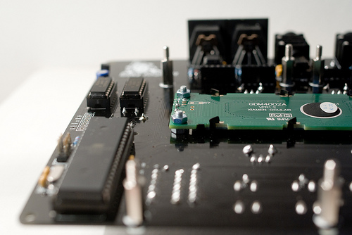
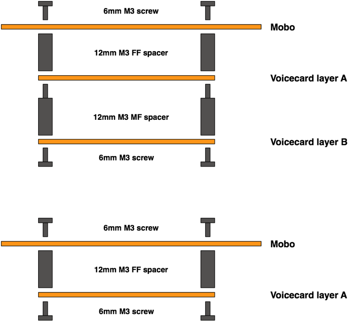
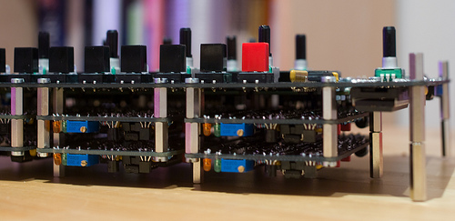
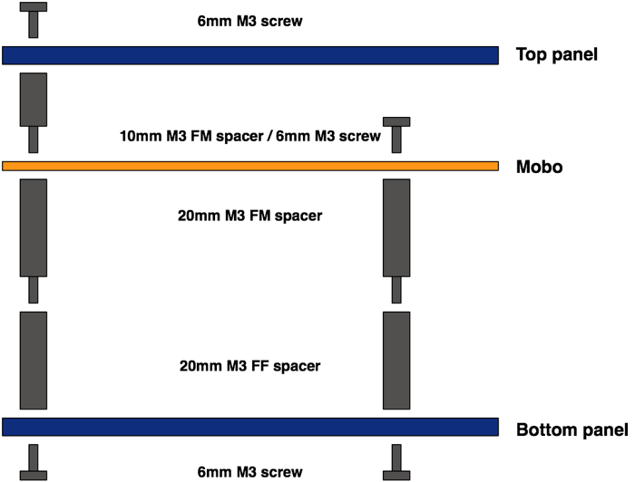

Bill of materials
-----------------

All the mechanical parts described in this section are [listed
here](https://docs.google.com/spreadsheet/pub?key=0Ai4xPbRS5YZjdHl4MG1PWkxONzg2ZFdRYXJrMzZvTWc&single=true&gid=4&output=html).
Note that the kits come with custom 40mm spacers, which are hard to find
- you can obtain the same height by stacking together a 20mm MF spacer
and a 20mm FF spacer.

Motherboard
-----------

A few elements are directly screwed onto the motherboard:

-   The large heatsink for the 7805 regulator is kept in place with one
    6mm M3 screw and a M3 nut. Screws are not needed for the two other
    heatsinks which are directly clipped onto the 7908 and LM2940-8.0
    regulators.
-   The LCD module is held by four 10mm M3 screws, and 8 M3 nuts.

Voicecard / motherboard assembly
--------------------------------

A 12mm M3 female/female spacer is inserted between the motherboard and
the first layer of voicecards. A 12mm M3 female/male spacer is inserted
between the two layers of voicecards.

Case assembly
-------------

Note that the voicecards are "hanging" from the motherboard -- they are
not attached to the case.

The top panel of the case is attached to the motherboard through four
10mm female/male M3 spacers.

The bottom panel of the case is attached to the motherboard through
twelve 40mm female/female M3 spacers. Since this is a rather unusual
size, this height can be achieved with a 20mm male/female spacer and a
20mm female/female spacer.

