The motherboard supports up to 6 voicecards, and contains everything
**not** related to sound generation: power supply, MIDI interface, audio
outputs, SD card storage, user interface and the main processor.

It is strongly advised to start the assembly with the motherboard.

Schematics and PCB
------------------

The schematics in PDF format are [available
here](../static/schematics/Ambika-Mobo-v09.pdf).

You can find the Eagle files for this board in the source code hosted on
[github](https://github.com/pichenettes/ambika/tree/master/controller/hardware_design/pcb).

If you need a reference during soldering, you can download this printout
of the
[bottom](../static/images/ambika_mobo_bottom.pdf)
and [top](../static/images/ambika_mobo_top.pdf)
sides of the board.

Bill of materials
-----------------

[Bill of
materials](https://docs.google.com/spreadsheet/pub?key=0Ai4xPbRS5YZjdHl4MG1PWkxONzg2ZFdRYXJrMzZvTWc&single=true&gid=0&output=html).

Some friendly notes for the self-sourcing crowd:

-   The resistance of the potentiometer adjusting the output volume does
    not matter much as long as you connect Ambika to an audio interface,
    mixer, amp (anything with a reasonably high input impedance). You
    can even bypass it.
-   Given the lead spacing and height constraint, there isn't much
    choice for the big electrolytics. Check the dimensions carefully
    when ordering from an unlisted source.
-   C12 is not needed for now - it might be needed if additional digital
    peripherals/extensions drawing a lot of current on the +5V rail are
    added.
-   Do not attempt to use a 7808 instead of a LM2940-8.0.
-   Be extremely careful in your choice of LCD module. Some of them
    won't fit in the cutout in the PCB, so you might have to file the
    PCB to get them through ; or solder them above the PCB.
-   Heatsinks are absolutely necessary! The part from digikey (HS336-ND)
    or Mouser (567-265-118ABH-22) has two "legs" that need to be cut.
-   The 2-color LED from Mouser (604-WP937GYW) has to be mounted
    backwards because the Y and G LEDs are oriented differently. The
    2-color LED from Reichelt is not green & yellow, but red & yellow.

Assembly instructions
---------------------

Some equipment you'll need:

1.  Soldering iron + solder (nothing fancy, a 15 or 20W will do).
2.  Cutters.

We assume you know soldering. If you don't, look first at [this
tutorial](http://www.instructables.com/id/How-to-solder/) .

**DISCLAIMER: ** We are not responsible for anything wrong (including electric shocks, malfunctions, fires, accidents involving a soldering iron) that might happen during the assembly of the kit. Everything you do while assembling the kit is at your own risks.

### Resistors

Resistors are not polarized, though it is a good idea to align them as
on the pictures, to make your boards more "readable" to other people who
might have to look at them.

3x 220R (red, red, black, black) and 1x 10k (brown, black, black, red)
resistor for the MIDI in/out

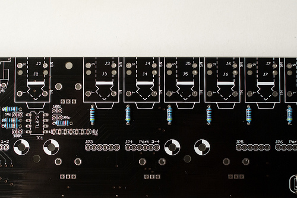

-   7x 470R (yellow, purple, black, black) for output protection of the
    audio out op-amps
-   1x 10k (brown, black, black, red) or lower (down to 4.7k)
-   2x 100k (brown, black, black, orange)

Note the bridge done with the leg of a resistor on the resistor labelled
0R. This is because the LCD module provided by Mutable Instruments does
not need a current limiting resistor for its backlight. However, if your
LCD module comes from Optrex (green on black, with a white frame), you
need to solder a 100 ohm resistor there - otherwise the internal
backlight LED of the module will be damaged.

The 10k resistor just above the resistor network RN1 determines the gain
of the final mixing stage. A value of 10k might cause clipping if the
level of all voicecards is set to the maximum value and if all 6
voicecards are playing at the same time. To prevent this, a lower value
of 6.8k or 4.7k is recommended. You can keep 10k if you do not plan to
install all 6 voicecards in your Ambika.

Unless you intend to solder a main on/off switch, bridge the pads
labelled SW.

Add a 10k resistor (brown, black, black, red) near the ATMega (it pulls
up the RST line of the MCU). Add the 20 MHz crystal.

\

Add 15x 470R resistors (yellow, purple, black, black). They are used for
limiting the current flowing through the LEDs. Lower values might
increase the brightness of the LEDs, at the risk of damaging them.

\
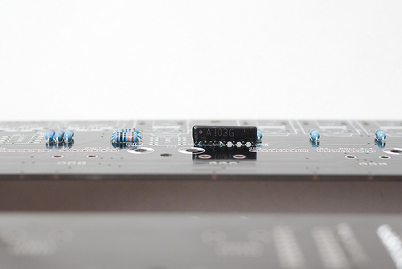

Add the 10k resistor networks. The 9 pins one pulls up the switches; the
7 pins one is used for mixing the voicecards signals. The dot on the
resistor network must match the **1** marking on the board. Check the
photos.

Add the 5k adjustable resistor used for LCD contrast adjustment (the
photo shows that it is called R47, but it has been renamed R36 in later
revisions of the board).

### Diodes

The polarity of the diode is indicated by the ring (black on the
1N4148); white on the 1N4004 and 1N5819. Make sure that it matches the
ring on the symbol silkscreened on the PCB. The 1N4004 is somehow
overkill because Ambika does not use high-voltages - you might find a
1N4001 instead with your kit.

Add 1x 1N4148 (MIDI input protection)

Add 2x 1N4004s (or 1N4001s) - they rectify the input AC voltage.

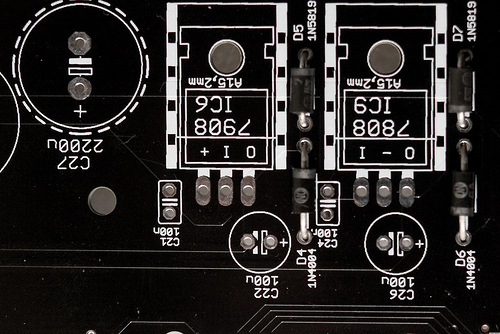\
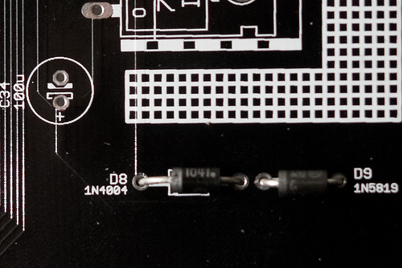

Add 3x 1N4004 (or 1N4001) and 3x 1N5819. These diodes protect the
regulators from weird things that can happen during the power on/off
phases.

### Ceramic capacitors

Ceramic capacitors (the yellow "drops") are not polarized.

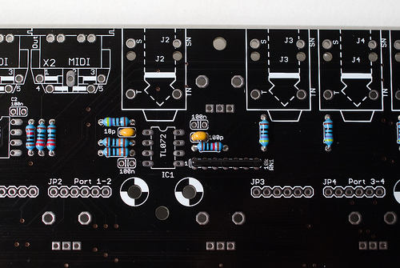

Add 1x 100pF (labelled 101) and 1x 18pF (labelled 180) capacitors. They
limit the bandwidth of the op-amps and keep them stable. The TL072s
don't strictly need them though. Note that 22pF capacitors (220) can be
used without problem in place of 18pF.

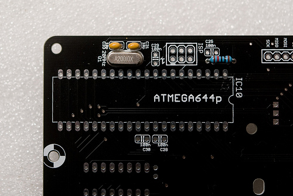

Add 2x 18pF (labelled 180) capacitors. Note that 22pF capacitors (220)
can be used without problem in place of 18pF.

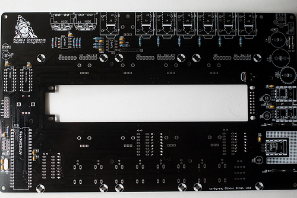\
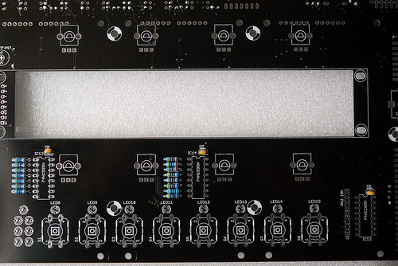

Add all the bypass 100nF capacitors (labelled 104).

### ICs and sockets

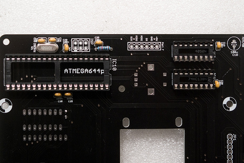\

Add the DIP40, 2xDIP16 and 2x DIP8 sockets for the ATMega644p, 4050,
74hc138, 6N138 and the TL072.

Some logic ICs on the top of the board are not socketed. Solder the 2x
74hc595 (shift registers for the LEDs) ; and 1x 74hc165 (shift register
for reading the 8 switches).

\

### Power supply

**Be very careful about the polarity of the electrolytic capacitors**.
When incorrectly polarized, they can pop and/or poop. The long lead of
the capacitor indicates the positive lead, marked (+) on the PCB. A
white strip on the edge of the capacitor indicates its negative lead.

Add the MCP1700 3.3V regulator and the 100µF capacitor adjacent to it. I
used here a short capacitor but the one that comes with the kit might be
taller.

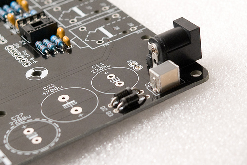

Add the power connector - add enough solder to get a "lake" of solder
forming inside the solder pad. Solder only one pin of the connector,
adjust its position while keeping the solder joint hot, then solder the
other pins.

Add the 1uF film capacitor. Note that it is not polarized.

Add the 3 regulators. The 7908 and LM2940-8.0 have a small heatsink
attached to them. Insert the part into the heatsink. You might have to
bend some of the metal wings to make it fit to the regulator.

The 7805 gets very hot and needs a very big heatsink. Use a 6mm M3 screw
and a nut to keep the heatsink in place, and make sure that the metal
tab of the 7805 is touching the heatsink. Check that the heatsink is not
shorting the three leads of the 7805.

Add the two big capacitors (2200µF and 4700µF) used in the rectifier.
Check and double-check their polarity.

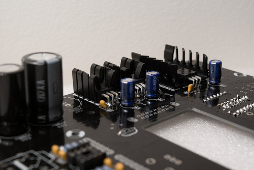

Add the 3x 100µF capacitors stabilizing the regulators.

### Connectors

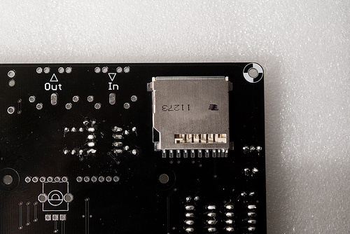

Add the SD card connector. This is fortunately the only surface-mount
soldering you will have to do here. A friendly note: it is not a big
deal if you mess up the 3 smaller pins on the right. They are not used
on Ambika.

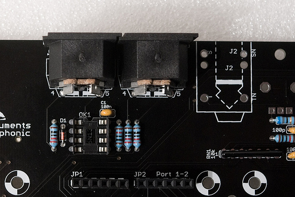

Add the 2x MIDI connectors and all the voicecard connectors (6x 1x6
female headers).

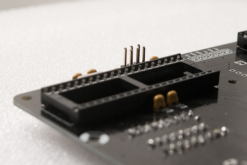

If you intend to hack the firmware and send your own code to the
motherboard, add a 2x3 male connector for an AVR ISP programmer.

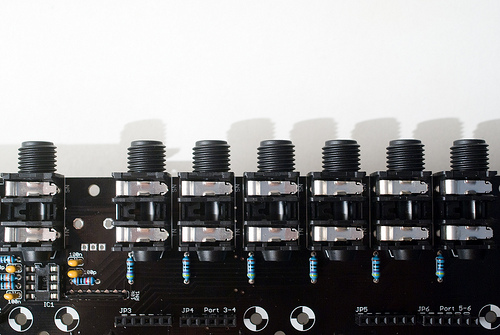

Add 7x audio connectors.

### LCD module and LEDs

Solder the 2x8 connector to the top of the LCD module. Insert the LCD
module through the board, and add 2x nuts + 1x 10mm screw on each corner
to keep it in place.

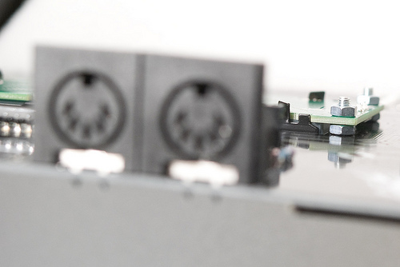

Solder the LCD module to the PCB.

\

Add the 15 LEDs. The LED symbol printed on the PCB has a round edge and
a flat edge. The shortest lead of the LED goes on the same side as the
flat edge ; and the long lead is on the same side as the round edge.

Note that soldering a LED backwards will make it shine with the wrong
color.

### Controls

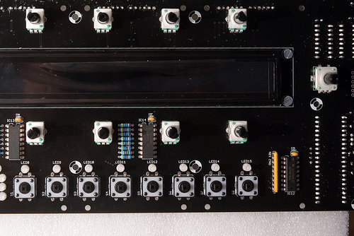

Add the 8x 10k linear pots, the encoder, and the 8x switches.

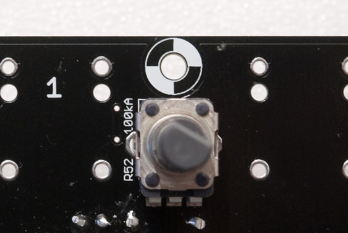

Add the 100k audio taper pot ; or bridge its middle and right pins if
you think this pot is breaking some symmetry...

### Getting ready for voicecards

\

Add 12x male/female spacers (with a 6mm M3 screw on the other side of
the board) to welcome the voicecards.

Hooray! We're done!

Testing
-------

### Power supply testing

For now, do not insert any IC

Before powering Ambika, check that there is no short between one of the
colored points and ground ; and no short between any pair of those
points.

Plug the +9V **AC** wall transformer.

Check that the voltages are:

-   +5V on the green point
-   +3.3V on the yellow point
-   +8V on the red point
-   -8V on the blue point

You can now power off the unit, and safely insert the 6N137, the TL072,
the 4050, the 74hc138 and the ATMega644p.

### LCD adjustment and UI test

Power the unit back on. LED9 should be lit in green. The first LED of
the part indicator (block of 6) should be lit in green.

Adjust the LCD contrast with the R36 trimmer.

Press the first switch to go to the oscillators page and test that the 8
knobs are modifying values. Click the encoder and turn it left/right to
check that it modifies values.

Press the 8 switches one by one and check that all pages are reached,
with the corresponding LED lighting up.

Insert a FAT32 formatted SD card with the contents of the [following
archive](../static/firmware/ambika_golden_card.zip).
Press the last switch. You should be able to load presets from the card
(you should see A000 Junon). If there is a problem with the SD card
circuitry, an error message is displayed. If the card is simply blank,
(empty) is shown in place of the preset name.

Connect a MIDI source to the MIDI in. A note icon should be displayed in
the top left of the screen whenever you play a note. Different symbols
are shown when the pitch bend lever or the modulation wheels are
touched.

### A first voicecard!

**Never attempt to connect a voicecard** while the motherboard is
powered on.

**Make sure that spacers are present before stacking voicecards** - you
don't want the bottom of the voicecard to touch any bit of circuitry
below it.

Make sure that the two layer jumpers are set to A if the voicecard is
stacked directly on top of the motherboard ; or to B if the voicecard is
stacked on top of another voicecard.

Connect your first voicecard to Port 1 and power Ambika on. The orange
LED on the voicecard should light up - indicating that it receives data
from the motherboard. During tests, it is recommended to temporarily set
the first part to mono - this way, whatever you play, the first
voicecard will always receive the note. To do so, go to the keyboard and
tuning page (by pressing S5), and change the second setting to **mono**:

    Volu 120|mode mono|lega off|port    0
    octv   0|tune    0|sprd   0|raga equa

Play some notes and check that a green LED lights up on the voicecard
every time it receives a note. Check the mix audio output and the first
individual out.

License
-------

This circuit and PCB layout is made available under a **cc-by-sa-3.0**
license.

Kudos
-----

Todd Bailey, Neil Johnson and Yves Usson for useful board layout
reviews!

Releases
--------

#### v0.8

Original release.
