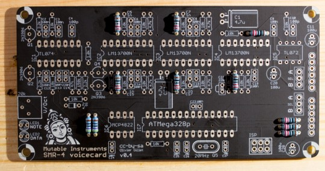
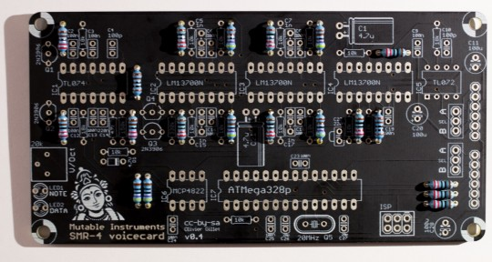
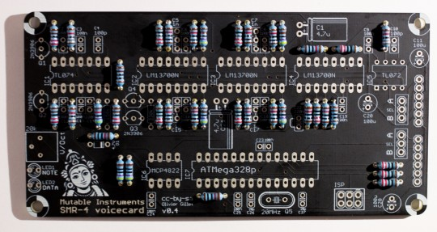
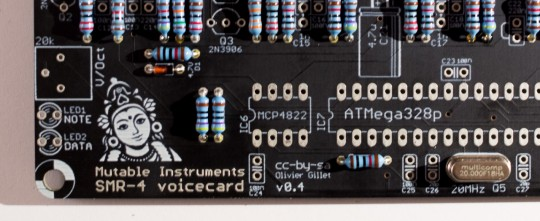
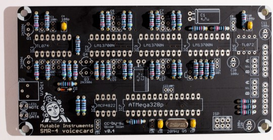
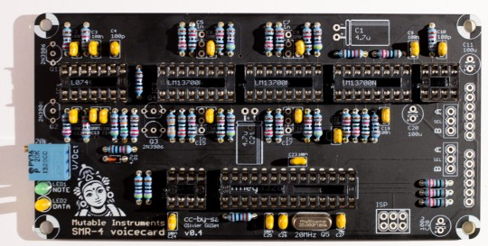
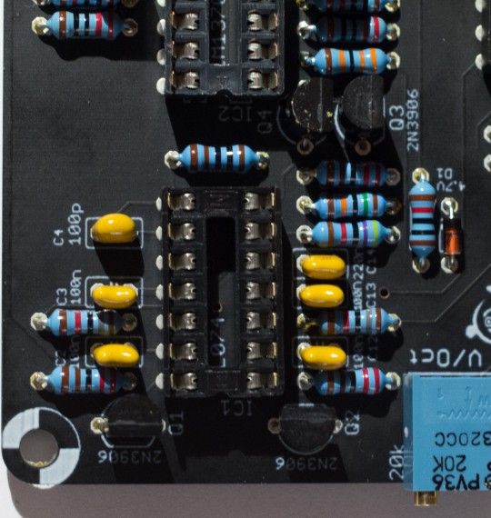
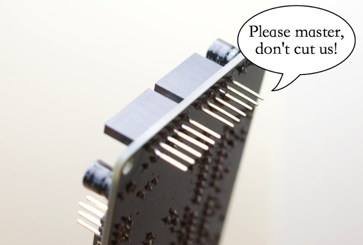

Assembly instructions
---------------------

**DISCLAIMER:** We are not responsible for anything wrong (including electric shocks, malfunctions, fires, accidents involving a soldering iron) that might happen during the assembly of the kit. Everything you do while assembling the kit is at your own risks.

Given the relatively small size of this board, we do not build it functional unit by functional unit - we just work our way from the shortest to the tallest component.

### Resistors, first decade

Add 9x 220R resistors (red, red, black, black, brown). Add 2x 470R resistors (yellow, purple, black, black, brown). Resistors are not polarized - but it helps to solder them with the same orientation as on these photos, it will make it easier for you to spot mistakes in case the board does not work!

### Resistors, second decade

Add 2x 1.0k resistors (brown, black, black, brown, brown) ; 3x 2.2k resistors (red, red, black, brown, brown) ; and 4x 4.7k resistors (yellow, purple, black, brown, brown).

### Resistors, third decade

Add 13x 10k resistors (brown, black, black, red, brown) ; 3x 18k resistors (brown, grey, black, red, brown) ; and one 47k resistor (yellow, purple, black, red, brown). Do not mix the 18k and 10k resistors - check the photo carefully.

### Resistors, last decade

Add one 150k resistor (brown, green, black, orange, brown) and one 330k resistor (orange, orange, black, orange, brown).

### Miscellaneous short parts

Add the 4.7V zener diode. It is polarized, the black ring of the diode must be on the same side as the ring printed on the circuit board. Solder the 20MHz quartz. It is not polarized.

### Ceramic capacitors

Ceramic capacitors are not polarized. Add 2x 18pF ceramic capacitors (marked 180 = "18 with 0 extra zero pF = 18pF") in positions C26 and C27. Similar values like 20pF or 22pF are also tolerated - they must be chosen according to the quartz' specifications actually. Don't worry, no difference in sound will be noticed if you get a different value, and the quartz is rather tolerant to a +/- 20% deviation. Add 2x 100pF ceramic capacitors (marked 101 = "10 with 1 extra zero pF = 100pF") in positions C4 and C10.

Add 13x 100nF ceramic capacitors (marked 104 = "10 with 4 extra zeros pF = 100,000pF = 100nF"). Note: the parts used in the kit have a very small marking on them. If you cannot read the value of a ceramic capacitor, if it has very long legs, and if it does not come attached to a strip, it is a 100nF ceramic capacitor! Add 2x 220nF ceramic capacitors (marked 224) in positions C14 and C22.

### Trimmer and LEDs

Add the 20k trimmer. It is used to adjust the response of the filter. Add the two LEDs. the DATA LED is orange ; and the NOTE LED is green. The LED is polarized, its orientation is defined by its long and short legs. Insert the two LEDs just as shown on the picture. The flat side of the LED symbol printed on the board actually indicates the cathode (short lead). The round side is the anode (long lead). Solder and cut the leads.

### IC sockets

Make sure that the notch of IC sockets is oriented on the same side as the notch on the PCB symbol. This does not change anything electrically, but having the notch in the right position is a helpful hint for correctly inserting the IC in the next steps! Add 2x DIP8 sockets in positions IC5, IC6. Add 1x DIP14 socket in position IC1. Add 3x DIP16 sockets in positions IC2, IC3, IC4. Add 1x DIP28 socket in position IC7.

### Electrolytic capacitors

The 3x 100µF capacitors (C11, C20, C28) are polarized. The white stripe indicates the -, and this should match the symbol printed on the PCB. The 2x 4.7µF capacitors (C1, C21) that come with the kit are dedicated to audio applications (AC coupling) and are not polarized. If you use polarized capacitors instead, follow the +/- symbol printed on the PCB.

### Film capacitors

Add 4x 1nF capacitors in positions C5, C15, C7, C17. These are not polarized. There are three holes in the PCB because these capacitors are available in two packages:

-   2.54mm pitch (WIMA, red): They need to be soldered as on the photo -
    leaving the outer hole unconnected.
-   5.08mm pitch (other manufacturers, grey or blue): the hole in the
    middle is not connected.

### Transistors

Add the 4x 2N3906 transistors. These parts are polarized - the shape of
the symbol printed on the board must match the round/flat sides of the
transistor.

### Connectors and IC

Add the 2x 1x6 female headers, and the 2x 1x3 male headers.

Do not trim the leads of the board stacking connectors. The voicecard is stacked on top of the motherboard or of another voicecard, so the 6 leads of the 1x6 connectors should be kept long. This is the same stacking approach as the Arduino "shields".

Insert the ICs in their sockets.

Setup
-----

### Layer jumpers

A voicecard can either be inserted into the Ambika motherboard ; or stacked on top of another voicecard. In the former case, the two jumpers must be set to the A position. In the later case, the two jumpers must be set to the B position. The first jumper determines where the voicecard is sending its audio signal. You might exploit this to route the two voicecards in the stack to the same individual audio output (passive mixing), though this is not recommended. The second jumper is used to assign a unique CS line to each voicecard. When the master MCU wants to talk to a voicecard, for example to make it play a note, it sets the CS (chip select) line of the voicecard to a voltage of 0V. It is thus very important that no two voicecards are addressed through the same CS line! For this reason, check and double check that the two voicecards in the stack have their second jumper set to A and B respectively.

### VCF tuning

All boards have a V/Oct trimmer to tune to a correct musical scale the tone emitted by the filter when it reaches self-oscillation. To do this adjustment, start from a blank patch. It greatly helps to assign the voicecard being tuned (and no other voicecard) to part 1. Set all oscillators to none, kill all modulations on the filter cutoff — env2> and lfo> modulation amounts to 0 — and set cutoff and resonance to 63. You should hear the self-oscillation tone. Adjust the V/Oct trimmer so that the intervals are respected – that is to say, when you play C3 then C4, you should hear two notes, maybe not C3s and C4s, but they must be one octave apart. If you do not have a good sense of pitch, you can try a software tuner like Tuna Pitch on OS X. If the filter is correctly tuned, you should be able to play the filter "self oscillation tone" across roughly 4 octaves with correct tuning. Note that tuning might vary a bit with temperature, so there is no need to spend too much time on this! As far as the digital oscillators are concerned, they are always in tune and do not need any calibration!

Technical documentation
-----------------------

This filter uses the same topology as the [Shruthi
SMR4mkII](../static/documents/smr4mkII_analysis.pdf),
with the following change: OTA / op-amp integrator cells are replaced by
OTA-C-Darlington buffer cells. This saves a quad op-amp which wouldn't
have fit on the board. The difference can be heard when increasing the
resonance.

 The schematics in PDF format are [available here](../static/schematics/Ambika-SMR-v04.pdf).

You can find the Eagle files for this board in the source code hosted on [github](https://github.com/pichenettes/ambika/tree/master/voicecard/hardware_design/pcb).

If you need a reference during assembly, you can download this printout of the [top side](../static/images/ambika_smr_top.pdf) of the board and print it at a 2:1 scale.

[Bill of materials](https://docs.google.com/spreadsheet/pub?key=0Ai4xPbRS5YZjdHl4MG1PWkxONzg2ZFdRYXJrMzZvTWc&single=true&gid=1&output=html)

### Licence and credits

This circuit and PCB layout are made available under a **cc-by-sa-3.0** license. The firmware is released under a **GPL3.0** license.
