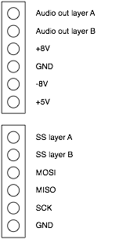

Overall design
--------------

Ambika consists of one motherboard and up to 6 voicecards - each of them
containing a complete sound synthesis voice under the control of the
motherboard.

The main motivation behind this design was the choice of the low
performance 8-bit AVR as a platform for the digital oscillators code. At
the time Ambika was designed, this was the only through-hole part with a
well-supported, easily available open-source toolchain based on gcc -
the fact that the Shruthi-1 codebase was already proven on this platform
was a plus. This required one MCU per voice, and it was thus decided to
keep each voicecard as close as possible to a simple standalone synth.
An advantage of this is that it suits well the "mix and match different
filters/voicecards". The inconvenient is that a multi-processor system
is always more difficult to troubleshoot than a single processor system!

Motherboard
-----------

### Power supply

Earlier versions of Ambika used a single +9V supply for the analog
section with a virtual ground; but the noise floor was higher (it
required a lot of bypassing on the virtual ground).

Thus, a proper +/- 8V symmetric supply was chosen. The advantage of 8V
is that there exists fixed output positive and negative regulators for
this voltage; and that it is relatively close to +5V -- a lot of current
is drawn on the +5V rail, so there's an incentive to use an input
voltage which is not too high, to avoid having to dissipate too much
power on the +5V regulator.

The requirements for a fully loaded unit with SMR4 voicecards are the
following: 310mA for the +5V; and 130mA for the +/- 8V rails.

We decided to work from an AC wallwart (which is really just a step down
transformer) to keep builders away from anything dealing with mains
voltage. The big inconvenient of those is that they do not have a center
tap, so a full-wave rectification input stage is not possible. Half-wave
rectification is what is used on the Ambika power supply. It requires
fairly large input capacitors and/or will cause quite some ripple at the
rectification stage.

Our original design used a 4700uF cap for positive rectification, and
7805 / 7808 / 7908 regulators. When powered with 12V AC, the 7805 was
getting too hot; when powered with 9V AC, the ripple on the rectified
positive input of the 7808 was dipping below 10.5V and caused ripple on
the output. We thus replaced the 7808 with a LDO (LM2940-8.0) more
tolerant to the ripple (it would have required more than 10000u of caps
in the rectifier to make the ripple go away). It is still possible to
run Ambika on 12V AC if a switching-mode pin-compatible 7805 replacement
is used such as the PT78ST105H - this is indeed the best solution to
minimize heating inside the case.

|Input supply|+8V regulator|+5V regulator|Observations
|---|---|---|---|
|+9V AC|LM2940-8|7805|Recommended|
|+12V AC|7808|PT78ST105H|Recommended|
|+9V AC|7808|7805|50Hz Hum on audio output when too many voicecards are installed|
|+12V AC|7808|7805|Works, but 7805 heatsink gets very hot|

### MIDI input

Note that the pull-up resistor on the 6N137 has an unusually high value
of 10k. This softens the edges of the MIDI signal, since some DIP
ATMega644p running at 20 MHz suffer from a bug causing random memory
corruption when sharp spikes are injected on the UART input (this is
apparently a [rarer instance of this
problem](http://www.seanet.com/~karllunt/1284pmemprob.html)).

### SD card

The SD card is the only part of Ambika running on +3.3V. It has its own
small (TO92) regulator, an MCP1700. Level translation from +5V to +3.3V
is handled by a 4050N. There is no level translation from +3.3V to +5V
as the ATMega has a logic threshold below +3.3V.

### Audio output

The audio output of each voicecard is connected to the corresponding
individual output jack through a 470R resistor which serves as extra
short circuit protection. When the jack is not inserted, the signal is
routed to an inverting mixer with a gain of 1, then through the volume
pot, then through an inverting mixer with a gain of 1 (to get the
original phase) - this yields the "mixed" output. This realizes the same
behavior as drum machines like the 808, in which plugging a jack in an
individual output removes the corresponding instrument from the global
mix.

### User interface

The 8 switches are read into a parallel-in / serial-out shift register
(165).

The 15 LEDs are addressed by two daisy-chained parallel-out / serial-in
shift registers (595). The LEDs are bicolor (green or orange depending
on the polarity). The 16th output of the 595s chain is used to either
source/sink current into the LEDs, controlling their colors. This works
because the 595 can source/sink up to 10mA. For example, to light the
first LED in green, the bit pattern is: 10000000 00000000. To light the
first LED in orange, the bit pattern is: 01111111 11111111. 00000000
00000000 or 11111111 11111111 switches off all LEDs. To allow different
brightness levels and the simultaneous display of green and orange, we
alternate between displaying the green field (with 16 brightness levels
achieved through software PWM); and the orange field.

The LCD module is a HD44780 compatible device, it is refreshed using the
same approach as on the Shruthi.

The 8 pots are directly connected to the MCU's ADC inputs without
external hardware multiplexing.

The rotary encoder is directly connected to the MCU and is debounced /
decoded in software.

### SPI bus

The SPI bus is used in a 1-master / 8-slave configuration. The slaves
are the 6 voicecards (address 0 to 5); an expansion port used for future
peripherals/controllers (address 6) and the SD card (address 7). Slave
selection is done by a 3 to 8 decoder (74hc138), whose output pins are
hooked to the SS pin of each slave. The hardware SPI module of the 644p
is used, to allow fast communications - 10 MHz when communicating with
the SD card; 2.5 MHz when communicating with a voicecard (this is
because the ATMega's SPI receiver needs the clock to be strictly slower
than Fclk / 4). The SS pin of the ATMega SPI unit enables/disables the
74hc138 - one just has to write the address of the peripheral we want to
talk to to the 74hc138, and do a transaction using the ATMega644p SPI
module as if there was only one slave!

### Voicecard connectors

Each voicecard connector can be used to stack two voicecards. The lower
layer directly connected to the motherboard is called "Layer A", the
upper layer is called "Layer B".

Here is the pinout of the voicecards connector:

The physical audio outputs 1, 3, 5 are playing the signals from the
layer A voicecards audio outs. The physical audio outputs 2, 4, 6 are
playing the signals from the layer B voicecards.

At the exception of the audio output and the SS line, all signals are
common to the two voicecards in the stack. Jumpers are present on the
voicecard to indicate whether it will "respond" to SS A or SS B; and to
indicate whether it will output its signal to the Audio A or Audio B
line.

Note that it might be possible to design a "dual" voicecard responsing
to both SS A and SS B; and producing audio on both Audio A and Audio B.

Voicecard
---------

### SPI bus

The MISO/MOSI/SCK lines of the SPI bus are connected to the voicecard
MCU through 220R resistors. This has little impact on signal integrity;
and this allows the ISP programmer (which uses the same pins as the
hardware SPI module) to be isolated from the SPI bus during programming
(see AVR910).

The SS A / SS B lines are connected to a 3 pins header + jumper to
assign the voicecard to a layer. One of them is hooked to the SS pin of
the ATMega328p's hardware SPI receiver. Note that the voicecard MCU does
not use interrupts for SPI reception ([some exploration
here](http://www.avrfreaks.net/index.php?name=PNphpBB2&file=viewtopic&t=109367)).
Instead, it polls the SPI peripheral. Normally, the polling is done
sparsely (every time an audio sample is written to the DAC); though it
can temporarily enter a busy loop when the master MCU sends a large
block of patch data.

### VCA compensation

The SVF voicecard uses an exponential VCA whose response curve needs to
be linearized in software. To allow the same firmware to be used on all
voicecards, a pin of the ATMega328p (pin 14) is tied to ground on the
SVF voicecard to instruct the firmware to do the compensation. On the
other voicecards, this pin is unconnected (internally pulled-up), and no
correction is applied.

### Output signals/CV

A voicecard needs to generate at least 4 control signals: oscillators
mix, VCF CV, VCA CV and resonance CV. We have chosen an external 12-bits
dual DAC for the oscillators mix and VCA CV; and 8-bits PWM for the
others. The DAC eliminates some of the weird low frequency tones
obtained on the Shruthi-1 when the filter self-oscillation starts
interacting with the 39kHz PWM carrier. The bandwidth constraint on the
VCF and Q CVs is lower and 1-pole filtering can be applied to them to
eliminate the PWM carrier. In any case, any remain of the PWM carrier in
those CV does not show up in the audio signal.

The DAC (MCP4822) has a SPI interface. Since the SPI module of the
ATMega328p is already used for communication with the master MCU; what
is used for communicating with the DAC is the USART in SPI mode. It is
actually more convenient to talk to the DAC through the USART in SPI
mode, since it has a 4-byte buffer.

### Digital control of filter routing

The SVF voicecard uses a digitally controlled switch (4052) to route the
various filter nodes to the VCA. Because the 4052 is powered by +/- 8V,
it needs some level translation to correctly be switched from +5V
outputs (Vishay DG405x series have +5V compatible inputs, but they are
harder to find). This is done with simple MOSFET inverters.

### Signaling

The meaning of the LEDs patterns is as follows

|LED pattern|Status|
|---|---|
|Orange on|Voicecard is normally refreshed by master|
|Green on|Voicecard is playing a note|
|Green and Orange blink simultaneously|Voicecard has failed to boot successfully, either due to a corrupted firmware update, or to a power supply disruption during boot. It is now locked in firmware upgrade mode, and is waiting for the master to send an upgraded firmware from the SD card|
|Green and Orange blink in turns|Voicecard firmware has been successfully upgraded|

### Firmware update and initialization sequence check

Firmware update is triggered by the master, which sends a dedicated
command to the voicecard. Upon reception of this command, the voicecard
writes a value in internal EEPROM, resets itself, and lands into its
bootloader. The bootloader checks this value in EEPROM, and enters the
firmware update mode accordingly. This design works well but does not
handle the following situation: after a failed firmware update, the
voicecard is left with a non-bootable firmware, and thus it cannot
receive the firmware update command from the master!

To solve this, the bootloader always set a flag in internal EEPROM
during boot -- flag which is cleared in the main firmware after a
successful initialization. During the next boot, the bootloader checks
this flag. If it has not been cleared, it means that the main firmware
could not complete the initialization sequence, and this is interpreted
as a sign of crash and/or corrupted firmware. Thus, the bootloader will
force the voicecard into firmware update mode even if not instructed to
do so by the master.

What this means is that if for any reason a voicecard does not complete
its initialization (for example, if it is disconnected or removed during
the boot process), it will lock itself into firmware update mode.

Master <-> voicecard communication protocol
-------------------------------------------

During a SPI transaction, the master and the voicecard exchange a byte
of data. Except when noted otherwise, the voicecard only sends 0xff to
the master - as communication is mostly done in the master -> slave
direction.

### 0x00 PATCH SEND

This command is followed by an 8-bit integer N indicating the size of
the data block sent in bulk. Then, N bytes follow. These bytes are
copied into the patch data structure of the voicecard. Please refer to
the [patch data
structure](https://github.com/pichenettes/ambika/blob/master/common/patch.h#L246).

### 0x10 TRIGGER NOTE / 0x11 TRIGGER NOTE LEGATO

This command is followed by 3 bytes: the MSB of the note pitch, the LSB
of the note pitch, and the velocity. The pitch is represented by a
14-bit integer, the 7 MSB being the MIDI note number. The velocity is
represented by an 8-bit integer, twice the MIDI velocity value. The LSB
of the command indicates whether the note is played legato. Whether this
should actually retrigger the envelopes or not is a function of the
legato mode setting of the patch.

### 0x20 WRITE PATCH DATA

This command is followed by an address byte and a value byte; and writes
data into the [patch data
structure](https://github.com/pichenettes/ambika/blob/master/common/patch.h#L246).

### 0x30 WRITE PART DATA

This command is followed by an address byte and a value byte; and writes
data into the [part data
structure](https://github.com/pichenettes/ambika/blob/master/voicecard/voice.h#L37)

### 0x40 WRITE MODULATION SOURCE

This command is followed by a modulation source index and its value. The
modulation sources are [listed
here](https://github.com/pichenettes/ambika/blob/master/common/patch.h#L162).
At the exception of envelopes, LFO4, operators and noise (which are
internally generated), all modulation sources values come from the
master MCU.

### 0x50 / 0x51 / 0x52 WRITE LFO

This command is followed by a byte, and sets the value of the LFO
indexed by the lower nybble of the command byte (0x50 writes LFO1, 0x51
writes LFO2 etc.). The same thing could have been achieved with a 0x40
command, but this command is shorter; and thus allows a faster refresh
rate of the LFOs.

### 0x60 RELEASE

This command releases all envelopes.

### 0x70 KILL ALL SOUND

This command releases and sets to zero all envelopes.

### 0x80 / 0x81 / 0x82 RETRIGGER ENVELOPE

This command retriggers the envelope indexed by the lower nybble of the
command byte (0x80 for envelope 1; 0x81 for envelope 2; 0x82 for
envelope 3).

### 0xf8 RESET ALL CONTROLLERS

This command resets to their default position the pitch bend,
aftertouch, modulation wheels and expression pedal controllers.

### 0xf9 RESET

This command stops all sound and resets the voicecard to a blank
(silent) patch.

### 0xfa LIGHTS OUT

This command instructs a voicecard that it should stop blinking its LEDs

### 0xfb START FIRMWARE UPGRADE

This command instructs a voicecard to resets into its bootloader so that
its firmware can be upgraded. The voicecard is expected to reply with
the size of a flash memory block divided by 16. It is followed by a
100ms pause; then this command is repeated 250 times. The master then
sends the firmware nibble by nibble; and finally an 0xfb is issued to
indicate that the transmission of the firmware is over.

### 0xfc GET SLAVE ID

This command instructs a voicecard to send (during the next
transaction), its slave id. The slave id is 0x01 for a sound synthesis
voice.

### 0xfd GET VERSION ID

This command instructs a voicecard to send (during the next
transaction), its firmware version id. The higher nybble is the major
version number; the lower nybble is the minor version number.

### 0xff SYNC

This command can be used in three contexts:

-   Receive a byte from a previously issued command.
-   A long string of 0xff messages can be used to resynchronize the
    state of a voicecard's protocol decoder in case it has skipped a
    byte.
-   When a voicecard boots, it waits for a first SPI message to decide
    whether it should boot into the normal code, or enter the firmware
    upgrade mode. Receiving a 0xff SYNC message makes it boot into the
    normal code; while receiving a 0xfb START FIRMWARE UGPRADE message
    makes it stay in bootloader land for firmware upgrade.

