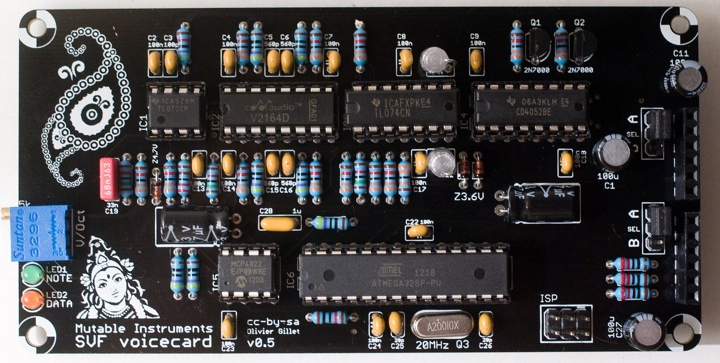
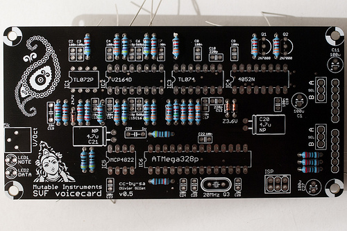
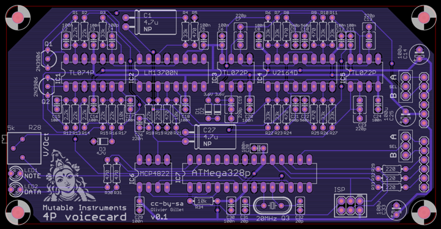
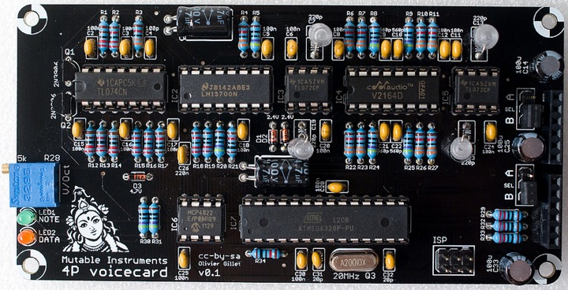

These voicecards can synthesize one voice of sound, using a hybrid synthesis engine derived from the Shruthi and three different flavors of analog filters (2-pole multimode SVF ; 4-pole OTA-C ; and 4-pole VC integrator based on a SSM2164).

You can [listen to a comparison of those](../static/audio/ambika_filters.mp3)
(in order: SMR4, SVF LP, SVF BP, SVF HP, 4P).

General comments
----------------

The following observations apply to all the voicecards

### Layer jumpers

A voicecard can either be inserted into the Ambika motherboard ; or
stacked on top of another voicecard. In the former case, the two jumpers
must be set to the **A** position. In the later case, the two jumpers
must be set to the **B** position.

The first jumper determines where the voicecard is sending its audio
signal. You might exploit this to route the two voicecards in the stack
to the same individual audio output (passive mixing), though this is not
recommended.

The second jumper is used to assign a unique CS line to each voicecard.
When the master MCU wants to talk to a voicecard, for example to make it
play a note, it sets the CS (chip select) line of the voicecard to a
voltage of 0V. It is thus very important that no two voicecards are
addressed through the same CS line! For this reason, check and double
check that the two voicecards in the stack have their second jumper set
to A and B respectively.

### Board layout

The lower part of the board is the digital section, containing an
ATmega-328p MCU responsible for the sound and control signal generation,
and a MCP4822 dual DAC converting the oscillators and VCA CVs into
analog signals. VCF and resonance CVs are generated directly by the
ATMega328p using PWM.

The upper part is the analog filter and VCA - emplying a different
circuit for each voicecard in this family.

### Board assembly

Work in the following order:

-   Resistors and diodes
-   Ceramic capacitors, crystal
-   IC sockets, LEDs, trimmer
-   Film and electrolytic capacitors
-   ISP connector

And finally, solder the pair of 6x1 header for board stacking.

**Do not trim the leads of the board stacking connectors**. You might
have gotten this habit if you have built Shruthi-1s... Don't do it! The
voicecard is stacked on top of the motherboard, so the 6 leads of the
1x6 connectors should be kept. This is the same stacking approach as the
Arduino "shields".

Keep in mind that the boards are spaced by 12mm vertically. This might
be of importance if you use styroflex caps on the SVF or 4P boards - you
have to make sure that their leads won't touch the board above it.

### VCF tuning

All boards have a V/Oct trimmer to tune to a correct musical scale the
tone emitted by the filter when it reaches self-oscillation. To do this
adjustment, start from a blank patch. It greatly helps to assign the
voicecard being tuned (and no other voicecard) to part 1. Set all
oscillators to **none**, kill all modulations on the filter cutoff --
**env2&gt;** and **lfo2&gt;** modulation amounts to 0 -- and set cutoff
and resonance to 63. You should hear the self-oscillation tone. Adjust
the V/Oct trimmer so that the intervals are respected – that is to say,
when you play C3 then C4, you should hear two notes, maybe not C3s and
C4s, but they must be one octave apart. If you do not have a good sense
of pitch, you can try a software tuner like Tuna Pitch on OS X. If the
filter is correctly tuned, you should be able to play the filter "self
oscillation tone" across roughly 4 octaves with correct tuning. Note
that tuning might vary a bit with temperature, so there is no need to
spend too much time on this!

As far as the digital oscillators are concerned, they are always in tune
and do not need any calibration!

### Parts sourcing

Each board has 3 low-profile 100uF capacitors that serve as local
bypassing of the +5V, +8V and -8V rails. Panasonic makes some which are
easy to find. Check the dimensions carefully when ordering from other
sources. 10mm is the maximum allowed height.

The connector used for stacking the voicecards is often labelled as an
"Arduino stackable header" or "Arduino shield header". This is the part
you need, though it is often sold at exorbitant prices for what it is.

Schematics and PCB
------------------

### SVF voicecard

This filter circuit is documented
[here](../static/documents/svf_analysis.pdf).
A digitally controlled SPQT switch (half 4052) commutes the 3 modes (LP,
HP and BP).

\

The schematics in PDF format are [available
here](../static/schematics/Ambika-SVF-v05.pdf).

You can find the Eagle files for this board in the source code hosted on
[github](https://github.com/pichenettes/ambika/tree/master/voicecard/hardware_design/pcb).

If you need a reference during assembly, you can download this printout
of the
[top](../static/images/ambika_svf_top.pdf) side
of the board and print it at a 2:1 scale.

[Bill of
materials.](https://docs.google.com/spreadsheet/pub?key=0Ai4xPbRS5YZjdHl4MG1PWkxONzg2ZFdRYXJrMzZvTWc&single=true&gid=2&output=html)

-   The DAC output goes straight to an SSM2164 expo gain cell. This does
    not mean that the VCA has an exponential response. It is linearized
    in software. This costs a bit of resolution.
-   C19 smoothes the filter CV. A value of 68nF is recommended. The
    original design (hence the silkscreen on the board) used 33nF which
    gives snappier, "clickier" filter envelopes.

I usually build this board in 4 steps - one with resistors, one with
ceramic capacitors, one with IC sockets, and one with everything else!

\
\
\

### SMR4 voicecard

This filter uses the same topology as the
[SMR4mkII](../static/documents/smr4mkII_analysis.pdf),
with the following change: OTA / op-amp integrator cells are replaced by
OTA-C-Darlington buffer cells. This saves a quad op-amp which wouldn't
have fit on the board. The difference can be heard when increasing the
resonance.

\

The schematics in PDF format are [available
here](../static/schematics/Ambika-SMR-v04.pdf).

You can find the Eagle files for this board in the source code hosted on
[github](https://github.com/pichenettes/ambika/tree/master/voicecard/hardware_design/pcb).

If you need a reference during assembly, you can download this printout
of the
[top](../static/images/ambika_smr_top.pdf) side
of the board and print it at a 2:1 scale.

[Bill of
materials.](https://docs.google.com/spreadsheet/pub?key=0Ai4xPbRS5YZjdHl4MG1PWkxONzg2ZFdRYXJrMzZvTWc&single=true&gid=1&output=html)

### 4P voicecard

This filter uses the same core as the [4-Pole Mission Shruthi-1 filter
board](../static/documents/pole_mixing.pdf),
but only provides the LP4 output.

\

The schematics in PDF format are [available
here](../static/schematics/Ambika-4P-v01.pdf).

You can find the Eagle files for this board in the source code hosted on
[github](https://github.com/pichenettes/ambika/tree/master/voicecard/hardware_design/pcb).

If you need a reference during assembly, you can download this printout
of the
[top](../static/images/ambika_4p_top.pdf) side
of the board and print it at a 2:1 scale.

[Bill of
materials.](https://docs.google.com/spreadsheet/pub?key=0Ai4xPbRS5YZjdHl4MG1PWkxONzg2ZFdRYXJrMzZvTWc&single=true&gid=3&output=html)

License
-------

These circuits and PCB layouts are made available under a
**cc-by-sa-3.0** license.
