### Getting ready

We assume you know soldering. If you don't, look first at [this tutorial](http://www.instructables.com/id/How-to-solder/). The CVpal is very easy to build even for beginners!

**DISCLAIMER:** We are not responsible for anything wrong (including electric shocks, malfunctions, fires, accidents involving a soldering iron) that might happen during the assembly of the kit. Everything you do while assembling the kit is at your own risks.

### Step 1: Zener diodes

[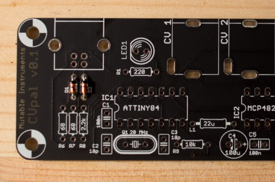](../static/images/cvpal-assembly-1.jpg)

Solder the two 3.6V Zener diodes D1 and D2. They are polarized. The black ring on the diode must be on the same side as the stripe printed on the circuit board. These diodes serve as voltage-limiters: the USB standard requires 3.3V while the microcontroller uses 5V I/O (the currents involved are so small that the voltages on the diodes do not actually reach 3.6V!).

### Step 2: Resistors

[](../static/images/cvpal-assembly-2.jpg)

Solder the two 68R resistors (blue, grey, black, golden) in positions R6 and R7. Orientation does not matter. These two resistors work along with the Zener diodes for voltage limiting. [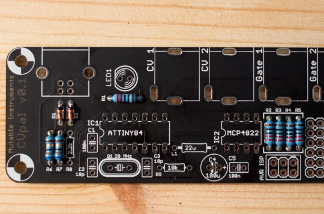](../static/images/cvpal-assembly-3.jpg)

Solder the five 220R resistors (red, red, black, black) in positions R1 to R5. The resistor below the LED provides current to the LED - the smaller the resistor, the brighter the LED... until it is destroyed by excess of current! If you ever want to solder a fancy-colored LED (blue, white, pink...) instead of the one provided with the kit, you'll need to use a larger resistor. Rule of thumb: look at the brightness in mcd in the datasheet and multiply by 10 to get the value of a suitable resistor. 220Ω is fine for the green LED provided with the kit. The four resistors near the output ports serve as a protection in case you connect, by mistake, the output of a module into the CV/Gate outputs. Higher values would provide more protection but would cause voltage drops (and thus, detuning) when the output is connected to several modules via multiples/stackcables. 

[](../static/images/cvpal-assembly-4.jpg)

Solder the 2.2k resistor (red, red, black, brown) in position R8. This resistor is what allows the host computer/smartphone to recognize the CVpal as a low-speed USB device.

[](../static/images/cvpal-assembly-5.jpg)

Solder the 10k resistor (brown, black, black, red) in position R9. This resistor "pulls up" the reset line of the microcontroller - causing it to run continuously after it has been powered.

### Step 3: Capacitors

[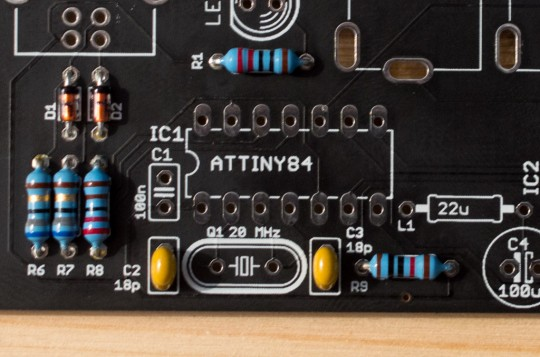](../static/images/cvpal-assembly-6.jpg)

Solder the two 18pF ceramic capacitors C2 and C3. The number "180" is printed on them (This reads as 18 x 10\^0 pF). These capacitors are not polarized. They are companions to the quartz Q1.

[](../static/images/cvpal-assembly-7.jpg)

Solder the two 100nF ceramic capacitors C1 and C5. The number "104" is printed on them (10 x 10\^4 pF = 100nF). These capacitors are not polarized. They are known as "decoupling capacitors". Their role is to provide a local reservoir of energy to an integrated circuit (the microcontroller IC1 and the digital-to-analog converter IC2). This improves the stability of the power supply line, and ultimately prevents cross-talk or unexpected coupling/glitches between integrated circuits. 

[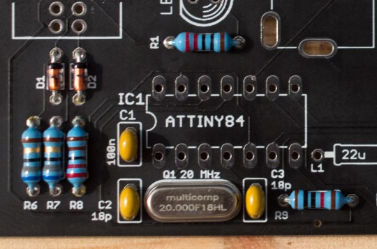](../static/images/cvpal-assembly-8.jpg)

Solder the 20 MHz quartz Q1. This part is not polarized. The quartz is the "heart" that makes the microcontroller beat - on the CVpal, the ATTiny microcontroller will perform 20 million elementary operations per second. Solder the 100µF electrolytic capacitor C4. This capacitor is **polarized**. The long lead goes on the "+" side (as printed on the PCB). The white stripe on the side of the capacitor indicates the negative side. This picture was taken while the capacitor was being inserted through the board - so that the marking on the circuit board is visible: 

[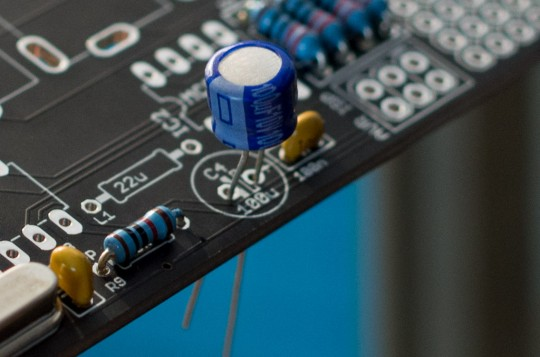](../static/images/cvpal-assembly-9.jpg)

Of course, you need to push it all the way down, not let it float above the board like that! 

[](../static/images/cvpal-assembly-10.jpg)

Solder the 22µH inductor L1. The 100µF capacitor is also a decoupling capacitor for the digital to analog converter. Teaming with the inductor, it prevents the signals emitted by the DAC to "see" any of the fluctuations and impurities coming from the computer. Digital circuitry needs to be isolated from sensitive analog circuitry!

### Step 4: Integrated circuits sockets

[](../static/images/cvpal-assembly-11.jpg)

Solder the two sockets for IC1 and IC2. Make sure that the notch on the socket is on the same side as the notch printed on the board. Sockets make it easy to replace integrated circuits in case of failure or... assembly mistake!

### Step 5: LED

[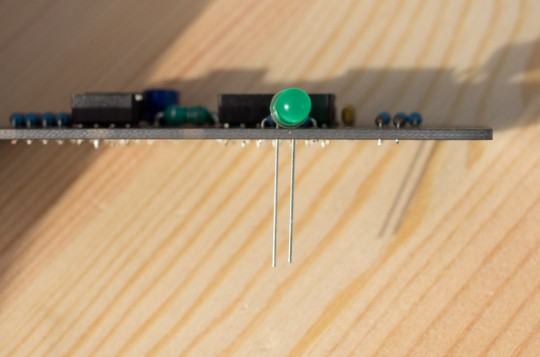](../static/images/cvpal-assembly-12.jpg)

Solder the LED. The LED is **polarized**. Look at the drawing printed on the board. The circle representing the LED has a "flat" side where the text "LED 1" is printed. This indicates the cathode (short lead -) of the LED. The other side is the anode (long lead +). Notice that the LED also has a flat side. If you plan to mount the CVpal in a Eurorack modular system, you need to keep the LED about 1 cm above the PCB so that you can bend it to reach the hole in the panel.

[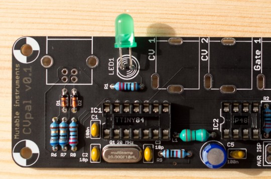](../static/images/cvpal-assembly-13.jpg)

### Step 6: Connectors

Pro tip: Use the front panel to keep the connectors well-aligned while you solder them.

[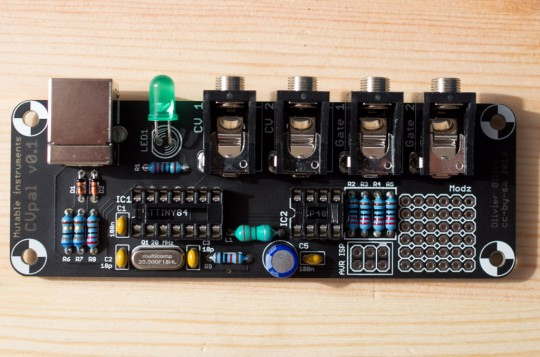](../static/images/cvpal-assembly-14.jpg)

Solder the 4 jack connectors and the USB socket.

### Step 7: Integrated circuits

[](../static/images/cvpal-assembly-15.jpg)

Insert the two integrated circuits in their socket. Orientation is very important! The notch on the IC should be on the same side as the notch printed on the circuit board. The ATTiny84 is a microcontroller with 8kb of non-volatile program memory (flash), 512 bytes of non-volatile memory (eeprom) and 512 bytes of RAM. It runs a program implementing the USB-MIDI protocol, sorting notes, emitting gates/triggers on the GATE outputs, and driving the digital to analog converter to produce CVs. You can see the [source code of this program here](https://github.com/pichenettes/cvpal/tree/master/cvpal). The MCP4822 is a two-channel digital to analog converter with 12-bit of resolution - it can emit two voltages from 0 to 4.095V by increments of 1mV, under control of the microcontroller.

### Step 8: Firmware programming

**Skip this step if you bought a kit** The microcontroller supplied with the kit is already programmed.

Download the file [cvpal.hex](../static/firmware/cvpal.hex). Solder a 2x3 header to the AVR ISP port. Connect your ISP programmer to the header and run the following avrdude commands:

````
avrdude -V -p t84 -c PROGRAMMER_NAME -P usb -B 10 -e -u \
		-U efuse:w:0xff:m \
		-U hfuse:w:0xd6:m \
		-U lfuse:w:0xde:m \
		-U lock:w:0x2f:m
avrdude -V -p t84 -c PROGRAMMER_NAME -P usb -B 1 -U flash:w:cvpal.hex:i -U lock:w:0x2f:m
````

Replace **PROGRAMMER\_NAME** by the name of your programmer, for example **avrispmkII** if you use Atmel's official programmer.

Calibration
-----------

Note: Yamaha and Roland have defined different schemes for numbering octaves – and since then nobody ever agreed on this! If, in the following procedures, everything appears to be off by one octave (the manual says something will happen with C4 but it happens with C3) or if measurements are off by +/-1V, don't panic – it is simply that your controller/DAW uses a different scheme for numbering octaves.

### Introduction

The CVpal uses the V/Oct standard - every time the note increases by one octave, the voltage on the CV output increases by 1V. To make sure that this exact interval of 1V is reproduced (and thus that the VCO driven by the CVpal will play in tune), a calibration procedure is necessary. In this procedure, we will "tune" the voltage emitted by the CVpal for eight notes: F\#2, C3, F\#3, C4, F\#4, C5, F\#5 and C6. It is not necessary to calibrate more notes because the CVpal will interpolate between these. It is necessary to calibrate that many notes because the DAC has imperfections (non-linearity) that make a 2-point calibration (like the OFFSET/Scale trimmers found on many, many MIDI/CV interface) inaccurate. This procedure will have to be done for the two channels (CV1 / CV2).

### Setup

Connect the CVpal to a computer or smartphone with a USB cable. Check that the LED is lit (CVpal receives power) and that the CVpal is listed as a MIDI device in your sequencer (the microcontroller is up and running and the USB link is sound). Configure your sequencer software/app to make it play the note F\#2 on channel 15. Here is how it looks in Logic, for example (we use the built-in keyboard, the key to press is "T"): 

[](../static/images/Picture-1.png) 

[](../static/images/Picture-2.png)

F\#2 is the first F\# key on a 49-key keyboard: 

[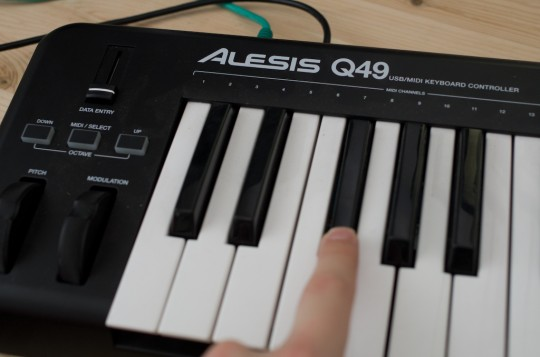](../static/images/f_sharp_2.jpg)

The next steps involve voltage measurements - lots of them. We assume that you have a digital multimeter with 3.5 or more digits of accuracy, and that it is set to measure small DC voltages (450mV to 4.5V). Measure the voltage on the CV1 output. Here are two ways of doing it: You can either connect a cable to the CV1 output, and put the probes on the other end of the jack (black probe/COM on the sleeve, red probe/V on the tip). 

[](../static/images/calibration-2.jpg)

Another approach is to put the black (COM) probe on the lower-left pin of the ISP connector, and the red probe (V) on the metal part of the jack for CV1 output. [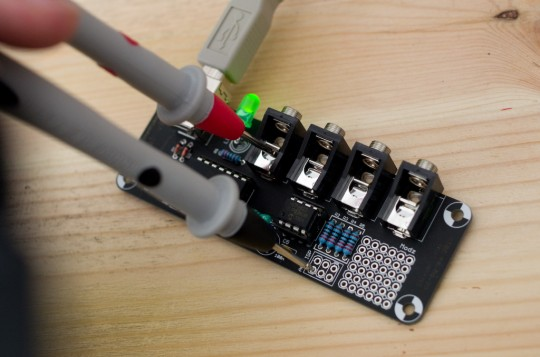](../static/images/calibration.jpg)

### Calibration

For the F\#2 note, the voltage you measure must be between 450mV and 550mV. If this is not the case, verify that you have played the correct note (if you get something like 1.5V or 2.5V - it is a sign that you are playing the wrong octave!). 

[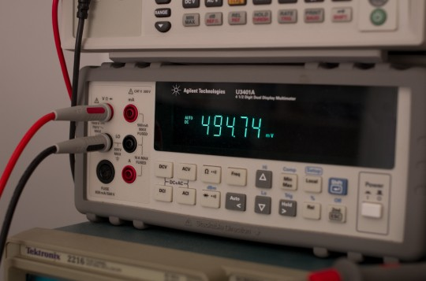](../static/images/calibration-3.jpg)

Press the keys F2 and G2 to, respectively, decrease and increase the read voltage, so that you get as close as you can to 500mV. The keys will apply a change of about 1mV. 

[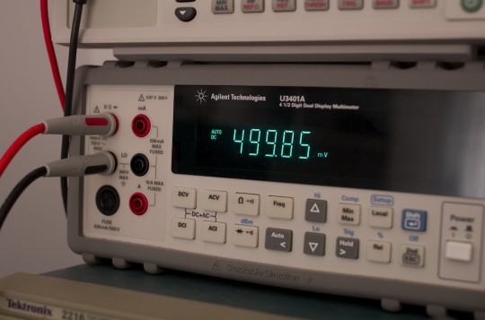](../static/images/calibration-4.jpg)

Done? Then play a C3 note. 

[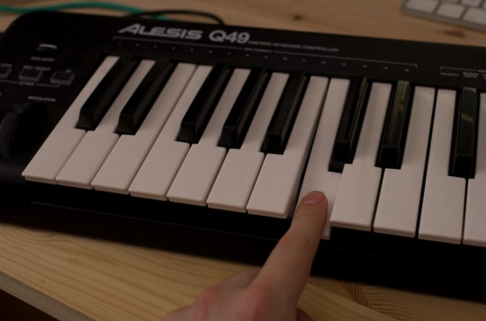](../static/images/calibration-5.jpg)

The voltage measured on the CV1 output should be near 1.0V. Use B2 and C\#3 to, respectively, decrease and increase the voltage, until you get as close as you can to 1.000V. The following chart shows the notes that need to be tuned next: 

[](../static/images/cvpal_calibration.png)

*Note: Yamaha and Roland have defined different ways of assigning an octave number to a MIDI note – and since then nobody agrees on them! Don't be surprised is the \*C3\* in this chart is your \*C4\*, or the other way round.* 

Once the last note has been tuned, you can tune the second CV channel. The procedure is almost the same:

-   For the voltage measurement, the cable will have to be plugged, this time, in channel 2 output (or you will have to put the red probe of the meter on the CV output 2 jack).
-   The MIDI notes will have to be sent on channel 16 instead of 15

Technical documents
-------------------

### PCB and schematics

Here is a view of the board (click for a larger version): 

[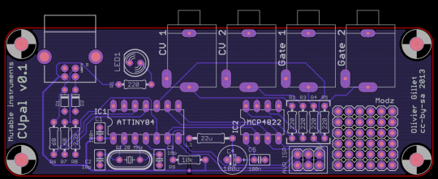](../static/images/cvpal.png)

You can find the Eagle files for this board in the **cvpal/hardware\_design/pcb** directory of the source code hosted on [github](http://github.com/pichenettes/cvpal).

The schematics in PDF format are [here](../static/schematics/CVpal-v01.pdf). [](../static/images/cvpal-v01.png)

Finally, the [parts placement diagram](../static/images/cvpal_top.pdf) (top view).

### Bill of materials

[(Full page version)](https://docs.google.com/spreadsheet/pub?key=0Ai4xPbRS5YZjdHJoeFp1Y0tham5jQ3hTSHF1MjdlMkE&output=html) Note that Reichelt does not sell the right version of the ATTiny84 - the version they have in stock is limited to a 10 MHz clock rate, while the CVpal uses a 20 MHz clock rate. We have tried overclocking this chip and it worked, but cannot confirm whether this solution is reproducible and sustainable.

### License and credits

This circuit and PCB layout are made available under a **cc-by-sa-3.0** license. The firmware is released under a **GPL3.0** license. It uses Objective Development's [V-USB virtual USB library](http://www.obdev.at/products/vusb/index.html).
