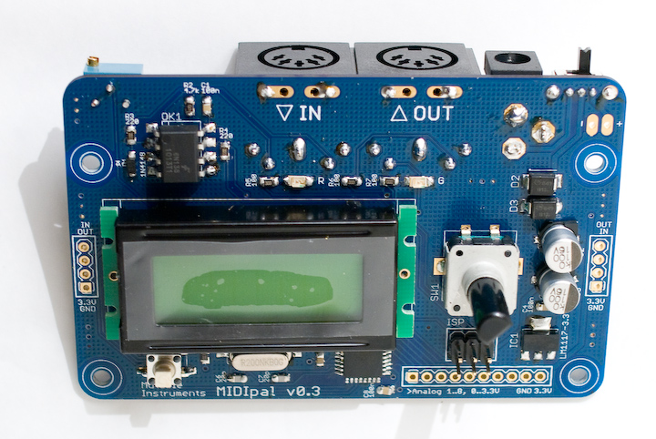
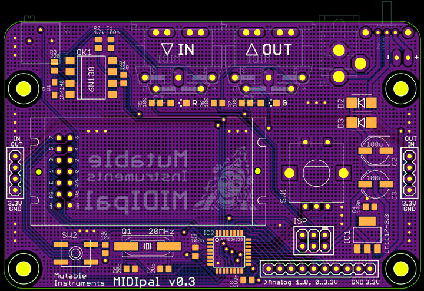
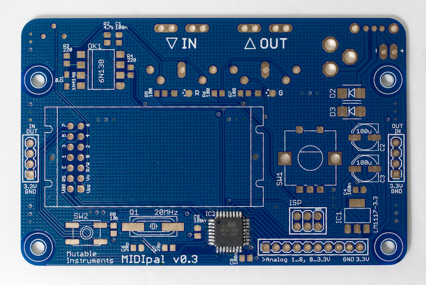
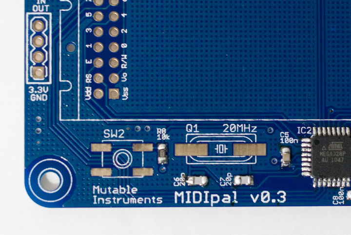
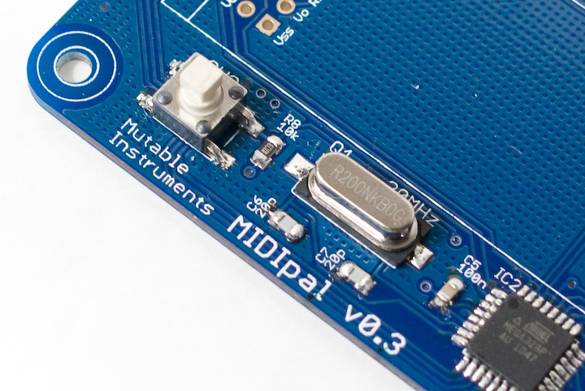
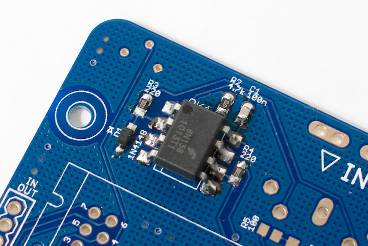
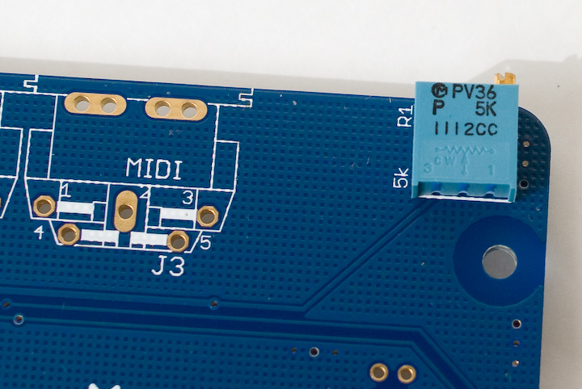
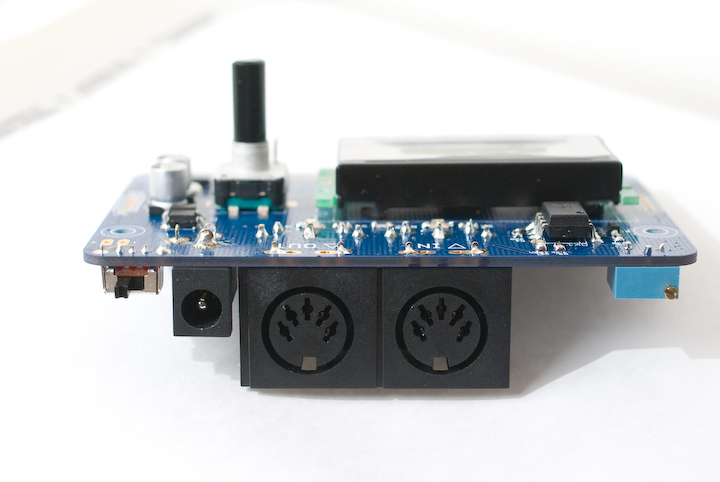

The MIDIpal board features:

-   A regulated 3.3V power supply, taking power from either a DC wall
    wart or a 9V battery.
-   An ATMega328p clocked by an external 20 MHz quartz.
-   A MIDI output and input, with opto-isolation.
-   An 8x1 LCD module, 2 LEDs and a clickable encoder.
-   A reset button and a 2x3 ISP connector used during firmware
    development.

Schematics and PCB
------------------

Here is an image of the board:



Note that all the SMD parts are on the top side of the board, while all
the through-hole connectors are on the bottom of the board.

You can find the Eagle files for this board in the
`midipal/hardware_design/pcb` directory of the source code hosted on
[github](http://github.com/pichenettes/midipal/tree/master).

The schematics in PDF format are
[here](../static/schematics/Midipal-v03.pdf).

Bill of materials
-----------------

[Bill of
materials](https://docs.google.com/spreadsheet/pub?hl=en_US&hl=en_US&key=0Ai4xPbRS5YZjdGlHeVBfQUg3Y18xbEZpOG45Vkh6U1E&output=html&widget=true)

Assembly instructions
---------------------

### SMT soldering in short

* Get a flux pen and some solder wick

* Get some thin solder, at most 0.5mm. Digikey \#82-117-ND has been
reported to be very well suited for this job!

* Clean your iron's tip!

* Watch the [best video tutorial
ever](http://www.youtube.com/watch?v=b9FC9fAlfQE).

* Sissy method for soldering the TQFP ATMega, aka "tip-pin-pad-solder
rendez-vous":

1.  Apply solder on a pad in a corner
2.  Heat the pad and move the chip in until it is correctly aligned
3.  Are you sure the chip is correctly aligned? Really?
4.  Apply flux abundantly on the 4 sides of the chip
5.  Touch pin 1 with the tip of the soldering iron
6.  Hear the crackling sound of the barbecued flux
7.  Touch the pin and the tip of the soldering iron with the tip of your
    solder
8.  Repeat for each pin

* Things go wrong because:

1.  The tip of your iron was dirty
2.  You have not applied enough flux
3.  You have not aligned the chip in such a way that the pins are
    sitting in the middle of their pads

-   When soldering resistors, capacitors, etc. start by a pad that is
    not grounded. Heat it, apply solder, move the part in with the
    tweezers. Solder the other side. Starting with a grounded pad is
    more difficult because of heat being dissipated on the ground plane.

### Step 1: ATMega328p



This part is the most difficult, so start by this. After having soldered
it, check that there is no short between adjacent pins. Use solder wick
to remove bridges -- even if you need to rework it 4 or 5 times it
cannot go wrong (here is [a
photo](../static/images/5867605926_7f79d5afa4_b.jpg)
of a fully working board the MCU solder job of which had been redone 8
or 9 times).

### Step 2: 4x 100nF caps


### Step 3: 1x 10k resistor, 2x 22pF caps



### Step 4: 1x 20 MHz quartz, 1x switch with gull wings



### Step 5: 2x 220R resistors, 1x 4.7k resistor, 1x 4N4148


There is a stripe marking the cathode of the diode. It goes "up". See
the little diagram silkscreened above D1.

### Step 6: 1x 6N138



Let the solder flow up the pins.

### Step 7: 3x 100R resistors, 2x LEDs (green and red)


Look closely at the LED package. It has green dots on one side. They
should go on the same side as the 3 dots pattern silkscreened on the
PCB.

Which LED is green, which LED is red? The easiest way to check is to use
a meter in continuity testing or diode testing mode. This will provide
enough current to dimly light them.

### Step 8: 1x LM1117, 2x 100uF caps, 2x Schottky diodes


The Schottky diodes are a bit tricky to solder. Applying solder on a pad
and moving in the diode won't work that well. If you can get someone to
help you, the best solution will be to have someone firmly hold the
diode into place with the tweezers, while you solder one side of the
diode. **The diodes are polarized**, the cathode is identified by a
stripe that should be on the same side as the symbol silkscreened on the
board.

The capacitors are polarized too ; the shape silkscreened on the PCB
should match the base of the capacitor. To solder the capacitor, hold
the tip of the iron on the tiny "tail" on the capacitor's sides.

### Step 9: 1x SPDT Switch, 1x DC connector, 1x 5k trimmer




### Step 10: ISP connector


At this stage you can connect a DC power source (delivering a voltage
between 5V and 9V, and with a current rating above 150mA) and check that
you get 3.3V at the pads marked **3.3V**.

### Step 11: MIDI connectors, LCD module, encoder




That's it! You can now adjust the contrast of the LCD. If you plan to
use the MIDIpal with a 9V battery, you can solder the provided battery
clip (black = negative, red = positive).

### Step 12: Getting started

At any time, to select the "app" the Midipal will run, hold the encoder
down for 2 seconds. Rotate the encoder to select an app, and press it to
confirm. For example, you can select the "Monitor" app and check that
incoming MIDI signals are correctly parsed.

Most of the MIDIpal apps work the following way: rotate the encoder to
navigate in the list of parameters, press the encoder to select a
parameter (the value of the parameter will be enclosed in square
brackets), rotate the encoder to modify the value, and press the encoder
to confirm.

This is a very short overview, experiment or [check the
manual!](../manual)

Firmware setup
--------------

This section explains how to flash the firmware of the MIDIpal. Note
that kits shipped after April 11th have their MCU already programmed -
in this case, this step is optional - but you might still want to read a
bit about this topic if you are interested in modifying the MIDIpal
code!


### Option 1: build the code and upload it with avrdude.

The firmware code is hosted on
[github](http://github.com/pichenettes/midipal), in the `midipal`
directory. It can be built and sent to the MCU with:

````
make -f midipal/makefile bake\_all
````
### Option 2: install pre-built binaries with avrdude.

Download the following files:

-   [midipal\_flash\_golden.hex](https://raw.github.com/pichenettes/midipal/master/midipal/data/midipal_flash_golden.hex)
-   [midipal\_eeprom\_golden.hex](https://raw.github.com/pichenettes/midipal/master/midipal/data/midipal_eeprom_golden.hex)

Type the following commands in a terminal/command line:

````
avrdude -B 100 -V -p m328p -c avrispmkII -P usb -e -u -U efuse:w:0xfd:m
-U hfuse:w:0xd4:m -U lfuse:w:0xff:m -U lock:w:0x2f:m
````
````
avrdude -B 1 -V -p m328p -c avrispmkII -P usb -U
flash:w:midipal\_flash\_golden.hex:i -U
eeprom:w:midipal\_eeprom\_golden.hex:i -U lock:w:0x2f:m
````
Note that in these commands, you will have to replace:

-   **avrdude** by the path to your local install of avrdude (for
    example `C:\WinAVR\bin\avrdude` on windows).
-   **avrispmkII** by the name of your ISP programmer.
-   **usb** by something else if your ISP programmer is not a USB one.

### Option 3: use Atmel's AVRStudio.

Download the following files:

-   [midipal\_flash\_golden.hex](https://raw.github.com/pichenettes/midipal/master/midipal/data/midipal_flash_golden.hex)
-   [midipal\_eeprom\_golden.hex](https://raw.github.com/pichenettes/midipal/master/midipal/data/midipal_eeprom_golden.hex)

Launch AVRStudio and select **AVR programming** in the **Tools** menu.

Select **AVRISP mkII**, **ATMega328p** and **ISP** in the Tool, Device,
Interface combo boxes and click on **Apply**. If you have another
programmer or if it is connected to another port, you'll have to change
the **tool** and **interface** settings.

Click on the **Memories** tab on the left column and select the
`midipal_flash_golden.hex` file in the **Flash** section. Select
`midipal_eeprom_golden.hex` file in the **EEPROM** section.

Connect the AVR ISP mkII programmer to the ISP connector on the MIDIpal
board.

Click on the **Interface settings** tab on the left column and set the
ISP clock to **16.1 kHz**. Click on **Set**.

Click on the **Fuses** tab on the left column and set the values to
**EXTENDED = 0xFD** ; **HIGH = 0xD4** ; **LOW = 0xFF**. Click on
**Program**.

Click on the **Interface settings** tab on the left column and set the
ISP clock to **4 MHz**. Click on **Set**.

Click on the **Memories** tab on the left column. Click on **Program**
on the **Flash** section. Click on **Program** on the **EEPROM**
section.

Hacking
-------

### ADC ports

The 8 pads labelled "Analog 1..8 0..3.3V" are connected to the ATMega
ADC. They accept voltages in the 0..3.3V range (voltages outside of this
range will damage the MCU), which can be converted to 8 freely
assignable CC by the "controller" app on the MIDIpal firmware.

### Chaining

You can easily chain several MIDIpal together to build one monster MIDI
multi-FX. Two 4 pins connectors are located on each side of the MIDIpal
to ease chaining. The following rules apply:

-   You only need to connect to a battery/DC wall wart the power supply
    section of one unit in a chain. The other units will be powered by
    the 3.3V rail of the powered unit.
-   Do not create feedback loops! That is to say, if the IN of unit A is
    connected to the OUT of unit B, do not connect the OUT of unit A to
    the IN of unit B.

The following image shows how to hook up two units.


The areas in yellow and green can be left unpopulated. Notice how the
OUT of the left unit is connected to the IN of the right unit, but not
the other way round.

License
-------

The MIDIpal is made available under a **cc-by-sa-3.0** license ; and its
source code under a GPL3.0 license.
