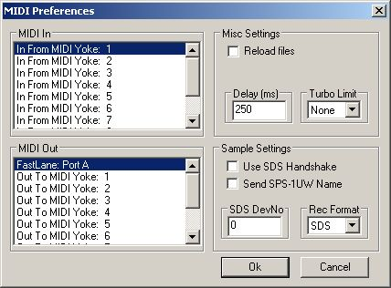
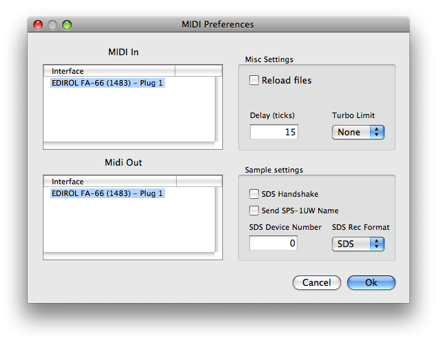

Latest firmware
---------------

[Grab the latest MIDIpal firmware
here](../static/firmware/midipal_1.4/midipal_stdclock_shseq.syx).
Scroll to the bottom of this page for the upgrade procedure.

Variants for v1.4
-----------------

The latest firmware version is v1.4.

|  | Monitor | Event processing | Clock source | HD clock source | SH-seq | Step seq | JX-seq |
|---|---|---|---|---|---|---|---|
| [Download](../static/firmware/midipal_1.4/midipal_stdclock_shseq.syx) | X | X | X | . | X | . | . |
| [Download](../static/firmware/midipal_1.4/midipal_stdclock_stepseq.syx) | X | X | X | . | . | X | . |
| [Download](../static/firmware/midipal_1.4/midipal_hdclock_shseq.syx) | X | X | . | X | X | . | . |
| [Download](../static/firmware/midipal_1.4/midipal_hdclock_stepseq.syx) | X | X | . | X | . | X | . |
| [Download](../static/firmware/midipal_1.4/midipal_poly_sequencer.syx) | X | . | . | . | . | . | X |

List of changes:

* The **Ear Training game** app has been deprecated. All versions linked above are built with the **Tanpura** app instead.
* The arpeggiator has two new modes: `pla` (`as played` - notes are arpeggiated in the same order as they have been played) and `cho` (`chord` - all notes are played simultaneously, as a chord).
* The length of the arpeggiator rhythmic pattern can be altered - this allows many new crazy irregular rhythms!
* The CC LFO app can now send pitch bend messages. Wowowowow. To do so, select CC# 127 - a modulated pitch-bend message will be sent instead of a CC# 127.
* The clock divider app now has a built-in clock delay function. For example, when the delay is set to 6; the transmission of the MIDI **Start** message and of the subsequent clock ticks is delayed by 6 clock ticks. This can be used to create interesting time-shifting effects between two drum machines or sequencers.
* The `clock` app has an extra setting called `con`. When enabled, the clock messages continue to be sent even when the transport is stopped.
* A new app called `settings` allows some global system settings to be defined, such as 0xFE message handling (let them go or filter them), and more goodies (see below).
* The MIDIpal can now be edited using CC messages. CC #80 changes the first parameter, CC# 81 the second parameter and so on. The whole CC range (0 to 127) is mapped to the range of each parameter. The **remote control** channel is defined in the settings app (setting called `ccc` for `cc channel`), and can be of course disabled - when the channel is set to 0.
* The MIDIpal can now be clocked by note messages on a user-selectable channel:
	 - Go to the settings app and select the MIDI channel (`clc` for `clock channel`) and note (`cln` for `clock note`) which will be interpreted as a clock message.
	 - Select the clock resolution (`div`): by how many ticks each note will move the clock forward.
	 - Go back to the application you want to control with note messages (sequencer, arpeggiator...).
	 - Select the `not` clock source.
	 - Repeatedly play a note on the selected channel to start and advance the clock.

Third party firmware versions
-----------------------------

Michael Lauter has developed his [own version of the MIDIpal arpeggiator
and synchlatch apps](http://lauterzeit.com/midipal/firmware/) that
support MIDI SPP messages. This allows the MIDIpal to be slaved to some
hardware sequencers that make use of this MIDI synchronization
technique.

Updating the MIDIpal firmware
-----------------------------

Keep the encoder pressed while you power on the MIDIpal. You'll see the
MIDI in and MIDI out LEDs rapidly blink in sequence, and the MIDI in LED
will stay on. The MIDIpal is ready to receive the update data, which can
be sent as a SysEx (with a 250ms or more delay between packets) or
MIDIfile. The MIDI in LED blinks on every received packet, an update
containing up to 256 packets. The update takes about 1 minute, and can
be restarted in case of accident during the transmission. Upon reception
of the last packet, the MIDIpal immediately boots with the new firmware.

If you want to use a dedicated SysEx transfer tool rather than a
sequencer, we recommend [Elektron's C6
tool](http://www.elektron.se/support-and-downloads) available for both
Windows and OS X, with the following timing settings:

