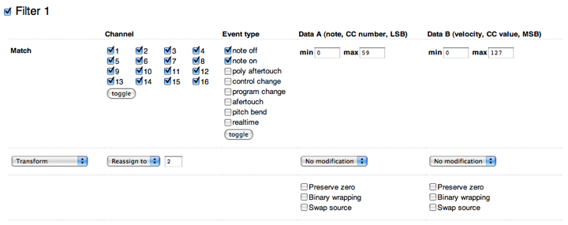
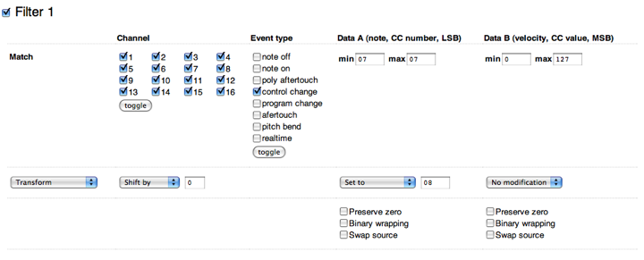
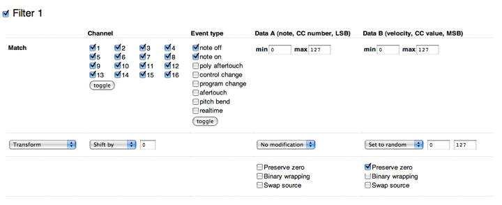

The MIDIpal is a powerful MIDI processor - like a multi-effect operating
on MIDI data! It features 19 different MIDI "apps", ranging from MIDI
debugging or routing utilities (monitoring messages, remapping a channel
to another one...) to complex compositional or inspirational tools like
arpeggiators or pattern generators.

Overview
--------

Basic setup
-----------

Connect a MIDI message source, such as a keyboard, control surface or
computer interface to the MIDI in port of the MIDIpal.

Connect a MIDI message receiver, such as a synth module, expander, or
computer interface to the MIDI out port of the MIDIpal.

The MIDIpal can be powered by either a 9V battery or a 5V-9V unregulated
DC supply, with a minimum current rating of 150mA. Make sure that the
connector has a center pin (or tip) positive / outer collar (or sleeve)
negative pin polarity. Most universal power supplies allows the polarity
to be selected — the polarity being often represented by a diagram like
this: – (o +.

User interface
--------------

Incoming and outgoing MIDI signals are visualized by the red and green
LEDs near the MIDI sockets.

The 8 characters LCD display is used to display the name and value of
the currently edited parameter. Editing is done with the clickable
rotary encoder.

### Launching apps

Each "feature" of the MIDIpal can be seen as an independent "app". Only
one app can be running at a time - that is to say, you cannot run an
arpeggiator, a drum sequencer and a MIDI monitor on the same unit! To
select the app to use, keep the encoder pressed. The name of the current
app is shown on the screen.

    sequencr

Turn the encoder to select an app. Click on the encoder to launch this
app.

Note that the last three entries in the list are not regular apps:

-   `notenuke` sends a NoteOff message, for all possible MIDI notes, on
    all MIDI channels.
-   `sysxdump` outputs a SysEx backup of all the MIDIpal settings.
-   `!reset!` resets the unit to its factory settings.

### Navigation within an app

Though there are a few exceptions, most of the apps are operated the
following way:

Turn the encoder to scroll through the lists of parameters.

    bpm 123

If you want to change a parameter, click on the encoder. Brackets appear
around the parameter value.

    bpm[123]

Turn the encoder to increase or decrease the value. Click again once you
are done.

    bpm 123

The brackets disappear, and your modification is kept in memory, even if
the MIDIpal is powered down - no need for a save button!

### Reverting to factory settings

In order to revert the MIDIpal to its factory settings, keep the encoder
pressed for 2s to display the app list. Scroll to the end of the list to
reach the `!reset!` item:

    !reset!

Click the encoder. Kaboom! All your settings are lost to the factory
defaults.

Apps
----

Please note that some of these applications might not be available on
your unit. Please [refer to this page](../firmware) and to the
firmware update section to find out how you can replace the standard
MIDIpal firmware with alternate versions containing extra applications.

### Debugging apps

#### MIDI monitor (`monitor`)

This app monitors the incoming MIDI traffic. The MIDI data itself is
passed through the MIDI output - so you can insert it through a MIDI
link in your home studio to look at what's going on...

    chn all

Press the encoder to select the MIDI channel to monitor. By default, all
channels are monitored.

The monitor displays the following text for note on/off messages:

    1*A#4 3f

-   The first character is the MIDI channel.
-   A star is displayed as the second character whenever an active
    sensing message is received. A dot is displayed whenever a MIDI
    clock message is received.
-   The next 3 characters are the MIDI note number is displayed.
-   The last 2 digits are the velocity value in hexadecimal, or '--' for
    a note off message.

The following text indicate a note pressure (aftertouch) message - 'a'
for aftertouch, 7 being the highest nibble of the aftertouch value.

    1*A#4 a7

The following text indicates a channel pressure (aftertouch) message.

    1*aft 7e

The following text indicates a CC \#30 message.

    1 #30 70

The following text indicates a pitch bend message of value 0x3070 on
channel 4.

    4 b 3070

Here is a list of text messages displayed for less common MIDI messages:

-   **notoff**: all notes off controller.
-   **omnoff**: omni mode off controller.
-   **omnion**: omni mode on controller.
-   **monoon**: mono mode on controller.
-   **polyon**: poly mode on controller.
-   **sysx..**: beginning of SysEx reception.
-   **.sysx.**: SysEx reception in progress.
-   **..sysx**: end of SysEx reception.
-   **start**: clock start.
-   **cont**.: clock continue.
-   **stop**: clock stop.
-   **reset**: system reset.

#### BPM meter (`bpm cntr`)

This app estimates and displays a BPM value from the MIDI clock. Every
incoming MIDI data is forwarded to the MIDI out.

Rotate the encoder to switch between the following views:

    b 120.0

BPM estimated over the past half-second

    B 120.0

Average BPM (estimated since the clock was started)

    t 23307

Total number of clock ticks received

Click the encoder to reset the BPM estimate and the clock tick counter.

### MIDI Plumbing apps

#### Channel filter (`chnfiltr`)

This app deletes from the MIDI stream all messages associated with one
or many MIDI channels.

    chX off

Enables or disable the MIDI channel X.

#### Splitter (`splitter`)

This app routes MIDI note messages (note on, note off and aftertouch)
from a specific channel to a different MIDI channel depending on their
note value. For example, if you have a keyboard emitting on channel 1,
you can use the lower half of the keyboard to send notes to a bass synth
listening on channel 1, and the upper half of the keyboard to send notes
to a multitimbral expander listening on channel 3.

    inp   5

Input channel.

    spl  B3

Split point.

    low   7

Notes below the split point, coming from the input channel, will be
routed to this channel.

    upp   7

Notes above the split point, coming from the input channel, will be
routed to this channel.

#### Dispatcher (`dispatch`)

This app routes MIDI note messages from a single channel to several
channels. This allows you to play chords on a rack of monophonic synths,
for example.

    inp   5

Input channel.

    mod cyc

Dispatching method:

-   cyclic (**cyc**). Each new note is cyclically played on the next
    channel.
-   polyphonic (**pol**). The mapping of notes to channel uses a true
    voice stealing algorithm. The MIDIpal tries to reuse the same
    channel for occurrences of the same note ; or the least recently
    used channel.
-   random (**rnd**). Each new note is routed to a random channel.
-   stacking (**stk**). Each note is sent to all channels at the same
    time. Perfect for thickening a lead by sending it to several synths,
    or to several parts of the same multitimbral device.
-   velocity (**vel**). The louder (higher velocity) the note, the
    higher the MIDI channel it is sent to.

    out   4

First output channel.

    num   3

Number of output channels. For example, if out = 4 and num = 3, the
notes will be dispatched to channels 4, 5 and 6.

#### Channel merger (`chnmergr`)

This app merges data from several channels into a single one.

    inp   5

First input channel.

    num   3

Number of channels to merge. For example, if inp = 5 and num = 3,
channels 5, 6 and 7 will be merged.

    out   2

Output channel.

#### Clock divider (`divider`)

This app forwards every incoming MIDI message, but it only pick every
Nth clock message. This has the effect of slowing down the MIDI clock by
a ratio of N.

    div   1

Ratio by which the MIDI clock is divided.

#### Sync latch (`syncltch`)

This feature, inspired by the [Mungo
Sync](http://mungo.com.au/syncZ.html) allows a slave device to be
synchronized and started/stopped in sync with a master device playing a
loop.

Consider the following situation: you have a drum machine playing a
steady 2-bar loop, in 4/4, and generating a clock signal for a slave
MIDI sequencer. You need to reload a pattern on the sequencer. You stop
the sequencer, load the pattern, and then you need to hit the **play**
button on the sequencer at the exact right moment so that it starts spot
on the first beat of the 2-bar drum loop. Tricky isn't it? This is where
the MIDIpal can be used. Insert it between the drum machine and the
sequencer. Configure the duration/time signature of the loop (Here: 8
quarter notes). The MIDIpal will keep counting beats. When you press the
MIDIpal encoder, it'll wait for the beginning of the loop and then send
a **start** message to the MIDI slave. When you press again the MIDIpal
encoder, it'll wait for the end of the loop and then send a **stop**
message to the MIDI slave.

    num   4
    den   1/4

Numerator and denominator of the time signature of the loop.

      03:00 .

Beat counter. This shows:

-   the MIDIpal counting beats.
-   whether the slave is playing or stopped (a dot is shown when the
    slave is stopped ; a "&gt;" sign is shown when the slave is
    running).
-   whether the MIDIpal is ready to send a start/stop message to the
    slave.

When you press the encoder, the beat count is shown in brackets, to
indicate that the MIDIpal is waiting for the beginning of the next bar
to send the **Start** message (or the end of the bar to send the
**Stop** message).

For example:

    [03:20].

Indicates that the slave is currently stopped, and that the MIDIpal is
waiting for the beginning of the next bar to send a **Start** message.

    [01:10]>

Indicates that the slave is currently running, and that the MIDIpal is
waiting for the end of the bar to send a **Stop** message.

### Controller and master apps.

#### Clock source (`clock`)

This app acts as a clock source - regularly sending MIDI clock (`0xf8`)
messages. Every incoming MIDI data, at the exception of MIDI clock
messages, are forwarded to the MIDI out. The settings are the following:

    run off

Starts or stops the clock.

    bpm 120

Tempo of the internal clock, in beats per minutes.

    grv swg

Type of shuffle/jitter to apply to the clock:

-   **swg**: swing
-   **shf**: shuffle
-   **psh**: *push* effect, anticipating the beats
-   **lag**: *lag* effect, delaying the beats
-   **hum**: humanization
-   **mnk**: monkeyzation

    amt  80

Amount of shuffle/jitter to apply to the clock.

    tap 120

While on this screen, you can "click" on the encoder to tap a tempo.

#### High-resolution clock source (`clock`)

This variant of the `clock` app acts as a clock source with a finer
resolution of 0.1 BPM. Both variants perform equally well in terms of
jitter/accuracy - this version just has a finer range of adjustment. The
settings are the following:

    run off

Starts or stops the clock.

      120.0

Tempo of the internal clock, in beats per minutes.

#### CC and NRPN knob (`cc knob`)

This app turns the MIDIpal into a MIDI controller - sending CC or NRPN
messages. All incoming messages are sent to the output -- that is to
say, the generated CC/NRPN messages are merged into the MIDI stream. The
settings are the following:

    val  60

CC or NRPN value to send.

    chn   7

Channel on which the CC message has to be sent.

    typ cc\#

Type of message to send: CC or NRPN.

    num   7

Number of the CC or NRPN message to send. For example, set this to 7 to
send a volume message.

    min   0
    max  80

Value range. This restricts the range of the `val` setting on the first
page.

#### Controller (`contrllr`)

This app is only useful if you dare opening your MIDIpal. On the circuit
board, you will find 8 pads labelled Analog 1..8 to which you can
connect any circuit (including a simple potentiometer voltage divider)
outputting a voltage **in the 0-3.3V range**. These are connected to the
analog to digital converter of the MIDIpal brain. Voltage changes on
these inputs will be translated into CC messages: a voltage of 0V yields
a CC value of 0 ; a voltage of 3.3V yields a CC value of 127.

Note that by default, these pads are floating, so they will receive
random values! And beware: **values above 3.3V are likely to destroy
your MIDIpal**.

The following settings are available:

    chn   8

Channel on which the CC messages will be sent.

    ccN   7

CC\# associated with the Nth input.

### Inspiration/composition apps

#### Drum pattern generator (`drums`)

This app generates 4-part rhythmic patterns on a selected channel
(preferably 10!). You can use a 49 keys keyboard (or larger) to start,
stop and mutate the patterns. The first octave on a 61 keys keyboard (C2
to B2) controls the first part. The second octave (C3 to B3) controls
the second part. And so on.

Two types of rhythmic patterns are available:

-   **Preset patterns**: Each key within an octave will trigger and loop
    a different 1-bar pattern. C mutes the part.
-   **Euclidean patterns**: Pressing a key in an octave indicates how
    many notes should be played within the span of a bar (C is 0, C\# is
    1, D is 2, D\# is 4, then 5, 6, 8, 10, 12, 14, 16). Pressing two
    keys indicate how many notes should be played within the span of a
    sequence + the duration of a sequence. For example, if you press D
    and E, a 5 steps long pattern, containing 2 evenly spaced notes will
    be played.

You can safely ignore these instructions and just play keys and clap
your hands.

The following settings are available:

    mod ptn

Switch between the **preset patterns** and the **euclidean patterns**
modes.

    clk int

Select an internal or external clock source. When using an external
clock source, start, clock and stop MIDI messages must be sent.

    bpm 120

Tempo of the internal clock, in beats per minutes.

    grv swg

Type of shuffle/jitter to apply to the clock.

    amt  80

Amount of shuffle/jitter to apply to the clock.

    chn  10

Channel on which the notes are sent. This is also the channel to which
pattern triggers must be sent.

    pt1  C1
    pt2  D1
    pt3  A#1
    pt4  C#1

MIDI Note to send when a note is triggered on parts 1, 2, 3, 4. Notes
are sent with a velocity of 100, and have a duration of one sixteenth
note.

#### Randomizer (`randomiz`)

This app randomizes the note and velocity values of the incoming MIDI
data. It can even send a random CC every time a new note is triggered!

    chn  8

Channel on which the randomization effect is applied.

    amt  99

How often randomization is applied. When this value is set to 127
(maximum value), every note is randomized. When this value is set to 63
(medium value), there is a 50/50% probability that a note will be
randomized. When this value is set to 0, no randomization is applied.

    not.  1

Amount of random modulation applied to the note number, in semitones.
For example, if this parameter is set to 12, the emitted note is within
*/- 12 semitones =*/- 1 octave of the original note.

    vel  70

Amount of random modulation applied to the velocity value.

    cc1  70
    cc2  70

Amount of random modulation applied to the first and second CC. Set both
to 0 if you don't want to send a random CC with each note.

    #c1   7
    #c2   7

CC Numbers for the first and second random CC sources.

#### Chord memory (`chordmem`)

This app memorizes a chord and lets you play transpositions of it. To
record a chord, click the encoder, and play a chord. Click the encoder
again and that's it maestro!

In recording mode, you can also select the affected channel.

#### Arpeggiator (`arpeggio`)

    clk int

Select an internal or external clock source. When using an external
clock source, start, clock and stop MIDI messages must be sent.

    bpm 120

Tempo of the internal clock, in beats per minutes.

    grv swg

Type of shuffle/jitter to apply to the clock.

    amt  80

Amount of shuffle/jitter to apply to the clock.

    chn   1

Channel to arpeggiate. Chords sent on this channels are filtered out and
played as arpeggios.

    dir  up

Arpeggio direction. The available directions are up, down, up&down, or
random.

    oct   1

Arpeggio range, in octaves.

    ptn  10

Arpeggio rhythmic pattern.

     1: o o o o o o o o
     2: o o ooooo o oooo
     3: o o oo oo o oo o
     4: o o o ooo o o oo
     5: o o o o oo o o o
     6: o o o o o  oo o
     7: o o o  oo o o  o
     8: o  o    o  o    
     9: o  o  o  o  o  o
    10: o  o  o  o  o o
    11: o  o  o o  o  o
    12: o  oo   o o o oo
    13: oo o oo oo o oo
    14: oo oo o oo oo o
    15: ooo ooo ooo ooo
    16: ooo oo oo oo oo
    17: ooo o o ooo o o
    18: oooo oo oooo oo
    19: ooooo oo oo ooo
    20: o   o   o  o o o
    21: o     oooooo oo
    22: o       o   o oo

    div /16

Duration of an arpeggio step (the duration of a 'o' or blank in the
previous chart). The default is /16 -- a 16th note per step.

    dur /16

Duration of the notes played by the arpeggiator. The default is /32, a
32th note.

    lat  on

Latch mode. When set to **on**, releasing the keyboard will not stop the
arpeggiator. To stop the arpeggiator, set this latch setting to **off**.
Please note that the sustain pedal of your controller can be used
similarity to hold notes.

#### Tempo-synchronized delay/strummer (`delay`)

This app adds echoes to incoming note on and note off messages. The echo
duration is specified as a fraction of the duration of a bar - thus,
this effect can be musically synchronized to a tempo clock (be it
internal or external).

    clk int

Select an internal or external clock source. When using an external
clock source, start, clock and stop MIDI messages must be sent.

    bpm 120

Tempo of the internal clock, in beats per minutes.

    grv swg

Type of shuffle/jitter to apply to the clock.

    amt  80

Amount of shuffle/jitter to apply to the clock.

    chn   1

Channel on which the echo effect is applied.

    del 1/4

Delay duration, expressed as a fraction of a bar. For example, when this
is set to 1/4, the duration between echoes is equal to the duration of a
quarter note.

    rep   8

Number of echoes to play. Note that when a complex sequence is played
with many overlapping echoes, the internal scheduler buffer can
overflow. In this case, a '!' symbol briefly appears on the LCD display.
Keep in mind that each echo is going to use a polyphony voice, so it is
not a good idea to play MIDI echoes on a device with a limited
polyphony.

    vel  16

Velocity dampening. When this value is low, the echoes have a small and
rapidly decreasing velocity. When this value is high (the maximum being
16), all the echoes are played with the same velocity as the original
note.

    trs   0

Number of semitones by which each echo must be transposed.

    dpl  32

Pseudo-doppler effect: Increases (when set to a positive value) or
decreases (when set to a negative value) the delay between the notes as
they echo.

#### Scale and harmony processor (`scale`)

This app can transpose incoming note messages, and "quantize" them to
the nearest note in one of the 25 preset scales. It can also harmonizes
the incoming note at a fixed interval and/or through algorithmic
modification of the played melody.

    chn   1

Channel on which the scale / transposition / harmony modifications have
to be applied.

    roo   C

Root note of the target scale.

    scl chr

Target scale. All notes outside of this scale are "quantized" to their
nearest neighbor in the scale. For example, if a C major scale is
selected, and if you play a chromatic scale (C, C\#, D, D\#, E...), what
will be heard will be C, C, D, D, E, F, F, G, G, A, A, B. The available
scales are:

-   **chr**: chromatic scale (no quantization).
-   **ion**: ionian mode (major scale).
-   **dor**: dorian mode (russian minor scale).
-   **phr**: phrygian mode.
-   **lyd**: lydian mode.
-   **mix**: mixolydian mode.
-   **aeo**: aeolian mode (minor scale).
-   **loc**: locrian mode.
-   **bmj**: major blues scale.
-   **bmn**: major blues scale.
-   **pmj**: pentatonic major scale.
-   **pmn**: pentatonic minor scale.
-   **bhr**: raga Bhairav.
-   **shr**: raga Shri.
-   **rup**: raga Rupavati.
-   **tod**: raga Todi.
-   **rag**: raga Rageshri.
-   **kaa**: raga Kaafi.
-   **meg**: raga Meg.
-   **mlk**: raga Malkauns.
-   **dpk**: raga Deepak.
-   **flk**: Folkish scale.
-   **jap**: Japanese scale.
-   **gam**: Gamelan scale.
-   **whl**: Whole tones.

    trs   0

Transposition to apply to the incoming notes.

    voi   0

When set to a non-zero value, a parallel harmony N semitones apart from
the incoming melody is played. For example, when set to -24, the
incoming notes are doubled 2 octaves below. Note that the generated
notes are also subject to scale quantization.

    hrm off

Generates an additional, mostly random, harmonic line on top of the
incoming melody. Several algorithms are available to generate the
harmony:

-   **mir**: mirrors the intervals played on the incoming melody. If you
    play an ascending scale, a descending scale will be added.
-   **alt**: alternates between following what you play, and the
    **mirror** mode.
-   **trk**: tracks the interval you play, plus or minus a few
    semitones. For example, if you play a fifth, a major third, and an
    octave, the harmonized line might play a fourth, a minor third, then
    an octave.
-   **random**: plays a random note within +/- 1 fifth of the note you
    played.

Obviously, all those random modifications are likely to generate
annoying junk unless you select a scale. In which case, it will still
sound random, but of the "Free-Jazz" flavor of random.

#### Step sequencer (`sequencr`)

This app is a step sequencer which can generate note messages, CCs, or a
combination of both, on up to 32 steps.

The following settings are available for each step:

-   Note (represented on the screen by a note icon).
-   Note duration (represented on the screen by a pulse icon).
-   Note velocity (represented on the screen by a triangle icon). Set
    the velocity to 0 to mark a step as being a rest.
-   CC value (represented by a knob icon).

Since navigating between the 32 steps x 4 settings = 128 pages can be
tedious, you can "simplify" the sequencer operation by:

-   Muting the notes track. In this case, the sequencer only sends CC -
    and works more like a programmable MIDI LFO.
-   Muting the note duration track. In this case, a default note
    duration of 1 step will be used for all the generated notes.
-   Muting the velocity track. In this case, a default velocity of 100
    is used for each step.
-   Muting the CC track. In this case, the sequencer only sends note
    information.

The muting/unmuting of those track can be used for creative effects --
for example, you can temporarily mute the velocity track of a synth
sequence to make it sound louder and more mechanical.

The sequencer has many settings pages, described in this section.

    run off

Start or stop the sequencer, when it is synchronized to the internal
clock -- When the sequencer is synchronized to an external MIDI clock, a
proper start/stop MIDI message must be sent for the sequence to start.

You can also start the sequencer by playing a MIDI note, and stop it by
replaying the same note.

    clk int

Select an internal or external clock source. When using an external
clock source, start, clock and stop MIDI messages must be sent.

    bpm 120

Tempo of the internal clock, in beats per minutes.

    grv swg

Type of shuffle/jitter to apply to the clock.

    amt  80

Amount of shuffle/jitter to apply to the clock.

    div /16

Duration of a step, in a fraction of a bar. The most common setting
(TB303-like) is one sixteenth note (/16) per step.

    chn   1

MIDI channel on which the sequenced events will be sent.

    cc#   7

CC number of the messages sequenced on the CC track.

    not  on

Whether the sequencer sends note messages.

    dur  on

Whether the note duration track is active. When this track is disabled,
all notes played by the sequencer have a duration of 1 step.

    vel  on

Whether the velocity track is active. When this track is disabled, a
note is played on every step, with a velocity of 100.

    cc  on

Whether the CC track is active.

    stp   8

Number of steps a sequence is made of.

    01N   C3

Note for step 1.

    01D /96

Duration of the note played at step 1 - here, 1 MIDI clock tick.

    01V  14

Velocity for step 1. The actual MIDI velocity value sent is 8 times the
displayed value. For example, 15 corresponds to the velocity value 120.

    01C  63

Value of the CC sent at step 1.

Some nice things about the sequencer:

While a sequence is playing, you can transpose it by playing a note
on the keyboard. The transposition is relative to C3 if the sequence
was started from the menu or from an external MIDI clock ; or
relative to the pressed key when the sequence was started from the
keyboard.

While the MIDIpal is in editing mode, on a note step (in other
words, when the screen is displaying something like this, pressing a key on the keyboard does not transpose or start the sequence. Instead, it records the played note at the current step.

    01N[ C3]

#### SH-101 style Sequencer (`sequencr`)

This variant of the sequencer app provides a very simple way of
recording sequences from a keyboard and playing them back with
transposition.

To record a sequence, turn the encoder until the display shows:

    rec off

Click the encoder to enable recording.

The display shows the number of the current step (here, 0):

    . 0|rest

Every note played from the MIDI in is added to the sequence.

-   To insert a rest (blank step), click the encoder.
-   To insert a tie (extends the duration of the previously input note
    into this step), turn the encoder to select "tie" and click.
-   To insert an accent, move the modulation wheel up before playing a
    note - this note will be accented.
-   To insert a slide between two notes, wiggle the pitch bend lever
    (the actual position does not matter) between the two notes.
-   To leave the recording mode, turn the encoder to select "exit" and
    click.

There are different ways of starting the play-back of the recorded
sequence:

-   Turn the encoder until the display shows the "run" option and click.
-   Play a note from the MIDI keyboard connected to the MIDIpal - you
    can transpose the sequence by playing a different note. The sequence
    stops if you move back to the original note used to start the
    sequence.
-   If the MIDIpal is configured to receive an external MIDI clock, send
    a MIDI start message.

The other settings available are:

    clk int

Select an internal or external clock source. When using an external
clock source, start, clock and stop MIDI messages must be sent.

    bpm 120

Tempo of the internal clock, in beats per minutes.

    grv swg

Type of shuffle/jitter to apply to the clock.

    amt  80

Amount of shuffle/jitter to apply to the clock.

    div /16

Duration of a step, in a fraction of a bar. The most common setting is
one sixteenth note (/16) per step.

    chn   1

MIDI channel on which the sequenced events will be sent, and from which
events will be recorded.

#### JX-3P style Sequencer (`polyseq`)

This sequencer app inspired by JX-3P sequencer allows layer by layer
recording of polyphonic sequences. Think of it as a polyphonic version
of the SH-101 style sequencer.

To clear the sequence and record a first layer, turn the encoder until
the display shows:

    rec off

Click the encoder to enable recording.

The display shows the number of the current step (here, 0):

    . 0|rest

Every note played from the MIDI in is added to the sequence.

-   To insert a rest (blank step), click the encoder.
-   To insert a tie (extends the duration of the previously input note
    into this step), turn the encoder to select "tie" and click.
-   To leave the recording mode, turn the encoder to select "exit" and
    click.

To record a new layer above the existing sequence (overdub mode), turn
the encoder until the display shows:

    dub off

Click the encoder to enable overdubbing. From there, you can record
notes/ties/rests just like in the record mode. Note that once you reach
the end of the sequence, the step counter goes back to 0 and you can
record a new layer above the previous one.

There are different ways of starting the play-back of the recorded
sequence:

-   Turn the encoder until the display shows the "run" option and click.
-   Play a note from the MIDI keyboard connected to the MIDIpal - you
    can transpose the sequence by playing a different note. The sequence
    stops if you move back to the original note used to start the
    sequence.
-   If the MIDIpal is configured to receive an external MIDI clock, send
    a MIDI start message.

The other settings available are:

    clk int

Select an internal or external clock source. When using an external
clock source, start, clock and stop MIDI messages must be sent.

    bpm 120

Tempo of the internal clock, in beats per minutes.

    grv swg

Type of shuffle/jitter to apply to the clock.

    amt  80

Amount of shuffle/jitter to apply to the clock.

    div /16

Duration of a step, in a fraction of a bar. The most common setting is
one sixteenth note (/16) per step.

    chn   1

MIDI channel on which the sequenced events will be sent, and from which
events will be recorded.

#### LFO (`lfo`)

This app generates slowly evolving controllers for up to 4 individual
CC. Note that there are a few fundamental differences between what this
app does and what an LFO on a synth traditionally does:

1.  The stream of CC is generated at a slow speed, typically 50 samples
    per second.
2.  Instead of controlling the LFO frequency in Hz, you control here the
    duration of a cycle expressed as a musical duration relative to a
    tempo.

    run off

Start or stop the LFOs, when it is synchronized to the internal clock --
When the LFO is synchronized to an external MIDI clock, a proper
start/stop MIDI message must be sent for the LFOs to start.

    clk int

Select an internal or external clock source. When using an external
clock source, start, clock and stop MIDI messages must be sent.

    bpm 120

Tempo of the internal clock, in beats per minutes.

    grv swg

Type of shuffle/jitter to apply to the clock.

    amt  80

Amount of shuffle/jitter to apply to the clock.

    res /96

Resolution of the LFO clock. Selecting a high resolution allows for
faster modulations and less stepping, but some devices might not like
the very dense MIDI streams this generates. Selecting a low resolution
might create "stepping" effects.

    chn   1

MIDI channel on which the CC messages will be sent.

    ccN   7

CC number sent by the Nth LFO.

    amN  63

Modulation amount of the Nth LFO. A negative amount inverses the
polarity of the LFO waveform.

    ceN  63

Center value of the Nth LFO. For example, if the modulation amount is 40
and the center value 70, the LFO will oscillate between 70 - 40 = 30 and
70 + 40 = 110.

    wfN tri

Waveform of the Nth LFO. The following waveforms are available:

-   **tri**: triangle
-   **sqr**: square
-   **rmp**: ascending ramp. Use a negative modulation amount to get a
    descending ramp.
-   **sin**: sine wave
-   **si2**: first and second sine harmonics
-   **si3**: first and third sine harmonics
-   **si5**: first and fifth sine harmonics
-   **gg1**: gurgle
-   **gg2**: double gurgle
-   **bt1**: bat (folded triangle) 1
-   **bt2**: bar (folded triangle) 2
-   **sp1**: spike
-   **sp2**: bipolar spike
-   **lp1**: smoothed ramp
-   **lp2**: smoothed square
-   **rs1**: ramp with overshoot
-   **rs2**: square with overshoot
-   **s&h**: (random) sample&hold

A large fraction of those waveforms has been approved by the
International Organization for Dubstep Standardization.

    rtN 1/8

Period of the Nth LFO. For example, if this is set to 1/4, the LFO will
complete a whole cycle every quarter note (beat).

    syN fre

Sync mode of the Nth LFO. The synchronization modes are:

-   **fre**: free running. The LFO oscillates independently of any note
    message, and its phase is never reset.
-   **not**: note synchronization. The LFO phase is reset to 0 every
    time a note on message is received.
-   **chd**: chord synchronization. The LFO phase is reset to 0 every
    time a new "chord" is received. In other words, as long as a note is
    held, playing new notes will not reset the LFO phase. You need to
    release all keys and press a new key to reset the LFO phase.

### Miscellaneous apps

#### Tanpura pattern generator (`tanpura`)

This app generates the repetitive note patterns traditionally played on
the [tanpura](http://en.wikipedia.org/wiki/Tambura) to accompany north
indian classical music.

The settings are the following:

    run off

Starts/stops playback.

    clk int

Select an internal or external clock source. When using an external
clock source, start, clock and stop MIDI messages must be sent.

    bpm 120

Tempo of the internal clock, in beats per minutes.

    grv swg

Type of shuffle/jitter to apply to the clock.

    amt  80

Amount of shuffle/jitter to apply to the clock.

    res 1/4

Relationship between the tempo grid (BPM) and the notes. The default is
1/4. 1/8 and 1/16 can be used for double and quadruple time.

    chn   1

MIDI channel on which the note messages will be sent.

     sa  C4

Root note (sa) of the pattern.

    mod  pa

Interval highlighted in the pattern. Pa = fifth, ma = fourth, ni = 7th,
sa = only octave.

    cyc   5

This setting indicates from which note the pattern starts. For example,
considering the pattern: sa . . . . pa Sa Sa sa. 0 will start the
pattern at sa ; 1, 2, 3, 4 will start the pattern by a silence ; 5 will
start the pattern at pa ; 6 and 7 will start the pattern at Sa.

### General purpose event processor (`user prg`)

This app applies one of 4 user-defined event filtering / remapping
pipelines, each of them consisting of up to 4 filtering / remapping
rules. It's like piping stuff on a unix shell, with note messages and
transpositions instead of grep and awk!

There is only one setting - the active program.

    prg   1

To edit a program:

-   Select the program number you want to edit on the MIDIpal.
-   Go to this [webpage](https://midipal-editor-350009.ew.r.appspot.com/).
-   Configure the filtering rules.
-   Click on "Download .syx" to retrieve a .syx file.
-   Play the .syx file into the MIDIpal to install the program at the
    active location.

And now, a few explanations about the filtering rules!

### Creating custom filtering rules

Each program contains up to 4 "filters". Use the checkboxes to activate
/ deactivate a filter.

The first line of the table specifies which events the filter operates
on:

-   The **Channel** column specifies the affected channel(s).
-   The **Event type** column specifies the affected MIDI event type(s).
-   The **Data A** and **Data B** columns specify value range for the
    two bytes of information contained in MIDI messages. You can use
    this, for example, to restrict an effect or processing to a certain
    range of notes (value A) or velocity (value B).

The second line of the table specifies some transformations to apply on
the matching event:

-   **Transform**: the original event is modified and sent to the MIDI
    out.
-   **Pass and transform**: both the original event and its modified
    version are sent to the MIDI out. You can use it to automatically
    "clone" a note to another channel.
-   **CCize**: a control change (CC) message is formed with the data of
    the incoming event, and sent to the MIDI out. The original message
    is lost. This can be used to translate pitch bend or note messages
    into CC.
-   **Pass and CCize**: a control change (CC) message is formed with the
    data of the incoming event, and sent to the MIDI out. The original
    message is also sent. This can be used, for example to send a new CC
    (maybe a random one?) every time a note is pressed.
-   **Filter out**: the original event is removed from the MIDI stream.

The next option list shows what to do with the MIDI channel of the
incoming event. By default, **Shift by: 0** does nothing. You can
specify another value to shift the channel number by the specified
amount (if **Shift by: 4** is used, Channel 1 becomes channel 5, channel
2 becomes channel 6 etc.). **Reassign to** overwrite the MIDI channel of
the original message to the specified value.

Finally, operations can be applied to the MIDI message data:

-   **Add/Subtract/Invert/Set to** are self-explanatory.
-   **Map to range** changes the dynamic range of a parameter -- you can
    use this to alter the velocity response of a keyboard or drum
    sensor.
-   **Set to random** replaces the value by a number picked within the
    specified interval.
-   **Add random** adds a random value (drawn from the specified
    interval).
-   When **Preserve zero** is checked, no matter which transformation is
    specified, a value of 0 is never modified. This is particularly
    useful when dealing with synths sending Note On with a velocity of 0
    instead of Note Off. You don't want those to be affected by your
    velocity randomizer don't you?
-   When **Binary wrapping** is checked, weird things may happen... For
    example, what if you use **Add: 12** to transpose a note one octave
    above, and then you play the last key on your keyboard? Normally,
    nothing will happen -- the note won't be transposed at all. With
    **Binary wrapping** checked, it'll wrap around and a very low note
    will be played!
-   When **Swap source** is checked, the second byte of the MIDI message
    (velocity, note) is put in place of the first.

Here are some examples:

Map all notes below C4 (Midi note 60) to channel 2:

Map CC 07 (volume) to CC 08 (pan):

Randomize note velocities:

Remove program changes on all channels except channel 1:

Send a random modwheel value at each new note:

To retrieve the rules contained in a .syx file, [go to this
page](http://midipal-editor.appspot.com/retrieve)

Updating the MIDIpal firmware
-----------------------------

To find out which firmware version the MIDIpal is running, hold the
encoder and jump to the app selection menu, then scroll to the end of
the list. On the first release of the firmware (v1.1), the last entry is
the system reset command. On more recent versions, starting from v1.2,
the firmware revision number is displayed at the end of the list.

**This section describes how to update the operating system and apps of
the MIDIpal (firmware)**. The operations described here are not required
for sending to the MIDIpal data such as memory backups, or custom
programs - the MIDIpal can receive such data while being powered on
normally.

Keep the encoder pressed while you power on the MIDIpal. You'll see the
MIDI in and MIDI out LEDs rapidly blink in sequence, and the MIDI in LED
will stay on. The MIDIpal is ready to receive the update data, which can
be sent as a SysEx (with a 250ms or more delay between packets) or
MIDIfile. The MIDI in LED blinks on every received packet, an update
containing up to 256 packets. The update takes about 1 minute, and can
be restarted in case of accident during the transmission. Upon reception
of the last packet, the MIDIpal immediately boots with the new firmware.

If you want to use a dedicated SysEx transfer tool rather than a
sequencer, we recommend [Elektron's C6
tool](http://www.elektron.se/support-and-downloads) available for both
Windows and OS X, with the following timing settings:

SysEx data format
-----------------

The MIDIpal can receive and transmit settings in system exclusive
format. The messages all share the same format:

    0xf0  (SysEx)
    0x00 0x21 0x02  (Mutable Instruments Manufaturer id)
    0x00 0x03  (Product ID for MIDIpal)
    Command
    Argument
    Payload
    Checksum
    0xf7  (End of SysEx)

**Command** indicates what the receiver should do with the data in the
**payload** block, and **argument** is a byte that might contain an
additional piece of information about what to do with the data.

**Payload** is a sequence of bytes in nibblized form. For example, the
sequence `0x80 0x56 0x13` is transmitted as
`0x08 0x00 0x05 0x06 0x01 0x03`.

**Checksum** is equal to the nibblized-sum, modulo 256, of the payload
bytes. In the example above, the checksum is equal to
`0x80 + 0x56 + 0x13 = 0xe9` and is transmitted as `0x0e 0x09`.

### Settings data block transfer

To transmit a block of data to the MIDIpal, **command** must be equal to
**0x01** and **argument** is the size (up to 32) of the data block to
transmit. The first 2 bytes of the payload are the address of the block
to write, the **argument** following bytes are the data.

Upon reception, the MIDIpal writes the block of data in its internal
eeprom, where all settings are stored.

### App selection

To change the current app the MIDIpal is running, set **command** to
**0x02** and **argument** to an app number. The payload must be left
empty.

Upon reception, the MIDIpal reboots into the select app.

### Settings data block request

To request the transmission of a block of data from the MIDIpal,
**command** is equal to **0x11** and **argument** is the size of the
requested data block. The payload consists of 2 bytes, indicating the
address of the requested block.

Upon reception, the MIDIpal sends the designated data. If **argument**
is null, the entire content of the eeprom is dumped. If **argument** is
greater than 32, the data is sent in 32 bytes chunk, with a 150ms pause
between chunks.
