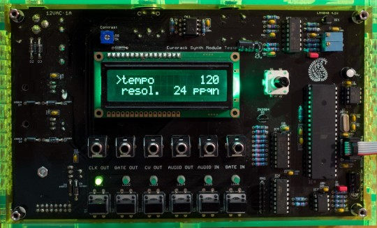
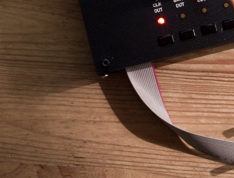

Overview
--------

Several problems were faced during the development of our Eurorack
modules:

-   How to power and test a module during development? Bench-top power
    supplies are cumbersome (especially for projects requiring 3 supply
    rails) and standard test equipment is sometimes useless or
    frustrating for quantities like musical notes or V/Oct scales. On
    the other extreme of the scale, who would run the risk of putting a
    half-built prototype in a rack loaded with thousands of euros worth
    of modules?
-   What kind of setup to use for factory testing?
-   How to take a project away from the lab without carrying heaps of
    "dependencies"?

We solved this the Mutable Instruments way, rolling up our sleeves and
designing a simple box able to provide power and all kinds of test
signals (clocks, gates, CVs, audio tones) to a module. This tool is made
available under cc-by-sa (hardware) and GPL (firmware) licenses.

Building it
-----------

### Schematics and layout

[Schematics.](../static/schematics/Module-Tester-v01.pdf)

Eagle .brd/.sch files hosted on
[github](https://github.com/pichenettes/module_tester/tree/master/module_tester/hardware_design/pcb).

[Top](../static/images/module_tester-v01_top.pdf)
and
[bottom](../static/images/module_tester-v01_bottom.pdf)
assembly.

### BOM

[Bill of
Materials](https://docs.google.com/spreadsheet/pub?key=0Ai4xPbRS5YZjdEtCeHdGVDhQWHJOc2w1ZFN3ZjlhRHc&output=html).

### Assembly notes

The large capacitors on the bottom of the board should be bent and rest
against the board (rather than be mounted vertically as it was done on
Ambika). The same thing applies to the NP capacitors on the top side.
See this picture:



### Firmware

Fuses: `EFUSE = 0xfd ; HFUSE = 0xd4 ; LFUSE = 0xff`

[Pre-compiled .hex
file](../static/firmware/module_tester.hex).

[Source code](https://github.com/pichenettes/module_tester/).

Build with
`make -f module_tester/makefile bootstrap`.

### Calibration

Set the CV output to "2 Oct arpeggio" with a period of 2s or 5s. It
cycles between a 1V output and a 3V output. Adjusts the two trimmers to
accurately get these voltages. Note that the MCP4822's linearity is not
fantastic - so don't be surprised to get 1V and 1.997V or 2.003V when
you change the CV output to "1 Oct arpeggio". The chance is, the analog
circuitry on the other end is much less precise than that anyway!

User manual
-----------

### Power generation

The tester must be powered by a 12V **AC** external power supply
(Wall-wart) with a 2.1mm jack. The red stripe of the ribbon cable
(indicating the -12V pins) must be oriented like on this picture:


Because the tester uses half-wave rectification, and input
capacitors and heatsinks of moderate size, it is not recommended to draw
more than 200mA from the supply rails.

### Features

The tester provides 4 channels of signal generation: clock, gate, CV
(LFO or stepped notes), and audio. The tester provides 2 channels of
signal analysis: audio signal frequency measurement (with display in Hz,
Note units, or intervals), and gate/clock timing measurement.

### Modifying settings

Each of the 4 signal generation and 2 signal analysis functions is
materialized by an output or input jack, a LED, and a button. To modify
the settings of a generator/analyzer, press the button under its I/O
jack. The LED indicates which generator/analyzer is being configured.
The display shows a list of parameters. Turn the encoder to scroll
through the list. Click the encoder to modify an option. Notice that the
'&gt;' arrow is now displayed in front of the value. Turn the encoder to
modify the value. Click the encoder to confirm. For example, to modify
the frequency of the audio signal generator to A3, press the AUDIO OUT
button. The display shows:

````
>shape      sine
 freq.        C5
````
Turn the encoder to select "freq.":

````
 shape      sine
>freq.        C5
````
Click the encoder to modify the value:

````
 shape      sine
 freq.      > C5
````

````
 shape      sine
 freq.      > A3
````
Click the encoder to confirm.

````
 shape      sine
>freq.        A3
````
### Settings reference

#### Clock signal generator

-   **Tempo** is the tempo of the clock, in beats per minute.
-   **Resolution** is the number of clock ticks per beat. For example, a
    tempo of 120 beats per minute with 8 ticks per beat corresponds to a
    clock frequency of 960 ticks per minute (16 Hz).
-   **Pulse** is the duration or duty cycle of a clock pulse.
-   **MIDI** allows the clock rate to be controlled by an external
    computer or sequencer.

#### Gate signal generator

-   **Period** is the period of the signal.
-   **Pulse** is the duration or duty cycle of a gate pulse.
-   **MIDI** allows the gate signal to be generated from an external
    keyboard. In gate mode, the signal is high whenever a key is pressed
    on the keyboard. In trigger mode, a pulse is emitted every time a
    key is pressed - irrespectively of the duration of the note.

#### Control Voltage generator

-   **Mode** controls the output waveform: triangle, square, ramp up,
    ramp down, sine, 1 octave arpeggio (alternates between 1V and 2V), 2
    octave arpeggio (alternates between 1V and 3V), chromatic scale
    (goes from 1V to 2V by 1/12V increments).
-   **Period** controls the period of the generated signal or sequence.
-   **Range** controls the amplitude and polarity of the signal: bipolar
    signals with a 2V, 4V or 10V amplitude; unipolar signals with a 1V,
    2V or 5V amplitude. This setting is ignored when one of the
    arpeggio/scale modes are selected.
-   MIDI allows the voltage produced by this generator to be controlled
    by a MIDI message from an external keyboard.

#### Audio generator

-   **Shape** selects one of 4 waveforms: saw, square, triangle, sine
    wave.
-   **Frequency** selects the signal frequency. A few fixed frequencies
    are available, the remaining values are musical notes.
-   **Envel.** allows an external signal to "shape" the tone produced by
    this generator. In gate mode, the signal is on whenever the signal
    at the Gate In input is high. In trigger mode, the signal has a
    decreasing envelope, which is retriggered on raising edges of the
    *Gate In* signal.
-   **MIDI** allows the audio generator to be played from a keyboard.

#### Audio input

The encoder selects between 3 units:

-   Frequency (Hz)
-   Note and detuning (MIDI standard + cents)
-   Interval. In this mode, the musical interval between the current
    stable note and the previously played note is measured. This
    interval is expressed in cents. 1 octave = 1200 cents.

#### Gate input

The first line displays either the period, frequency, and tempo of the
incoming signal. The second line displays either the duty cycle, or the
duration of the positive edge of the signal. Note that the Gate Input
LED blinks with the input signal.
