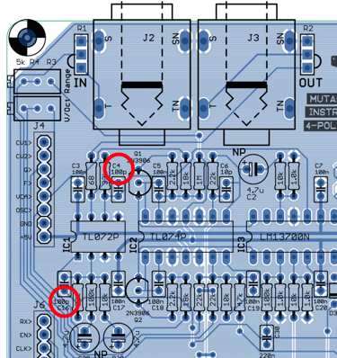
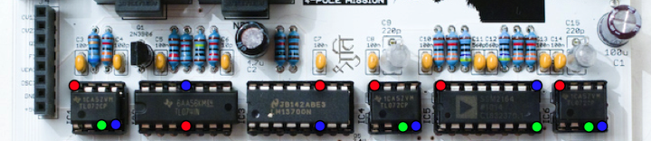
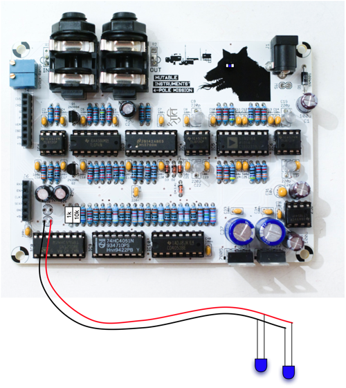
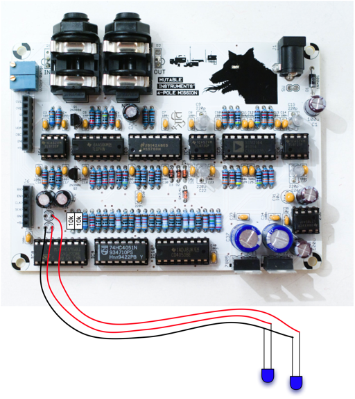
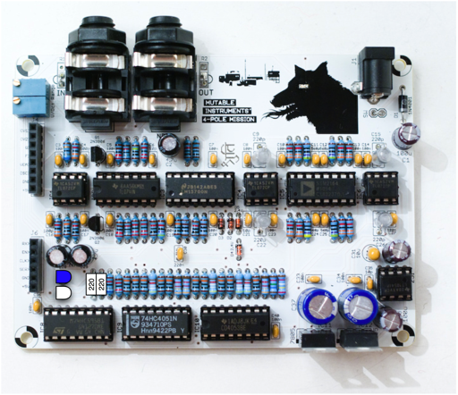

One board to rule them all... This filter board is probably the most advanced 4-pole core for the Shruthi-system! It uses the same "Pole-mixing" technique introduced in the Oberheim Xpander to provide a cornucopia of filter responses. It also provides 4 different settings controlling the "flavour" of the resonance, clean and liquid, MS-20 style, wobbly/chaotic, and a combination of the MS20 and wobbly modes.

The filter core is based on a SSM2164, for a very low-distortion and pure sound. A LM13700 is used as a global VCA and for resonance control, with loudness compensation.

Using this filter board
-----------------------

Please make sure that both the analog (CV1 to +5V) and digital (RX to +5V) ports of the filter and control boards are connected.

Beware! Only the Shruthi-1 firmware v0.96 (or above) generates the digital signals required to control the mode selection and routing matrix. In addition, it is not possible to use simultaneously the 4-Pole Mission filter board and the Programmer since they will be both accessing at the same time the digital extension port. To activate the 4-Pole Mission filter board, select **4pm** in the system settings page. If you don't do so, it is likely that it will emit glitchy filtered sounds everytime you navigate through the pages.

When pressing the **S2** switch (Filter page) a second time, a new page is displayed allowing you to configure the filter routing.

     Cut res mod fla
     100  33 lp4 liq

The parameters are the following:

1.  **cut (cutoff)**: Cutoff frequency, conveniently repeated on this page.
2.  **res (resonance)**: Resonance level, conveniently repeated on this page.
3.  **mod (mode)**: Filter mode. See below.
4.  **fla (flavour)**: Resonance flavour. See below.

The following **15** filter modes are available:

-   **lp4**: 4-pole low-pass.
-   **lp3**: 3-pole low-pass.
-   **lp2**: 2-pole low-pass.
-   **lp1**: 1-pole low-pass.
-   **hp1**: 1-pole high-pass.
-   **hp2**: 2-pole high-pass.
-   **hp3**: 3-pole high-pass.
-   **bp2**: 2-pole band-pass.
-   **bp4**: 4-pole band-pass.
-   **notch**: notch filter.
-   **phaser**: phaser.
-   **h2lp**: 2-pole high-pass and 1-pole low-pass (band-passlike).
-   **h3lp**: 3-pole high-pass and 1-pole low-pass (band-passlike).
-   **n+lp**: notch and 1-pole low-pass.
-   **p+lp**: allpass and 1-pole low-pass.

The 4 resonance flavours are:

-   **liquid**: standard, close to the CEM or Roland designs (no loudness drop).
-   **ms**: Korg-35 style soft limiting is introduced in the signal chain.
-   **wobbly**: The 1-pole output is fed back to the filter cutoff frequency for a rubbery chaotic and modulated resonance.
-   **whacky**: A combination of the **ms** and **wobbly** modes.

Schematics and PCB
------------------

You can find the Eagle files for this board in the shruthi/hardware\_design/pcb directory of the source code hosted on [github](http://github.com/pichenettes/shruthi-1).

The schematics in PDF format are [here](../static/schematics/Shruthi-Analog-PoleMixing-v02.pdf).

We did our homework! A technical document explaining the pole-mixing technique is [available here](../static/documents/pole_mixing.pdf).

Bill of materials
-----------------

[Bill of materials](https://docs.google.com/spreadsheet/pub?key=0Ai4xPbRS5YZjdGdhVGdVWUM1bGZvMmJTTUs1WnNuQ3c&output=html&widget=true).

Note that the 2x 220R resistors at the far left of the big row of resistors are current-limiting resistors for the LEDs. 220R is recommended if you use standard green, red or yellow LEDs. For blue or white LEDs, a value between 1k and 10k is recommended.

Assembly notes
--------------

### Assembly order

We recommend you to proceed in the following order (from shortest to tallest parts):

1.  Resistors
2.  Diodes
3.  Ceramic capacitors
4.  IC sockets
5.  DC connector
6.  Transistors, 220pF styroflex capacitors
7.  Remaining capacitors
8.  Remaining connectors and trimmers
9.  Regulators

Beware! a common mistake made by a handful of builders is to mix up the 100pF and 100nF caps. There are two 100pF caps, here is their location:

After soldering, we recommend a bit of testing. The following image shows where the power pins are located on the first row of ICs. Red: +5V ; Green: ground ; Blue: -5V.

1.  Without any IC inserted and the board powered off, check that there is no short between a red and green pad ; a red and blue pad ; a green and red pad.
2.  Insert the LT1054, power the board, and check the voltages on the red and blue spots (with a green point used as a reference). You should read a value close to +5V and to -5V.
3.  Once this power supply check is done ; insert all ICs. You are ready to go! Don't forget to set the control board to the **4pm** filter setting!

A quick check if something goes wrong: Probe the signal at those points - their voltage is the signal 1, 2, 3, and 4-pole filtered.

### V/Oct Tuning

The tuning procedure consists in making sure that the cutoff frequency of the filter follows a musical scale: increasing the cutoff setting on the Shruthi by 12 (or playing a note 1 octave = 12 semitones higher) should double the cutoff frequency.

The filter board must be connected to the control board (through both the 1x8 and 1x6 connectors) to carry out this procedure.

Dial the following settings on the Shruthi-1:

-   Oscillator 1 shape: **none**
-   Oscillator 2 shape: **none**
-   Filter cutoff: **64**
-   Filter resonance: **63** (maximum value)
-   Filter envelope and LFO modulations: **0**
-   Filter mode: **LP4**
-   Filter resonance flavour: **liquid**

Play on the keyboard. You should hear a pure tone (sine wave), which does not come from the Shruthi-1 oscillators but from the filter self-oscillating. Adjust the **V/Oct** trimmer (the one close to the 1x8 connector) so that the **intervals** are respected - that is to say, when you play C3 then C4, you should hear two notes, maybe not C3s and C4s, but they must be one octave apart. If you do not have a good sense of pitch, you can try a software tuner like Tuna Pitch on OS X. If the filter is correctly tuned, you should be able to play the filter "self oscillation tone" across roughly 4 octaves with correct tuning.

The second trimmer, labelled **Range**, adjusts the cutoff range of the filter. If **V/Oct** is correctly trimmed, the filter cutoff can span 10.66 octaves, that is to say the ratio between the maximum cutoff frequency and the minimum frequency is 1625. This allows the filter to cover the audio range (12 Hz to 19.5kHz). Note that the filter will behave a bit erratically at high resonance and very high cutoff values ; due to interactions between the resonance pure tone and high-frequency components due to aliasing or PWM modulation. The best way to adjust this setting is to use the patch 39, **e-piano**. Try to turn the trimmer to find a compromise between a very muffled sound ; and a sound that will sound too synthetic and bright.

### Light show

Here are some suggestions for blinking LEDs lovers. Keep in mind that putting two LEDs of a different kind in parallel, under the same current-limiting resistor, will not work (that is to say, if you solder the SMT LED for the eye of the beast, you won't be able to connect another LED in parallel for the inside of the case or the front panel). The LEDs must have the same forward voltage (from 1.7V to 3V) to be put in parallel.

### Blinking eyes on the front panel + blinking eye on the board with SMT LED.

### Blinking eyes on the front panel with alternating pattern.

### Blinking LEDs to light up the inside of the board.

License
-------

This circuit and PCB layout is made available under a **cc-by-sa-3.0** license.

Releases
--------

### v0.2

-   Added a pad for a SMT LED in the eye of the creepy dog.
-   Used standard (horizontally placed) resistors for the LED current limiting.
-   Changed the resonance gain resistor value.

### v0.1

-   First prototype.
