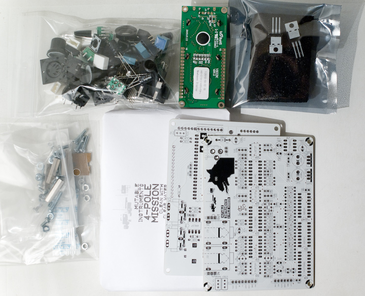
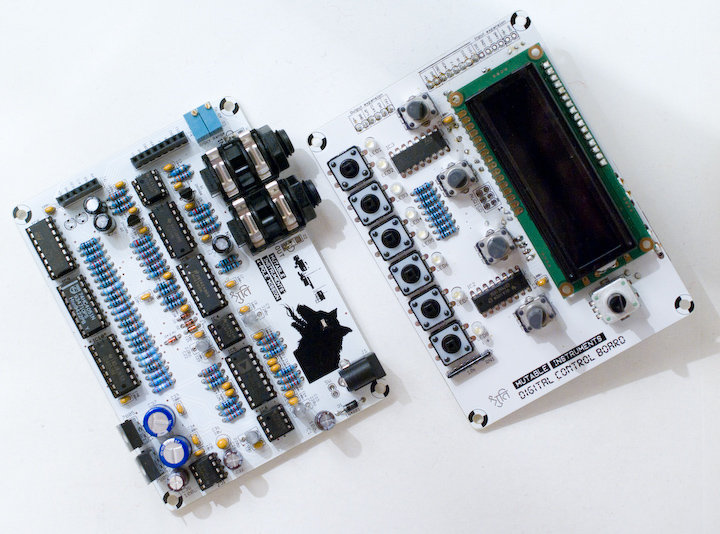
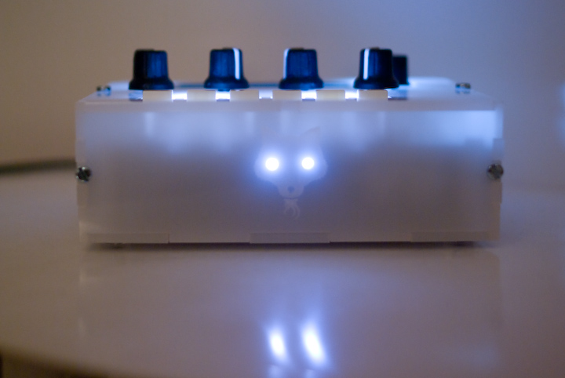

Contents of the kit
-------------------

The kit contains:

-   White control board and filter board PCBs
-   White semi-opaque case
-   White LCD module
-   8 white front-panel LEDs, 2 blue decorative LEDs
-   Case hardware
-   Board stacking hardware
-   Switches, potentiometers, encoders with knobs/caps ; trimmers and resistor networks
-   Quartz, audio capacitors
-   Connectors (Audio, MIDI, DC power, board-to-board)
-   Integrated circuits, including flashed MCU and 464 memories eeprom.
-   Extra candy!
-   [Exclusive postcard](../static/images/4pm_card.jpg) drawn by [Hannes Pasqualini](http://www.papernoise.net)

The kit **does not** contain:

-   Capacitors
-   Resistors
-   Semi-conductors (diodes, transistors)
-   IC sockets

The [following document](https://docs.google.com/spreadsheet/pub?key=0Ai4xPbRS5YZjdEd3QkNDQmJ5NTdvZURLcTlYcVdJQWc&single=true&gid=0&output=html&widget=true) shows the BOM of the control board and the filter board. Parts to be purchased are in blue, parts included are listed in pale green.

The parts not included in the kits can be purchased at:

-   [Reichelt Elektronik](http://www.reichelt.de/?ACTION=20;AWKID=567248;PROVID=2084) for European customers, for **9.55€**. Note that Reichelt's minimum order amount is 10€, so spoil yourself with 45 cts of electro-goodies!
-   [Mouser](https://fr.mouser.com/ProjectManager/ProjectDetail.aspx?AccessID=9facfe9aee) for US customers, for **$18.56 USD**. Mouser does not have a minimum order quantity but the shipping fees to Europe might be high.
-   Farnell, Digikey, using the listed references.

Assembly
--------

If you are used to soldering Shruthi-1 black PCBs, you will be surprised by the white PCBs - they can get dirty with brown solder flux very easily! Two solutions to this problem: either use a sharp edge (chisel, small screwdriver) to scrap the flux from the surface of the board ; or avoid solder which contains/requires too much flux (it might mean going back to leaded solder if you don't have any other option).

### Digital control board

**Warning:** The 8x 220R resistors on top of the control board set up the brightness of the LEDs. While 220R is fine for standard green/red/yellow LEDs, this is a bit too low for the bright white LEDs that come with the kit - even filtered through the semi-opaque case! We suggest instead a value in the 560R to 2.2k range. The BOM is specifying 1k and this is what we have used in our builds.

[Please follow these instructions](../digital), and don't forget to solder the 1x6 "expansion connector" on the bottom left of the control board.

### Filter board

[Please refer to this page for detailed information about the filter board](../4pm).

### Enclosure

Please wash the enclosure carefully before assembly. Beware of the stench! If you intend to put LEDs in the eyes of the front panel beast (who wouldn't?), the following procedure is recommended:

1.  Solder wires to the filter boards as described in the filter board assembly instruction ; solder LEDs to wires.
2.  Screw the filter board to the bottom panel, and add the 4 washers + nuts + spacers.
3.  Glue the two LEDs to the front panel, and clip their leads carefully. It is very important to reduce the risk of shorts caused by the long leads of the front panel LEDs touching the control board!
4.  Add the control board and screw it to the four spacers.
5.  Finish the assembly of the case.

Kudos
-----

-   Case design by [Frank Daniels](http://daniels-cards.de/).
-   Illustrations by [Hannes Pasqualini](http://www.papernoise.net/).

