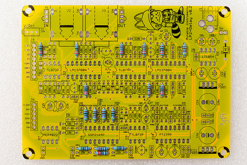
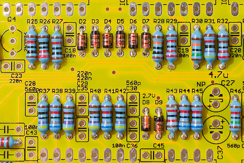
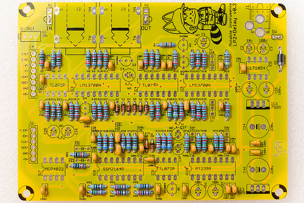
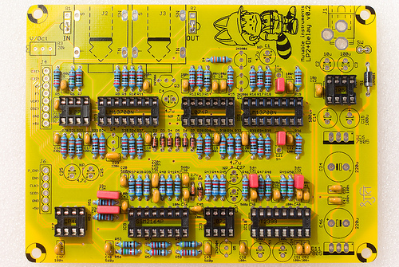
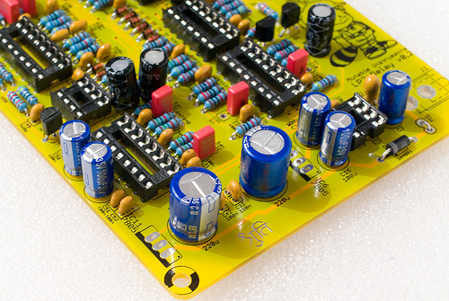
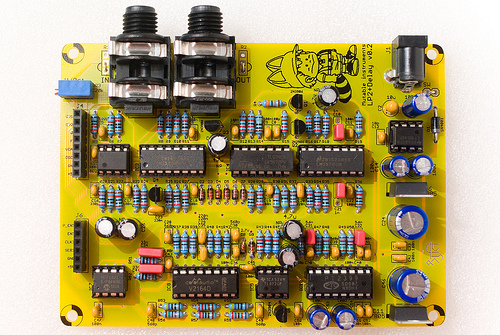
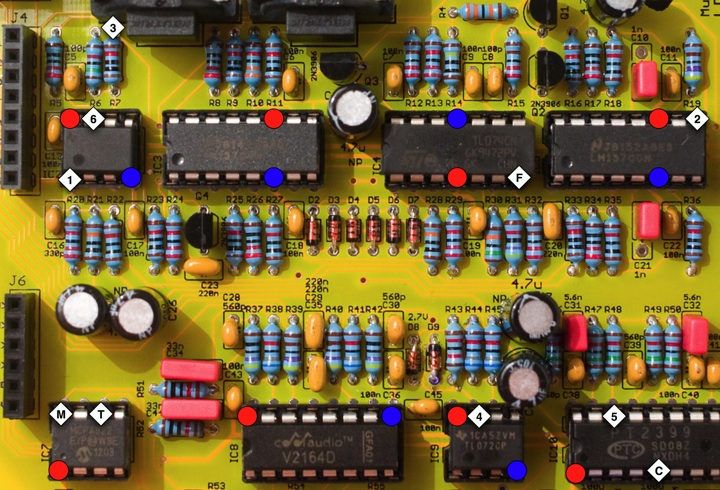

This filter boards combines a raw OTA-C 2-pole filter, combined with a classic lo-fi delay.

Using this filter board
-----------------------

**Important!** The Shruthi-1 control board needs to send specific digital control signals to drive this filter board.

-   Make sure that both the analog (CV1 to +5V) and digital (RX to +5V) ports of the filter and control boards are connected.
-   Make sure that the Shruthi-1 firmware v0.97 (or above) is installed, and that the **fil** (filter board) setting is set to **dly** on the system settings page.

The delay settings can be accessed by pressing the **S2** switch (Filter page) a second time:

     Tim lev fdb eq.
      60  48  12   0

The delay parameters are the following:

1.  **tim (time)**: Delay time. The delay time is expressed in arbitrary units. Due to parts tolerance, the actual delay time might vary by a few percents, and this parameter is not accurately calibrated. The delay time typically ranges from 30ms (0) to 550ms (127). This parameter has a logarithmic scale, so the intermediate delay time (64) is close to 120ms.
2.  **lev (level)**: Delay level. This controls the wet signal level. No delay effect can be heard when this parameter is set to 0.
3.  **fdb (feedback)**: Delay feedback. This parameter controls the level of the signal taken at the output of the delay loop and fed back to the input.
4.  **eq. (fdbck. eq)**: Feedback tone color. A simple EQ circuit is present in the feedback loop. When this parameter is set to 0, the signal fed back into the delay is colored by a low-pass filter with a cutoff of 500 Hz. This causes the echoes to get darker and darker, an effect which is not unlike reverb with short delay times. When this parameter is set to 15, the signal fed back into the delay is colored by a high-pass filter with a cutoff of 500 Hz. This gives the echoes a "dub" flavor.

A few observations about the lo-fi-ness of the delay:

-   Using a longer delay time causes a degradation of the sound quality. Unlike traditional analog BBD delays, this degradation is not a bandwidth reduction, but rather a combination of a bandwidth reduction and the addition of quantization noise. This is due to the 1-bit sigma/delta conversion used in the PT2399.
-   The frequency response of the filter circuit in place around the PT2399 has a slight bump near 3kHz. This means that when feedback level is too high, a 3kHz tone will build up into the delay line. Whether this build-up is musically useful or annoying is up to you to decide, but we deliberately allowed this to occur. Thus, some combinations of the **fdb** and **eq.** parameter, particularly with **eq.** set to a high value and **fdb** greater than 10, will cause pathological feedback to occur.
-   In order to make quantization noise less audible when long delay times are used, the signal is heavily amplified in the mixer at the input of the delay line, with a soft-limiter in place to prevent clipping. Don't be surprised if the echoes are more "fuzzy" than the original signal. This is particularly noticeable with high feedback times when many echoes add up to each other, causing the soft-limiter to get into action and add harmonics to the sound.

Schematics and PCB
------------------

You can find the Eagle files for this board in the shruthi/hardware\_design/pcb directory of the source code hosted on [github](http://github.com/pichenettes/shruthi-1).

The schematics in PDF format are [here](../static/schematics/Shruthi-Analog-LP2Delay-v02.pdf).

You can refer to Tim Stinchcombe's [notes](http://www.timstinchcombe.co.uk/synth/MS20_study.pdf) for an analysis of the filter core.

Bill of materials
-----------------

[Bill of materials.](https://docs.google.com/spreadsheet/pub?key=0Ai4xPbRS5YZjdFZXbG9FVEk4WW1Mc056M1BhQUpKVUE&output=html&widget=true)

**Important note to builders using self-sourced PT2399s.**

Some batches of PT2399s are more prone to clock latchup when short delay times are used (something that happens when the board is powered up and the delay time is initialized to its minimal value). If you encounter problems with the delay - such as the delay randomly not working when the board is powered on - simply replace R58 by a higher value, such as 27k or 30k. This has the side-effect of shifting up the delay times range.

The PT2399s that come with the kits have been tested and do not require the modification (R58 = 22k as printed on the board).

Assembly
--------

For parts placement, you can refer to [this pdf file](../static/images/shruthi_delay.pdf) during assembly.

Start with the smaller resistors:

-   6x 220R (red, red, black, black).
-   4x 470R (yellow, purple, black, black).
-   4x 2.2k (red, red, black, brown).
-   3x 4.7k (yellow, purple, black, brown).

More resistors:

-   14x 10k (brown, black, black, red).
-   1x 12k (brown, red, black, red).
-   7x 15k (brow, green, black, red).
-   5x 22k (red, red, black, red).
-   1x 33k (orange, orange, black, red).
-   1x 47k (yellow, purple, black, red).
-   4x 68k (blue, grey, black, red).

More resistors:

-   2x 100k (brown, black, black, orange).
-   1x 150k (brown, green, black, orange).
-   1x 330k (orange, orange, black, orange).
-   1x 1M (brown, black, black, yellow).

Note that 3 bridges have been added on the IN, OUT and SW pads - since we don't use input/output gain pots and power switches.

Add 6x 1N4148 diodes. They are polarized, make sure that the black ring follows the pattern silkscreened on the PCB. Add 2x 2.4V Zener diodes (this photo of an older board shows 2.7V, but the right value is 2.4V). They are polarized too.

Add the polarity protection diode (1N4001 or 1N4004). It is polarized.

Add the ceramic capacitors. They are not polarized:

-   1x 10pF (labelled 100).
-   2x 100pF (labelled 101).
-   1x 330pF (labelled 331).
-   6x 560pF (labelled 561).
-   20x 100nF (labelled 104).
-   4x 220nF (labelled 224).

Add the IC sockets.

Add the film capacitors (2x 33nF, 2x 1nF, 2x 6.8nF or 5.6nF). They are clearly labelled with their value, and are not polarized.

Add the 4x 2N3906 transistors, and the 2N3904 transistor. Beware of their polarity!

Add the electrolytic capacitors. The 6x 4.7uF capacitors are not polarized (a + and - are silkscreened on the PCB, don't bother with those). The 5x 100uF and 2x 220uF capacitors are polarized. The white stripe on the edge of the capacitor indicates the minus lead (which is also the shortest one).

Here is another view of the board:

Add the tantalum capacitor. A stripe indicates the + the lead.

Add the 20k trimmer.

Add the connectors and the 2 voltage regulators (7905 and 7805). **Don't mix them up, these are different parts!**

You can finally insert all ICs

The last step consists in tuning the filter, to make sure that the cutoff frequency of the filter follows a musical scale: increasing the cutoff setting on the Shruthi by 12 (or playing a note 1 octave = 12 semitones higher) should double the cutoff frequency.

First, you'll need to assemble the filter and control boards. Maybe you can start screwing them together onto the bottom plate of the enclosure or you can just temporarily sandwich female 1x8 and 1x6 connectors between the boards for testing.

Dial the following settings on the Shruthi-1:

-   Oscillator 1 shape: **none**
-   Oscillator 2 shape: **none**
-   Filter cutoff: **64**
-   Filter resonance: **63** (maximum value)
-   Filter envelope and LFO modulations: **0**

Play on the keyboard. You should hear a pure tone (sine wave), which does not come from the Shruthi-1 oscillators but from the filter self-oscillating. Adjust the V/Oct trimmer so that the **intervals** are respected - that is to say, when you play C3 then C4, you should hear two notes, maybe not C3s and C4s, but they must be one octave apart. If you do not have a good sense of pitch, you can try a software tuner like Tuna Pitch on OS X. If the filter is correctly tuned, you should be able to play the filter "self oscillation tone" across roughly 4 octaves with correct tuning.

Troubleshooting
---------------

-   RED: +5V
-   BLUE: -5V
-   **1**: Mixer output (raw oscillators signal)
-   **2**: Filter output
-   **3**: VCA output
-   **4**: Delay mixer input (this is what goes into the delay: input signal + feedback)
-   **5**: Delay output. This signal is referenced to +2.5V
-   **6**: Output amp output. This is the sum of the signal at the output of the VCA + the delay output attenuated according to the dry/wet control.
-   **F**: Filter cutoff expo converter input. Should swing by +/- 100mV when cutoff is adjusted.
-   **C**: Delay clock. High frequency signal visible with a scope, should speed up/slow down proportionally to delay time.
-   **M**: Wet signal attenuation CV. 0V when delay level is set to 63 ; 4.1V when delay level is set to 0.
-   **T**: Delay time CV. 0V when delay time is set to 0 ; 1.0V when delay time is set to 127.

License
-------

This circuit and PCB layout is made available under a **cc-by-sa-3.0** license.

Releases
--------

### v0.2

-   First stable prototype. v0.1 used a digital pot to control the delay time and level and this was a rather bad design choice.

