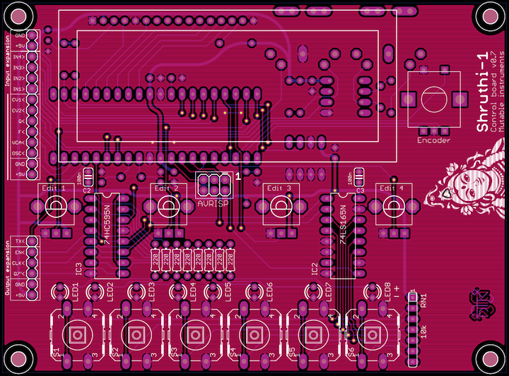
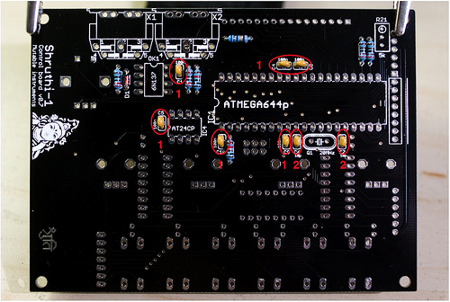
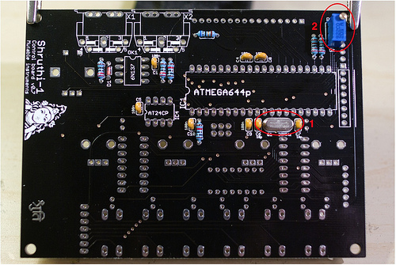
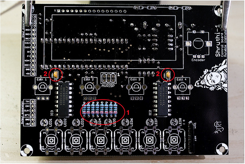
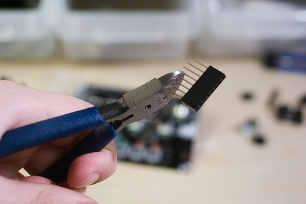

Schematics and PCB
------------------

The digital/control board hosts the main microcontroller (ATMega644p), the switches/pots/LEDs, the LCD display, and the MIDI interface. It is powered by a regulated 5V supply located on the analog filter board.

Here's a view of the board:

\

It has parts on both sides, but there's no overlap between the two regions, so when there's parts on one side, there won't be much action on the other side! The LCD has to be soldered last, since it will cover the ATMega644p pins. Otherwise you can start from whichever side you prefer.

You can find the Eagle files for this board in the `shruthi/hardware_design/pcb` directory of the source code hosted on [github](http://github.com/pichenettes/shruthi-1).

The schematics in PDF format are [here](../static/schematics/Shruthi-Digital-v08.pdf).

Bill of materials
-----------------

[Full-page version](https://docs.google.com/spreadsheet/pub?key=0Ai4xPbRS5YZjdG83ZnN2MWxSRmZaWkJPNWRhTmNndFE&output=html&widget=true)

Some notes:

1.  Resistors don't have to be 1% metal film, 5% carbon are fine for this board. But since there are 1% resistors with the same values in the filter board, it's a better deal to get 1% for everything.
2.  The reference from Farnell is for a 1+8 network that will have to be cut (ouch) to get the required network of 6 resistors. The reference from Digikey is a 1+7 network.
3.  The quartz sold on Reichelt have a surprisingly high capacitance (32pF). Buy at your own risks!

### Parts to avoid.

1.  **Reichelt ST 24C64 BN6**. Slow as molasses. If you really insist on using it, you need a hardware fix (increase the value of the 2.2k pull-ups to 6.8k or 10k) and a software fix (change the write delay to 10ms, set the I2C speed to 25kHz).
2.  **Reichelt RK09K113-LIN10K**. Do not have a D-shaped shaft. The end of the shaft is supposed to look like a miniknob.
3.  **Crystalfontz LCDs**. Very clean and bright display at a cost: they draw too much current. You need to replace R20 by a 8R resistor, but then the display dim and there's some heavy "motorboating" in the sound whenever you play a note, unless you put a beefier power supply (a 500mA rated wall-wart might not be enough, worked well with 650mA or 1500mA wall-warts).
4.  **Displaytech LCDs**. Their metallic, conducting frame might cause shorts between the pins of the ATMega644p beneath.

Assembly instructions
---------------------

If you are building a complete Shruthi-1 kit, it is recommended to build the filter board (or at least its power supply section) before starting this board.

### Getting ready

Locate the following parts/bags from the kit:

Some equipment you'll need:

1.  Soldering iron + solder (nothing fancy, a 15 or 20W will do).
2.  Cutters.

We assume you know soldering. If you don't, look first at [this tutorial](http://www.instructables.com/id/How-to-solder/). We highly recommend you to purchase a simple kit from [adafruit](http://www.adafruit.com) or [sparkfun](http://www.sparkfun.com) to practice on something that you won't regret breaking.

A last word: be patient! we know you're just a couple of hours away from playing your Shruthi-1, but if you do something stupid, those hours will turn into days or weeks.

**DISCLAIMER:** We are not responsible for anything wrong (including electric shocks, malfunctions, fires, accidents involving a soldering iron) that might happen during the assembly of the kit. Everything you do while assembling the kit is at your own risks.

### Step 1

First, we will populate the bottom side of the board - starting by the shortest and smallest parts. Add the following resistors:

1.  R20 (68R, blue, grey, black, gold). **This resistor sets the brightness of the LCD display. If you find a smaller resistor in your kit, such as 3.3 ohms (orange, orange, black, silver), instead of 68 ohms, use it there!** This is because different LCD displays have different requirements in terms of brightness.
2.  R19 and R18 (220R, red, red, black, black)
3.  R1, R14 (10k, brown, black, black, red)
4.  R16 and R15 (2k2, red, red, black, brown)

### Step 2

Then, add the capacitors. These are small ceramic capacitors, and thus, they are not polarized.

1.  C1, C4, C8, C5 (100nF caps, not polarized). The latest revision of the board (v0.7) has two more of those, C9 and C10.
2.  C6, C7 (18pF caps, not polarized)

The 18pF capacitors might look different from those on the picture, but you can recognize them with the **180** or **18** label. 100nF capacitors are labelled **104**.

### Step 3

Finally, add the diode D1, which is **polarized**. The black ring of the diode should point towards the MIDI connectors.

### Step 4

Add:

1.  The 20MHz quartz at the position labelled Q1.
2.  The trimmer (resistor adjustable with a screwdriver) R21. You can mount it in either orientations.

### Step 5

Add:

1.  The 3 IC sockets (2 DIL8 and 1 DIL40). Make sure that the notch is in the same direction as printed on the PCB.
2.  The 2 MIDI connectors. You can start by the biggest pad at the center to keep the part in place, then solder the other pads.

At this step, you'll need to carefully cut, on the other side of the board, the leads of the parts (including the IC socket) in the area covered by the LCD module. Since there are a few SMT parts at the bottom of the LCD module PCB, you'll have to make sure that the leads are cut as short as possible to avoid unwanted shorts between the two boards.

### Step 6

&lt;div class="warning"&gt;The 220R resistors soldered at this step are current-limiting resistors for the LEDs - they set the brightness of the LEDs. The 220R value printed on the circuit board is suitable for standard low-intensity green, yellow or red LEDs - and a lower value could indeed damage the LEDs. For blue or white LEDs, a higher value, such as 1k, must be used.&lt;/div&gt;

Now insert and solder the small parts on the top side of the board:

1.  R2 to R9 (220R ; red, red, black, black - or if your kit is supplied with them: 1k ; brown, black, black, brown).
2.  C2, C3 (100nF caps marked **104**, not polarized).

### Step 7

Insert and solder the following parts:

1.  IC2 and IC3 (74hc165 and 74hc595). If you have an older version of the kits, these have to be soldered directly on the PCB - in which case you have to be very very careful about the orientation of the chips (the notch on the PCB must be on the same side as the notch on the chip), and of course not swapping them. The new batches of kits have IC sockets, so just solder the sockets here; and socket the chips.
2.  RN1 (10k). This part is a network of 6 resistors sharing a common pin. It is **polarized**: The common pin is marked by a white dot. This dot should be near the "RN1" and "-" markings of the board.

### Step 8

Add the LEDs. They are **polarized**, the shortest lead and flat side of the LED (-) are on the side of the switches ; the longest lead and rounded side of the LED (+) are on the side of the resistors.

Note that the colors and types of LEDs vary from batch to batch of kits - but no matter how they look, they need to be soldered the same way!

### Step 9

Solder the 8-pin male connector through which the two boards will be connected. Here is a photo of a **finished** assembly, with the part to solder highlighted:

The connection between the two boards is ensured by a 8-pin female header on the filter board, a 8-pin female header stacked onto it, and the connector you have just soldered. You might need to clip the leads of the header in the middle.

\

### Step 10

Add the controls - the 4 potentiometers, the encoder and the 6 switches.

If the 2 legs on the side of the potentiometers do not fit in the holes on the PCB, don't panic! There is a wide tolerance in the PCB plating process which can cause an excessive accumulation of conductor on the PCB holes. File the holes until the potentiometers fit. It is not recommended to leave these 2 joints unsoldered - they help keeping the potentiometers solidly attached to the PCB.

### Step 11: a first test!

Even if the LCD screen is not soldered yet, you can already try to power up the Shruthi-1. Indeed, it is highly recommended to do so, since the LCD module will later cover some solder pads, preventing you to fix a bad solder point on the MCU. For now, the pads are still apparent, so it's a good time to make a first test.

&lt;div class="error"&gt;When temporarily connecting the control board to a filter board, without any spacer in place, make sure that the solder points at the bottom of the control board do not touch parts on the filter board, especially the metal tab of the regulators. This could easily short and damage parts on the control board.&lt;/div&gt;

Insert the 3 ICs (ATMega644p, AT24C and 6N137) in their sockets on the bottom side of the board. Be careful with their **orientation**. Connect a filter board, or, if you have not assembled the filter, a 5V power supply to +5V and GND. The Shruthi-1 should boot and the 3rd and 7th LED should be lit.

Press each of the switches several times to verify that the Shruthi reacts to key presses, and that all the LEDs are lit. Rotating the encoder should scroll through the different pages - which will be shown as different LED patterns. You can even connect it to a MIDI keyboard and an amp/mixer to play it.

### Step 12

If all sounds good, insert the 16x1 connector between the LCD module and the PCB, and solder it first to the LCD module, and then to the main PCB. Be careful and keep the module aligned with the PCB!

As you can see on this picture, the PCB of the LCD module is maintained at a height of 2.5mm above the main PCB by the black plastic part of the 16x1 connector. No need to add some extra height. The 6 black "feet" of the LCD module rest on the PCB. Don't worry about shorts: the material of the LCD bezel does not conduct.

### Step 13

Finally, adjust the contrast of the LCD:

1.  Turn the screw of the trimpot R21 counterclockwise until you have reached the end.
2.  Power the Shruthi-1 and check that the display is very bright but illegible.
3.  Turn the trimpot a few turns clockwise (it really depends on the LCD type - from one or two turns for the red ones, to four or five for the blue ones).

### Step 14

If your filter board is ready, you can now add the spacers and screw the two boards together.

If you are using an "official" plexiglass case, start with the following steps:

1.  Remove the protective sheets from the plexiglass panels
2.  Clean the panels to remove the dust
3.  Try putting together the 6 panels and check that the case does not appear bent / warped. If this happens, swap (inside &lt;-&gt; outside) the bottom panel ; then the side panels. The heat of the laser might bend the material by a fraction of mm ; so the concave side must be on the inside.
4.  Notice the little dot engraved on the bottom panel. It indicates the front side
5.  Ready to go? Start assembling the "sandwich" from the bottom to the top:

The composition of the "sandwich" is, from bottom to top:

1.  12mm screw (15mm in some kits)
2.  Bottom enclosure panel
3.  2mm nut
4.  Filter PCB
5.  Washer
6.  22mm Spacer (older kits have a 20mm spacer and four extra 2mm nuts)
7.  Digital/control PCB
8.  6mm screw

Troubleshooting
---------------

### When the digital board is powered, the LEDs show a x-x-x-x- pattern and the unit seems to freeze.

This could be one of the following problems:

-   Bad solder point on the 74hc165 or the resistor network.
-   Damaged 74hc165 (this might happen if the solder points under the digital board made contact with another part on the filter board).
-   Swapped 74hc165 and 74hc595.

### The Shruthi seems to boot correctly (LEDs 3 and 7 are lit), but the display is empty.

If the display shows a filled line (16 7x5 filled squares) and an empty line: there's a communication problem between the LCD module and the MCU. One of the LCD module pins is not correctly soldered or is shorted with its neighbor. In last resort check the continuity between the pins of the MCU that are connected to the LCD. If you observe shorts between some of those pins, it's likely that the AVR has been damaged by an electrostatic discharge.

If the display shows 2 filled lines: the contrast is set to its maximum value, in the wrong direction. Turn the R21 trimmer by about 5 turns (you'll notice it if you turn it in the wrong direction – you'll have reached the end of the trimmer and a slight click will be heard at each turn).

If the display shows nothing: the contrast is set to an incorrect value. Try adjusting the R21 trimmer until you see the text or the filled line. Check for bad joint in the contrast trimpot – in particular check that the GND pin is correctly soldered. Grounded points are more difficult to solder due to the ground-plane absorbing the heat.

Remember that even if the MCU is dead, blank, or removed from its socket, the LCD module will show a filled line. If you don't see the filled line or the splash screen, there's a problem with the contrast setting.

### MIDI does not work.

When a MIDI note arrives in the Shruthi on the right channel, it shows a note icon in a corner of the screen. The first thing is to make sure that the controller/keyboard sends on the right channel, 1 by default.

Other things to check:

-   Is the 6N137 correctly oriented? Check that it has not been swapped with the eeprom chip.
-   Check that pin 5 of the 6N137 is continuous with ground, and pin 8 is at a voltage of +5V.
-   Check that pin 6 is at +5V, and drops to a lower voltage when a large string of MIDI messages is sent (for example, wiggle the pitch bend lever).

### The parameter values seem to be "flickering" – as if the pots were constantly tweaked by an invisible and ghostly hand.

Your power supply is not providing enough current, and this cause oscillations on the +5V rail. Try a different power supply with a higher current rating.

Kudos
-----

[Todd Bailey](http://narrat1ve.com/) for useful board layout reviews!

Releases
--------

### v0.8

-   Rounded corners
-   Logo and text redesign

### v0.6, v0.7

-   Changed position of ISP header and modified routing of clock lines to reduce digital noise.
-   Added an extra bypass cap on the MCU RST line, and near the digital supply pin for extra stability.
-   Added extension port for external programmer or LED array.
-   Added solder pads for MIDI connector.
-   Changed MIDI pull-up resistor to 10k.
-   Changed labeling of ports.

### v0.5

-   Original release.

