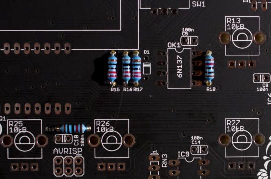
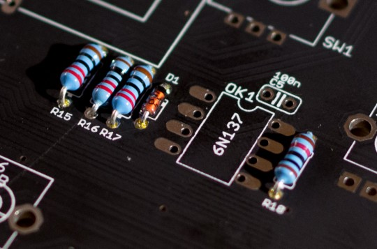
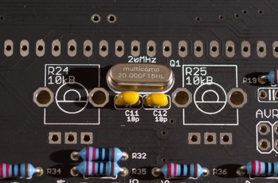
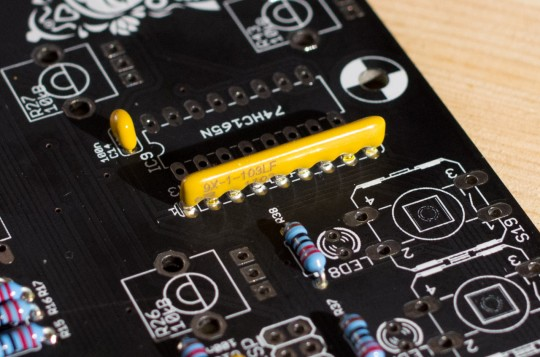
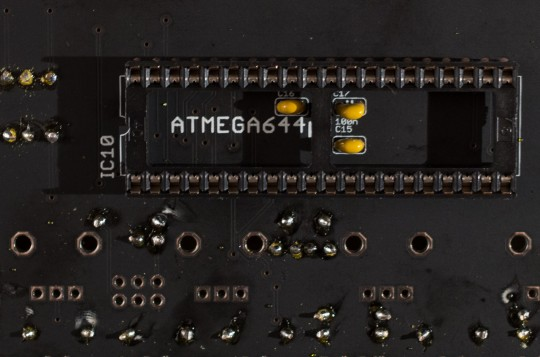
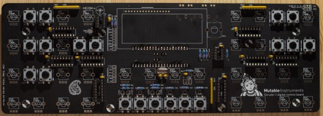
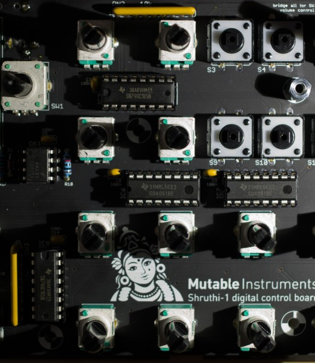

Assembly instructions
---------------------

We assume you know soldering. If you don't, look first at [this tutorial](http://www.instructables.com/id/How-to-solder/).

**DISCLAIMER:** We are not responsible for anything wrong (including electric shocks, malfunctions, fires, accidents involving a soldering iron) that might happen during the assembly of the kit. Everything you do while assembling the kit is at your own risks.

**Note:** There are a few mechanical changes (number, position and diameter of holes) between the production version of the board and the one shown in these instructions. This has no impact on the assembly procedure; and the parts and circuits used are the same.

### Resistors, first decade

Add 11x 220R resistors (red, red, black, black, brown). Resistors are not polarized, but following our illustrations will give you bonus point if you ever request help on the forum. R15, R16 and R17 are used for current limiting in the MIDI I/O, their values are chosen to match the MIDI specifications. R31 to R38 are current-limiting resistors for the LEDs. You can increase their value to 1.0k or even 4.7k if you use blue or white LEDs. Flat top LEDs just look better given the 4.6mm thickness of the plexi & alu top panels.

### Resistors, second decade

Add 2x 2.2k resistors (red, red, black, brown, brown) in positions R9 and R10. These are pull-up resistors for the [I2C](http://en.wikipedia.org/wiki/I%C2%B2C "I2C") bus that connects the processor and the EEPROM memory storing the patches.

### Resistors, third decade

Add 2x 10k resistors (brown, black, black, red, brown) in positions R18 and R19. R18 is part of the MIDI reception circuit (pull-up for the optocoupler output), while R19 keeps the RESET line of the microcontroller at a high logic level to keep it running.

### Bridges

The volume pot R8 on the top right corner of the panel can modify the volume in two ways: digitally, by reducing the level of the VCA envelope; or in the analog domain by directly attenuating the final output level. The first option does not require messy wires and is the simplest to build - its drawback is that a loss of resolution in the VCA envelope can be heard at low volumes. The second option requires wiring - which can also cause noise and catch nasty signals if done wrong.

#### Digital volume control

Solder 3 bridges like this: 

They can be made of discarded resistor leads.

#### Analog volume control

Bridge the top right and top center pins (JP1) ; and solder wires to the 3 pads above the pot (JP2). 

Connect these wires to the 3 pads near the filter board's output jack.

### Diode

Add the diode 1N4148 in position D1. The diode is polarized, the ring of the diode must be on the same side as the ring on the diagram printed on the board. This diode protects the MIDI in circuitry (optocoupler) from badly built MIDI cables or MIDI out circuitry.

### Quartz and friends

Add the 20 MHz quartz (not polarized) and the two 18pF ceramic caps that surround it in positions C11 and C12. They are not polarized and the value 180 is printed on them (180 = "18 with 0 extra zero pF = 18pF"). These three parts form - with the help of some circuitry inside the microcontroller - an ultra-stable 20 MHz oscillator which defines the speed at which the microcontroller runs. The quartz is extremely precise and barely sensitive to temperature changes - this is why digital oscillators are stable and do not need tuning.

### Bypass capacitors

Solder the 3x 100nF ceramic capacitors on the bottom side of the board. The number "104" is printed on them (10 x 10\^4 pF = 100nF). These capacitors are not polarized. They are known as ["decoupling capacitors"](http://en.wikipedia.org/wiki/Decoupling_capacitor). Their role is to provide a local reservoir of energy to an integrated circuit (the microcontroller). This improves the stability of the power supply line, and ultimately prevents cross-talk or unexpected coupling/glitches between integrated circuits. 

Solder the 11x 100nF ceramic capacitors on the other side of the board, in positions C1, C2, C3, C5, C6, C7, C8, C9, C10, C13 and C14. They are also decoupling capacitors, working for the ICs they are located next to.

### Resistor networks

 

 

Add 3x resistor networks in positions RN1, RN2, RN3. The code name of these parts is 9X-1-103LF, which means "this is a 9-pin part made of many resistors sharing 1 common pin, each of them having a resistance of 10e3 = 10k". These parts are polarized! The dot printed on the network indicates pin 1, which must be on the same side as the 1 printed on the PCB. In the Shruthi circuits, these parts play a role in detecting button presses - if a group of buttons is stuck it is worth checking the closest resistor network!

### IC sockets

Make sure that the notch of IC sockets is oriented on the same side as the notch on the PCB symbol. This does not change anything electrically, but having the notch in the right position is a helpful hint for correctly inserting the IC in the next steps! 

 

Add 2x DIP8 sockets in positions OK1 and IC1. Add 8x DIP16 sockets in positions IC2, IC3, IC4, IC5, IC6, IC7, IC8, IC9. 

Flip the board and solder a socket on the back for IC10.

### Taller and taller...

Add a 100µF electrolytic capacitor in position C4. This capacitor is polarized. The long lead goes on the "+" side (as printed on the PCB). The white stripe on the side of the capacitor indicates the negative side. This capacitor is a decoupling cap, and helps in preventing noise from the digital/logic circuits and the display to affect the analog circuitry downstairs...

### Switches, pots, connectors

It's now time to solder all the tactile switches. They are not polarized. 

Solder the 1x8 male connector. The kit does not come with a 1x6 male connector for the other group of pads; but you'll have to solder one if you want to use the Shruthi XT with a special control board with multimode filtering or effects.

Add all the potentiometers (they are all the same) and the encoder. 

Add the MIDI connectors. It is recommended to solder only one leg (as shown on the photo) - if necessary adjust their alignment; and once everything is okay, finish soldering all pins.

### Display

Solder the 1x16 male connector to the display. Solder the display to the control board. Try to keep the display as close to the circuit board as possible! The display that comes with your kit is an OLED - it has a little inductor on its back that gets in the way, but we cut a hole in the board for that! If you want to use a LCD display instead of an OLED, there are two extra parts to add:

-   A small resistor (3.3 ohm to 100 ohm - bridge for Newhaven Display parts).
-   A trimmer/adjustable resistor (for contrast adjustment) in position R1.

### LEDs

Put the 8 LEDs in place. Observe the symbol printed on the board. One side of the symbol is flat, the other is round. The flat side indicates the cathode (- pin) - which is also the short lead of the LED. The round side indicates the long lead. The base of LED lens should be elevated roughly 9mm above the PCB level. We recommend you to partially assemble the top of the case with the two panels (plexiglas and aluminum) in place to get the LED elevation right and keep them neatly aligned. Don't cut the leads of the LEDs fully - leave of few millimeters for later adjustments. 

### Integrated circuits

Insert the integrated circuits. Be careful with their orientation - the notch on the IC must be on the same side as the symbol printed on the PCB (and the notch of the socket if they have been correctly soldered). 

 

You can skip the following sections if you are not curious to know how your Shruthi works! The following paragraphs explain what each IC does.

#### 74hc165

They are 8 to 1 parallel to serial converters. They take binary data from 8 inputs, and send them one by one on a single line - this allows multiple inputs to be monitored while using a single microcontroller line (okay, three: a data line, a clock and a latch). Several 74hc165s can be daisy-chained. They are used for reading buttons state. There are 3 groups of buttons on the board, so 3 74hc165s in total. Non-responsive buttons are a symptom of faulty 74hc165s. [Datasheet](http://www.nxp.com/documents/data_sheet/74HC_HCT165.pdf)

#### 74hc595

It is a 1 to 8 serial to parallel converter. It does the exact opposite of the 165s - take a sequence of 8 bits and send them to different outputs. This is what allows the 8 LEDs to be controlled from one single microcontroller line. Incorrect LED patterns are displayed when this part is faulty. [Datasheet](http://www.nxp.com/documents/data_sheet/74HC_HCT595.pdf)

#### 6N137

It is an optocoupler. It allows two different devices to communicate (one sending data to the other) without any electrical connection between their circuitry. One side of the optocoupler is a LED, the other is a light sensor (photo-diode or photo-transistor) that converts the light of the LED back in electrical signals - all this isolated from external light in the darkness of the chip. The optocoupler is used here for MIDI communication. Concretely, this means that when you connect a MIDI keyboard to the Shruthi with a MIDI cable, you are actually connecting the MIDI keyboard to a little LED inside the Shruthi - whose on/off pattern is converted back into an electrical signal. What's the point of doing all this, rather than using a plain wired connection? This allows, for example, the connection between two devices running at different voltages (5V or 3.3V); this prevent ground loop problems; and this prevent any electrical problem/damage on one device to "contaminate" another through the MIDI cable (at worst, the optocoupler will be damaged). The people who designed MIDI knew what they were doing! If you have problems with MIDI reception, this is the part to look at. [Datasheet](http://www.fairchildsemi.com/ds/6N/6N137.pdf)

#### CD4051

They are analog multiplexers. They work like an 8-position switch, whose position can be digitally controlled. They are used to connect all the 29 potentiometers to the microcontroller, which measures their value. For example, when the microcontroller wants to know the position of the cutoff potentiometer, it activates the CD4051 to which the potentiometer is hooked; and it selects one of the 8 positions connecting it to the potentiometer - a bit like telephone exchanges in the old times... Once the connection is established, it runs an analog to digital conversion, and the result is a number giving the position of the potentiometer. The microcontroller permanently does that to scan all potentiometers in a round-robin fashion, at a rate of 20 scans per second on idle potentiometers, and 250 scans per second once a potentiometer has been touched. Check these parts if some potentiometers are not responsive or if the display flickers with random values. [Datasheet](http://www.ti.com/lit/ds/schs047g/schs047g.pdf)

#### 24LC512

It is a 512kbits EEPROM with an I2C interface. It is used here to store patches and presets. The one in the kit is pre-programmed with the "factory" presets. [Datasheet](http://ww1.microchip.com/downloads/en/DeviceDoc/21754M.pdf)

#### ATMega644p

It is the main processor. It has 64kbytes of flash ; 4kbytes of RAM ; 2kbytes of EEPROM and runs at 20 MHz. It handles absolutely everything that happens in the Shruthi - except analog filtering! Of course, it runs code specially crafted for that, that has been programmed onto it during kit preparation. [Datasheet](http://www.atmel.com/Images/doc2593.pdf)

Technical documents
-------------------

### PCB and schematics

The schematics in PDF format are [available here](../static/schematics/Shruthi-Digital-XT-v03.pdf).

You can find the Eagle files for this board in the source code [hosted on github](https://github.com/pichenettes/shruthi-1) (Note: if the files are not present in the main branch, check for the "XT" branch).

If you need a reference during assembly, you can download this blueprint of the [top](../static/images/shruthi_digital_xt_v03_top.pdf) and [bottom](../static/images/shruthi_digital_xt_v03_bottom.pdf) sides of the board. Note that they are at 0.9 scale.

### Bill of materials

The BOM can be browsed online [at this address](https://docs.google.com/spreadsheet/pub?key=0Ai4xPbRS5YZjdFV1YmdGZXdFYmMzV1NfTEZpRWZVd1E&output=html).

Download the [spreadsheet version](https://docs.google.com/spreadsheet/pub?key=0Ai4xPbRS5YZjdFV1YmdGZXdFYmMzV1NfTEZpRWZVd1E&output=ods).

### Licence and credits

This circuit and PCB layout are made available under a **cc-by-sa-3.0** license. The circuit has been designed by Émilie Gillet, with contributions from Frank Daniels regarding UI and mechanical aspects. The firmware is released under a **GPL3.0** license.
