This manual documents the version 1.00 of the firmware - which has been
introduced with the Shruthi XT but can also be installed on the classic
version of the Shruthi.

Getting started
---------------

### Overview

The Shruthi comes either in the **classic** version with only 4 knobs
below the screen; or the **XT** version which provides hands-on controls
on all synthesis parameters. The panel of the **XT** version is divided
into 3 sections: oscillators/mixer/filter ; main control ; and
modulations (LFOs/envelopes). The main control section is the same on
the **XT** and on the **classic** versions.

The main control section consist of the following elements:

-   The LCD or OLED display shows, most of the time, the name and value
    of the 4 parameters that can be directly edited with the
    potentiometers under the screen. When a parameter is modified, the
    display temporarily shows the full name of the parameter and its
    value. In some other circumstances, the display might show a
    confirmation messages, the content of a sequence, etc.
-   The clickable encoder can be used to navigate between
    parameters/pages, or to step through the values of a parameter.
-   The four potentiometers below the display modify the synthesis
    parameters currently displayed on the active page.
-   The 8 LEDs provide complementary information about the active page.
-   The 6 switches facilitate navigation between pages. The switches
    **S1** to **S4** are used to cycle between groups of related pages ;
    **S5** is used to switch between the synthesis pages and the
    sequencer/system pages ; and **S6** is used to bring the load/save
    page to load and recall presets.

The following connectors are available on the rear panel:

-   **1**: 2.1mm DC power jack. The Shruthi can be powered with a
    7.5V-9V unregulated supply, or with a 9V battery adapter. Make sure
    that the connector has a **center pin (or tip) positive** / **outer
    collar (or sleeve) negative pin** polarity. Most universal power
    supplies allows the polarity to be selected -- the polarity being
    often represented by a diagram like this: - (o +, or by the
    indication *tip: +*. The power supply has a reverse polarity
    protection.
-   **2**: MIDI in. This input should be connected to the MIDI out port
    of a sound card, master keyboard, sequencer...
-   **3**: MIDI out. This output can be used as a MIDI thru, but also to
    transmit the notes generated by the Shruthi's internal sequencer,
    backup data, or for polychaining units.
-   **4**: Line-level, mono audio output.
-   **5**: Line-level, mono audio input. Note that the external audio
    signal flows through the VCF and the VCA - you won't hear anything
    until a note or sequence is played by the Shruthi to "open" the VCA.

In addition to the extra knobs for editing synthesis parameters, the
**XT** additionally features:

-   An on/off switch on the back panel.
-   A global **volume** knob.
-   A **Jam** button which holds a note and starts the
    sequencer/arpeggiator.

### Controls and navigation

#### Pages

The Shruthi parameters are edited by blocks of four (one per
potentiometer). A set of four related parameters are grouped together on
a *page*. For example, the **Filter** page will assign the four
following functions to the four potentiometers: filter cutoff, filter
resonance, envelope to filter modulation, LFO to filter modulation. The LEDs **L1**
to **L6** display the currently active page. Moreover, the display is
constantly showing which knob does what in the current page. For
example, if the filter page is active, the display will show:

     Cut res env lfo
     110   0  10   0

Pages are bundled together in groups, and repeatedly pressing one of the
group switches cycles between the different pages in this group. For
example, pressing **S1** cycles between the oscillator 1 page, the
oscillator 2 page, and the mixer page.

Pages are also grouped into two large categories: one category contains
all the pages related to sound synthesis -- the ones you'll navigate in
when creating a sound -- and another category contains all the pages
related to sequencing and to system settings. The switch **S5** is used
to toggle between the two categories. When the **synthesis** category is
active, the LED on top of **S5** is lit. When the **sequencer** category
is active, this LED is not lit. The switches **S1**, **S2**, **S3** and
**S4** cycle through different groups of pages as shown on this diagram:

The upper list shows the pages in the **synthesis** category accessible
from each switch, the lower list shows the pages in the **sequencer**
category. **L7** indicates which page category is active, and the leds
**L1-L6** show which page is active.

Here's an example. The Shruthi displays:

     Cut res env lfo
     110   0  10   0

**L7** is lit (synthesis category) and **L3** is lit: the **filter**
page is active.

Press **S1** to jump into the **oscillators** group. **L1** is lit, and
the screen is now displaying:

     Sha prm rng sub
     saw   0   0 tr1

Press **S1** again to move to the next page in the **oscillators**
group. **L2** is now lit, the screen is displaying:

     Sha prm rng tun
     squ  16 -12  12

Now press **S5** to switch to the **sequencer** category. **L7** is now
off, **L1** is lit. The active page is the **clock** page:

     Mod bpm gro amt
     stp 120 swi   0

Press **S5** again to get back to the **synthesis** category. **L7** is
on, and you are back to the **oscillator 2** page.

#### Editing

When a page is active, a summary of the four parameters modified by each
potentiometer is displayed on screen. While tweaking a potentiometer,
the full parameter name, its value, and the page name, are temporarily
displayed on the screen:

    filter
    cutoff 89

After a short delay, the four parameters page summary is shown again.

On the Shruthi **XT**, modifying any parameter through the switches or
buttons on each side of the central section also brings this temporary
display.

#### Using the encoder.

When the Shruthi is displaying a page summary, the rotary encoder can be
used to scroll through the parameters. The name of the active parameter
is capitalized. For example, resonance is here the active parameter:

     cut Res env lfo
     110   0  10   0

Rotate the encoder clockwise to make **env** the active parameter,
rotate the encoder counter-clockwise to make **cut** the active
parameter. If you continue rotating the encoder clockwise for several
steps, the next page, **env 1**, will be shown, and its first parameter,
**atk**, will become selected. Once a parameter is selected, click the
encoder to edit it. The encoder is now used to increment/decrement the
parameter value. Once the value has been set, click on the encoder again
to move back to the 4 parameter summary.

Note that potentiometer and encoder editing can be combined. For
example, use a potentiometer to quickly adjust a parameter, and then,
while the parameter name is still displayed on the screen, use the
encoder to fine-tune it.

A last trick: if you hold S6 while rotating the encoder, it will
increment/decrement by 10 instead of 1. This is particularly useful for
browsing long lists of patches...

That's all you need to know about the pages/navigation system!

#### Display status symbols

The Shruthi sometimes flashes a symbol on the first line of the display
to signal incoming MIDI messages or the completion of specific commands.

|Symbol |Status |
| :---- | :---- |
|(note icon) | A Note On MIDI message has been received |
|(pitch bend lever icon) | A pitch bend message has been received
|**\~** | A control change message has been received
|**!** | The Shruthi is busy accessing memory - this can interrupt sound generation |
|**x** | The patch has been reset to initial settings |
|**?** | The patch has been randomized |
|**>** | Patch or sequence SysEx data is being sent |
|**+** | Patch or sequence SysEx data has been successfully received |
|**\#** | The Shruthi has received invalid SysEx data (for example a SysEx message intended for another device) |

Reference
---------

The section describes one by one all the parameters accessible on the
**synthesis** and **sequencer** pages.

### Synthesis

Before digging into the pages details, here is a diagram of the Shruthi
signal flow.

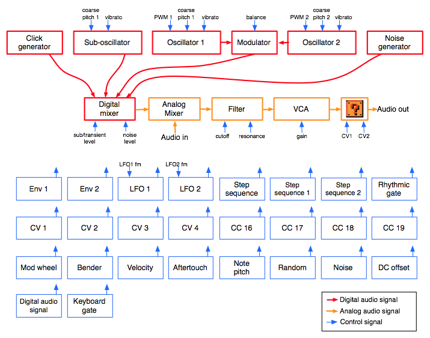

The audio signal flow is represented in red (digital path) and then in
orange (analog path):

-   The oscillators 1 and 2 generate digital waveforms, which are
    combined together by the modulator. The default modulator is a
    balance control over the level of the two oscillators, but more
    esoteric modulation methods are available.
-   The sub-oscillator (which is synchronized in pitch with the
    oscillator 1, but 1 octave lower) also generates a basic waveform.
-   The click generator generates a short transient/click at the
    beginning of the note. Note that the sub-oscillator and the click
    generator cannot be used at the same time. It's bassy-beefy or
    clicky, not both.
-   The output of the modulator, the sub-oscillator/click-generator and
    some additional noise are mixed together. You can adjust the balance
    of each ingredient.
-   The result is converted into a pseudo analog (10 MHz / 1bit) audio
    signal, and mixed in the analog domain with an external signal
    coming from the **Audio in** jack.
-   The result is then sent to an analog VCF and VCA, to produce the
    final audio signal. Some filter boards might offer other signal
    transformations such as additional filters, effects, distortions...

Each of these modules have parameters (represented by the blue arrows)
which can be controlled by any of the modulation sources listed below.
However, some connections are already "hardwired" (or rather "softwired"
in the firmware):

-   The oscillators' pitch always track the note played on the keyboard.
-   The filter cutoff frequency always tracks the note. Again, this can
    be disabled or attenuated by applying a negative modulation from
    note pitch to cutoff frequency. The rationale behind this choice is
    that most of the time, you want 1:1 tracking, so this frees up a
    slot in the modulation matrix for something more interesting!
-   Lfo 2 and Envelope 1 are always connected to the filter, their
    modulation amount being controlled by dedicated parameters on the
    **filter** page.

The following routing programmed in the `init` patch:

| Source | Destination | Amount |
| :--- | :--- | :--- |
| Lfo 1 | Oscillator 1 coarse pitch | 0|
| Lfo 1 | Oscillator 2 coarse pitch | 0 |
| Lfo 2 | Oscillator 1 PWM | 0 |
| Lfo 2 | Oscillator 2 PWM | 0 |
| Lfo 2 | Oscillators balance | 0 |
| Step sequencer | Oscillators balance | 0 |
| Velocity | Oscillator 1 PWM | 0 |
| Velocity | Oscillator 2 PWM | 0 |
| Envelope 2 | VCA gain | 100% |
| Velocity | VCA gain | 25% |
| Bender | Oscillator 1+2 fine pitch | 2 semitones |
| LFO | Oscillator 1+2 fine pitch (vibrato) | 2 semitones |

#### Oscillator 1

     Sha prm rng sub
     saw   0   0 sq1

-   **sha (shape)**: Oscillator 1 waveform shape.
-   **prm (parameter)**: Oscillator 1 parameter. This changes the timbre
    of the generated waveform, in a waveform-specific way (see below).
-   **rng (range)**: Oscillator 1 pitch, from -24 semitones to 24
    semitones (relative the pitch of the MIDI note).
-   **sub (subosc)**: Sub-oscillator shape (see below).

The following is a list of all the available waveforms, with some
applications and a description of what adjusting the **parameter**
setting actually does.

##### **none**: Silence

This simply switches off the oscillator. This might be useful for
filtering/gating external signals, or to temporarily mute an oscillator
when editing a patch.

##### **saw**: Sawtooth

This waveform is perfect for basses and brass sounds. The parameter
controls the waveshapping - when its value is increased, an increasingly
large section of the waveform is shifted up. Note that this is not
intended to be a perfect, drawn with a ruler, sawtooth. It contains a
bit of high-pass filtering to make it sound more Juno-y. This waveform
is band-limited. Thus, only a limited amount of aliasing artifacts will
be heard when playing high-pitched notes.

##### **square**: Square wave

The parameter controls the pulse-width. This waveform is perfect for
simulating a clarinet, for basses, "hollow" sounds or Depeche Mode-like
leads. Note that this is not intended to be a perfect, drawn with a
ruler, square wave. It contains a bit of high-pass filtering to make it
sound more Juno-y. This waveform is band-limited and only a limited
amount aliasing will be heard when playing high-pitched notes.

Note that there's a slight difference in sound when moving the parameter
from 0 to 1. To offer the best sound quality, the pulse width = 50%
flavor is read straight from a wavetable at full sample rate, while the
pulse width &gt; 50% flavor is obtained from two dephased sawtooth
waves, evaluated at half the sample rate. For bass sounds, for which
aliasing is not going to be a problem, it is recommended to use **pwm**
instead of **square** to get a beefier sound.

##### **triang**: Triangle

A pure waveform, which serves as a good basis for flute or
soundchip-like leads. The parameter controls some kind of waveshapping,
clipping the bottom of the waveform. This waveform is band-limited and
will still sound fine above C5.

##### **zsaw**: Phase-distortion sawtooth with filter sweep

This waveform uses phase distortion to recreate a low-pass filtered
sawtooth by progressively "pinching" the phase of a sine wave. The
parameter controls the brightness of the sound: from a sine wave to a
sawtooth, then from a sawtooth to a sawtooth gone through an ugly
transistor amp. Good for dirty bass guitar sounds or clavinets.

##### **zreso**: Phase-distortion sawtooth with resonant filter sweep

This waveform uses phase distortion to recreate a sawtooth sent through
a low-pass filter with high resonance. The parameter controls the
resonance frequency. Useful for doubly-filtered sounds, formants, or
anything where its synthetic, cheesy, feel will shine.

##### **ztri**: Phase-distortion resonant triangle monster

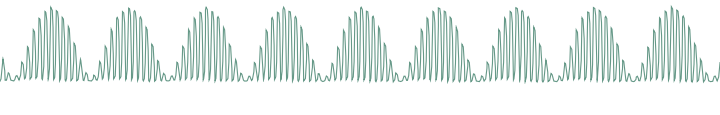

This thing is hard to describe and must be experienced. It sounds like a
resonant filter sweep, but has a very hollow, synthetic quality. It may
or may not have been in the Casio CZ-101. This waveform is likely to
result in whacky sounds, vaguely evoking hardsync.

##### **zpulse**: Phase-distortion trapezoidal creature

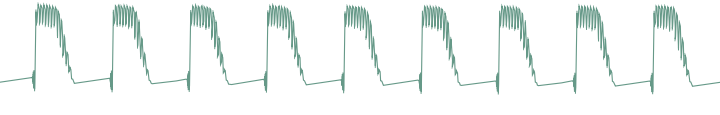

Yet another waveform that makes little sense. When the parameter is set
to 0, it sounds like a fat superposition of a square wave and a
sawtooth. Sweeping the parameter value progressively increases what
sounds like the resonance of an odd, goofily saturated analogue filter.

##### **zsync**: Phase-distortion/self-sync trick

You know the trick: one oscillator playing a low-frequency square wave
and another oscillator a higher-frequency sine wave, the first one
resetting the phase of the second... and the two of them sent into a
ring-modulator! Now roll this into one single sound generator, the
parameter of which controls the frequency ratio of the two oscillators:
we call it zsync... The resulting sound is close to a Jew's harp or
[Morsing](http://en.wikipedia.org/wiki/Morsing) - band-passey and
formantey.

##### **pad**: Stack of 4 detuned sawtooth waves

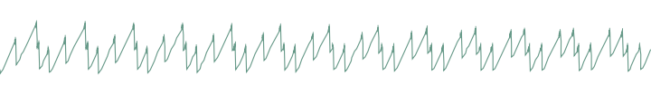

As the name implies, this waveform made of four stacked sawtooth waves
is useful for pads (when a copious amount of filtering is applied) or
for harsh trance leads. The parameter controls the amount of detuning
between the four waves. Note that no bandlimiting is happening here, so
this thing doesn't sound quite good above C5... but it's doing a perfect
job in the bass range!

##### **fm**: Minimal 2-operators FM

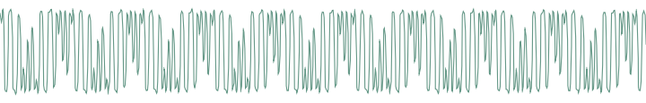

The parameter controls the modulation strength. This oscillator provides
the base material for metallic sounds, bells, metallophones, or the next
386 DX hit.

When the fm oscillator is selected, the **range** parameter plays a slightly different role than usual: instead of controlling the main pitch of the note, it controls the modulator frequency, and has a drastic impact on the timbre.

##### **waves**, **tampur**, **digitl**, **metall**, **bowed**, **slap**, **organ**, **male**: wavetables, wavetables, wavetables!

All these waveforms are wavetables, comprising 16 single-cycle
waveforms. The parameter scans the wavetable, smoothly interpolating
between each waveform. Some of these tables are "transwaves": the single
cycle waveforms were extracted from different "stages" of a sample, and
you can somehow recreate the original sample by using an envelope that
will sweep the parameter from 0 to 127.

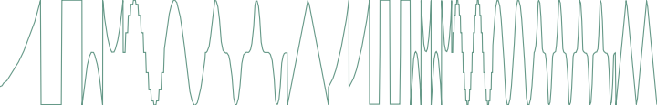

**waves** are 16 basic waveforms, or rather two series of 8 basic
waveforms: waveforms 9-16 are one octave higher.

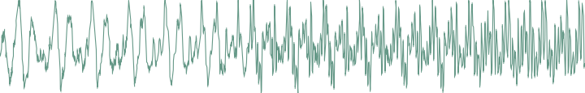

**tampur** is a transwave extracted from a looped
[Tampura](http://en.wikipedia.org/wiki/Tambura) note.

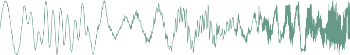

**digitl** is a PPG-wave classic.

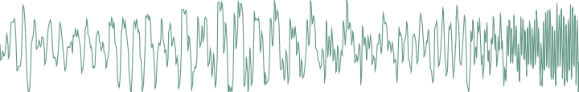

**metall** is made from single cycle waveforms extracted from classic
D50 patches.

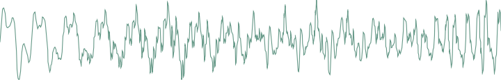

**bowed** is a transwave extracted from cello sounds.

**slap** is a transwave extracted from an SQ-80 slap bass patch.

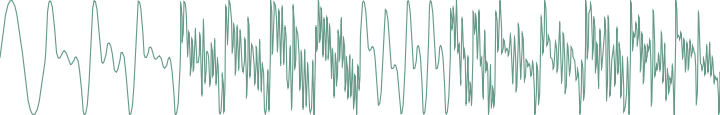

**organ** contains 16 different mixtures of pure tones, ready for some
"Light my fire" action.

**male** is another PPG-wave classic, it sounds vaguely like a human
male voice.

##### **user**: user wavetable

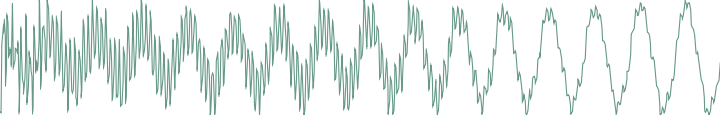

This wavetable has two peculiarities: it is smaller than the other ones
(8 single cycle waveforms, each of them being 129 samples long), and it
resides in RAM instead of residing in flash ROM. By default, it is
loaded with the same content as **digitl**, but its content can be
altered by [SysEx messages](#sysex). You can find
[here](../static/downloads/user_wavetables.zip)
some examples of MIDI files containing user wavetables.

##### **8bits**: bitwise anarchy

A palette of 8-bits sounding waveforms obtained by applying bitwise
operations to a basic sawtooth wave (something now known as
"biscuiting").

##### **crush**: bit-crushed sine and triangle wave

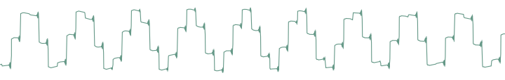

From 0-63, this oscillator will produce a bit-crushed sine wave ; 63
corresponding to the maximum amount of decimation. From 64-127, this
will produce a bit-crushed triangle wave, 64 corresponding to the
maximum amount of decimation. As a result, the transition from the two
waveforms is smooth since the bit-crushing is very heavy when the two
ends meet. A parameter value near 120 yields a very typical *NES bass*
sound.

##### **pwm**: my first Arduino synth

This waveform is a shamelessly naive square wave. The parameter controls
the pulse-width. Contrary to **square**, this waveform stinks aliasing -
but for notes below C2 it is not a real problem: it becomes much more
aggressive and "in your face" than **square**.

##### **noise**: Filtered noise generator

The parameter controls the frequency of a simple 1-pole
low-pass/high-pass filter in which is sent white noise. From 0 to 63,
high-frequency content is progressively added. From 63 to 127,
low-frequency content is progressively removed. Perfect as a raw
material for percussions or sound effects.

##### **vowel**: Low-tech formant synthesis

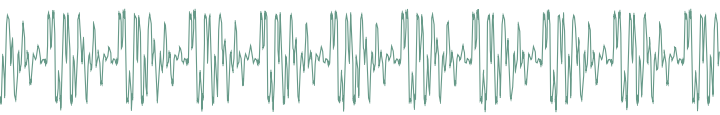

Changing the parameter will sweep between different vocal-like sounds
(14 vowels and 2 consonants). Now. Spell. Daftpunk.

##### Remaining wavetables...

The remaining waveforms are an additional selection of wavetables. Some
of them, like **cello** or **vibes**, are made of single-cycle waveforms
extracted from samples. The others are inspired by some PPG classics!

That's it for the oscillators waveforms. Oscillator 1 is linked to a
sub-oscillator / transient generator. The first 6 settings correspond to
the sub-oscillator, which is an oscillator of its own, playing always
one or two octave lower than the oscillator 1. The next settings disable
the sub-oscillator and enable various transient generators, which will
produce a short, clicky sound at the beginning of the note:

-   **sq1** square sub-oscillator, 1 octave below osc. 1
-   **tr1** triangle sub-oscillator, 1 octave below osc. 1
-   **pl1** 25% pulse sub-oscillator, 1 octave below osc. 1
-   **sq2** square sub-oscillator, 2 octaves below osc. 1
-   **tr2** triangle sub-oscillator, 2 octaves below osc. 1
-   **pl2** 25% pulse sub-oscillator, 2 octaves below osc. 1
-   **click** produces a discrete click (more obvious on sine/organ
    sounds).
-   **glitch** produces a sound similar to that of a skipping CD.
-   **blow** is a burst of noise with a slow attack.
-   **metal** adds a metallic sounding, high-pitched click.
-   **pop** adds a low-pitched discontinuity.

The transient generator can be used for instance to add some punch to
metallic-sounding or FM sounds, or for percussive effects.

#### Oscillator 2

     Sha prm rng tun
     saw   0   0   0

-   **sha (shape)**: Oscillator 2 waveform shape. The available
    waveforms are the same as for oscillator 1.
-   **prm (parameter)**: Oscillator 2 parameter.
-   **rng (range)**: Oscillator 2 pitch transposition, from -24
    semitones to 24 semitones.
-   **tun (detune)**: Fine detuning of Oscillator 2.

#### Mixer

     Op. mix sub noi
     sum  32   0   0

-   **op (operator)**: Modulation operator (see below).
-   **mix (osc bal)**: Oscillator 1&2 balance. Might do something
    different than balance when an operator different from **sum** is
    selected (see the Oscillator 1 section).
-   **sub (sub osc.)**: Sub oscillator or transient generator level.
-   **noi (noise)**: Noise level.

The **operator** parameter controls how oscillator 1 and oscillator 2
are blended together. The different modulation modes are:

| Operator | Description | What does the *mix* parameter do? |
| :--- | :--- | :--- |
| sum | Mixing | Adjusts the oscillator 1&2 balance |
| sync | Mixing and synchronization: oscillator 2's phase is reset whenever oscillator 1's phase is reset. You won't hear the detuning, but instead a timbral modulation | Adjusts the oscillator 1&2 balance |
| ring | Ring modulation - oscillators' signals are scaled and multiplied  | Balance between the original sound and the output of the modulator |
| xor | XOR modulation. The bits of oscillator 1 and 2's digital values are exclusive-or'ed, and the result is shifted | Shifts the output, with overflow |
| fuzz | Fuzz. Oscillator 1 and 2 are equally mixed and sent to a waveshapper with a warm tanh response | Fuzz amount |
| >> 4 | Oscillator 1 and 2 are mixed and sent through a dirty 4x sample rate reduction | Oscillator 1&2 balance |
| >> 8 | Oscillator 1 and 2 are mixed and sent through a dirty 8x sample rate reduction | Oscillator 1&2 balance |
| fold | Oscillator 1 and 2 are mixed and sent through a foldback distortion | Distortion amount |
| bits | Oscillator 1 and 2 are mixed and sent through a bit depth reducer | Bit depth reduction amount |
| duo | Duophony | Adjusts the oscillator 1&2 balance |
| 2steps | Oscillator 1 / 2 cycling | - |
| 4steps | Sound source cycling | - |
| 8steps | Sound source cycling | - |
| seqmix | Sound source cycling | - |

A few words about the last fancy modulation modes...

In **duophony** mode, you can play two-note chords (or bass + melody).
The first note of the chord will be assigned to oscillator 1, and the
second note will be assigned to oscillator 2, like on the ARP Odyssey or
the Polivoks. This works best when **mix** is set to 32 and when
oscillator 1 and 2 are set to the same settings (otherwise small
differences in timing can result in drastic changes as both notes of the
chord will be assigned to different oscillators). If you play more than
2 notes, the least recently played note will be assigned to oscillator
2, the most recently played note to oscillator 1 ; and the other notes
are ignored. The sub-oscillator follows the least recently played note.
Note that the Shruthi is by design a monosynth, with one set of
envelopes & LFOs, and one filter / VCA - both notes will go through the
same filter and have the same envelope, resulting in a kind of weird
paraphonic effect. Don't be surprised if you encounter pitch jumps,
envelope clicks, weird voicing, or if things do not sound and feel as
good as on a polysynth - all these are due to stubbornly trying to fit
duophony into an essentially monophonic design. Ironically, the duophony
mode works best with the arpeggiator - it will move through the chord in
pairs of notes. Try it!

In **2steps** mode, oscillator 1 and oscillator 2 are alternatively on
and off at each new note.

In **4steps** mode, oscillator 1, oscillator 2, the sub oscillator and
the noise source are alternatively on and off at each new note. The
first note you play is played by the sub-oscillator ; the second note by
oscillator 1 ; the third by the noise source ; the fourth by oscillator
2. Try this with the arpeggiator and you get a mini drum pattern!
**8steps** does the same thing, but with a more complex cha-cha rhythmic
pattern.

Finally, in **seqmix** mode, the on/off status of the oscillators / sub
/ noise is controlled by the values in the step sequencer. 1 = osc 1 ; 2
= osc 2 ; 4 = sub ; 8 = noise ; and these values can be added up for
combinations (osc 1 + noise = 1 + 8 = 9). The following table enumerates
all combinations:

| Step sequencer value | Osc 1 | Osc 2 | Sub | Noise |
| :--- | :--- | :--- | :--- | :--- |
| 0 | - | - | - | - |
| 1 | X | - | - | - |
| 2 | - | X | - | - |
| 3 | X | X | - | - |
| 4 | - | - | X | - |
| 5 | X | - | X | - |
| 6 | - | X | X | - |
| 7 | X | X | X | - |
| 8 | - | - | - | X |
| 9 | X | - | - | X |
| a | - | X | - | X |
| b | X | X | - | X |
| c | - | - | X | X |
| d | X | - | X | X |
| e | - | X | X | X |
| f | X | X | X | X |

You can thus use this mode for programming simple drum patterns in the
step sequencer - using the sub oscillator as a bass drum and the noise
as a snare drum, and interweaving notes from the oscillators between the
drum notes.

#### Filter

     Cut res env lfo
      66   0  16  37

-   **cut (cutoff)**: Filter cutoff frequency.
-   **res (resonance)**: Filter resonance.
-   **env (env1-&gt;vcf)**: Modulation amount from envelope 1 to VCF. If
    you want to set a negative modulation amount, you can patch env1 to
    the VCF in the modulations section and ignore this parameter.
-   **lfo (lfo2-&gt;vcf)**: Modulation amount from LFO 2 to VCF. Again,
    if you want to set a negative modulation amount, you can patch the
    LFO 2 to the VCF in the modulations section and ignore this
    parameter.

Note that a second page of filter settings might be available if a
special filter board is used - for example, the dual multimode filter
board has a second menu with the cutoff/resonance of the second filter,
or the filter mode settings. Please refer to the documentation specific
to each filter board!

#### Envelope 1 / 2

     Atk dec sus rel
       0  44  20  60

-   **atk (attack)**: Envelope attack time.
-   **dec (decay)**: Envelope decay time.
-   **sus (sustain)**: Envelope sustain level.
-   **rel (release)**: Envelope release time.

Note that the envelopes are not linear, but have a moderate exponential
slope for snappier action.

#### LFO 1 / 2

     Sha rat atk mod
     tri  52   0 fre

-   **sha (shape)**: LFO waveform. The available LFO waveforms are:
    triangle, square, sample&hold, ramp (sawtooth), step (cycles through
    the sequence of values programmed in the step sequencer). 16
    additional waveforms named \~1 to \~16 are also available. They are
    directly taken from one of the wavetables, are intended to be used
    with slow frequencies, and are very good at mimicking the sounds of
    machines or... human organs.
-   **rat (rate)**: LFO rate.
-   **atk (attack)**: LFO rise time. When this setting is non-zero, the
    LFO will take some amount of time to reach its maximum amplitude
-   **mod**: LFO synchronization mode: when set to **free**, the LFO is
    free-running. When set to **slave**, the phase of the LFO is reset
    every time a new note is played. When set to **master**, the LFO
    will retrigger the envelope (LFO 1 retriggers envelope 1 and LFO 2
    envelope 2). Finally, when set to **1 shot** the LFO will turn into
    a single-cycle envelope triggered on every key press.

Among the choices of LFO rates, the first values, which are prefixed by
a "x", are tempo-synchronized settings. The number following the X
corresponds to the number of sequencer steps that will be used to set up
the LFO period: **x16** simply means that the LFO will go through one
cycle over the duration of 16 sequencer steps (4 beats). For example, if
you set the LFO to a ramp, with a rate of **x4**, and map it to the
cutoff, the cutoff will raise over the duration of a beat and return to
a low value at the beginning of each beat. With a **x2** or **x1** rate,
square LFO mapped to the VCA, you can get old-school trancey gater
effects. With a **x2** rate, sample&hold LFO mapped to the cutoff and
the basic arpeggiator pattern, with high resonance, you get a random
bleeping at every note.

#### Modulation matrix

In this page, the routing between the modulation sources and
destinations is configured. The first important thing about this page is
that it works a bit differently from the others: the potentiometer
**P1** is used to select a patchcord, while **P2**, **P3** and **P4**
are used to edit it.

Here is an example:

     Mod src dst amt
       1 lf1  ~1   0

This page means: "The patchcord \#1 connects the LFO1 to the oscillator
1 pitch, and the corresponding modulation amount is set to 0". By
turning the first knob, you can scroll through the different connections
in place, for example:

     mod src dst amt
       9 en2 vca  63

"The patchcord \#9 connects the envelope 2 to the VCA gain, and the
corresponding modulation amount is 63".

Once a patchcord is selected with the first knob, the
source/destination/amount are edited with the 3 other knobs. Note that
you can see in details the source and destination when tweaking one of
those parameters:

    mod en>vca
    amount 62

When editing modulations, **L6** blinks/is dimmed to reflect the value
of the selected modulation source.

The modulation sources are, in modern lovers precise order:

1.  **lfo1**, **lfo2**: LFO output (centered).
2.  **stpseq**: Step sequencer output.
3.  **stpsq1**: Step sequencer's little brother 1: it cycles on the
    first 8 steps of the sequence.
4.  **stpsq2**: Step sequencer's little brother 2: it cycles on the last
    8 steps of the sequence.
5.  **arp**: Rhythmic gate signal, which outputs a high value when the
    arpeggiator or sequencer contains a note at the current step, or 0
    when there is no note.
6.  **mwheel**: Modulation wheel value read from the MIDI input.
7.  **afttch**: Aftertouch value read from the MIDI input.
8.  **bender**: Pitch-bend controller value read from the MIDI input
    (centered).
9.  **offset**: A boring constant value. This is useful if you want to
    output a fixed value to one of the CV outs.
10. **cv1**, **cv2**, **cv3**, **cv4**: Control voltages read from the
    CV input pins. By default, the input pins are floating, so it's
    likely that these modulation sources will sound just like noise.
    These modulation sources do nothing on the Shruthi XT (which does
    not have extra CV pads).
11. **cc A**, **cc B**, **cc C**, **cc D**: Value of the Control Change
    16, 17, 18 and 19.
12. **noise**: Another noise generator! Mapped to the VCA, makes for
    some super snares!
13. **env1**, **env2**: Envelopes.
14. **velo**: Note velocity.
15. **random**: A random value updated every time a new note is played.
16. **note**: Pitch of the currently played note (centered).
17. **gate**: Keyboard gate signal, null when no key is currently
    pressed.
18. **audio**: Digital audio signal produced by the mixer. Please note
    that since the modulation matrix is recomputed at 976Hz, some
    serious aliasing is happening here. You're not going to do FM with
    this thing, most of the time it sounds like crap, but it's something
    fun to experiment with!
19. **op. 1**: Operator 1.
20. **op. 2**: Operator 2.

The modulation destinations are, in modern lovers precise order:

1. **pwm1**: Oscillator 1 parameter (can be pulse width, but also
waveshapping, phoneme, etc. depending on the oscillator type).
2. **pwm2**: Oscillator 2 parameter (can be pulse width, but also
waveshapping, phoneme, etc. depending on the oscillator type).
3. **osc1**: Coarse oscillator 1 pitch, in a -16 / 16 semitones range.
Also affects the sub-oscillator's pitch.
4. **osc2**: Coarse oscillator 2 pitch, in a -16 / 16 semitones range..
5. **osc1+osc2**: Coupled oscillator 1+2 pitch, in a -4 / 4 semitones
range. Also affects the sub-oscillator's pitch.
6. **fine**: Fine oscillator 1+2 pitch, in a -1 / 1 semitones range.
Also affects the sub-oscillator's pitch.
7. **mix**: Oscillator 1&2 balance (or whatever the modulator does with
the balance parameter).
8. **noise**: Noise volume.
9. **subosc**: Sub-oscillator volume.
10. **cutoff**: Filter cutoff.
11. **reso**: Filter resonance.
12. **vca**: VCA gain.
13 **cv1**, **cv2**: Control signal for the CV output \#1 and \#2. When
a special filter board is used, this controls a parameter of an
additional sound processing unit, such as a secondary filter, a delay,
etc. Please refer to the documentation specific to each filter
board!
14. **attack**: Envelope 1 and 2 attack speed. For example, map velocity
to this modulation destination to have a faster attack time on notes
played with a high velocity.
15. **tr11**, **a1**, **d1**, **s1**, **r1**: Envelope 1 trigger, attack,
decay, sustain, release.
16. **tr12**, **a2**, **d2**, **s2**, **r2**: Envelope 2 trigger, attack,
decay, sustain, release.
17. **atk**: Envelope 1 & 2 attack time.
18. **lfo1**, **lfo2**: Frequency modulation of the two LFOs.

One thing that requires a bit of clarification is the notion of
"centered" modulation source. Let's take an example. We have a triangle
LFO mapped to the filter cutoff, with a modulation amount of 30. If the
cutoff is set to 80, the actual value of the cutoff will oscillate
between 50 (80-30) and 110 (80+30). On the other hand, if we have an
envelope mapped to the cutoff with a modulation amount of 20, the cutoff
will go from 80 to 120 (80 + 2 \* 20), then down to 80 after the
release. This is something to remember if you want to do PWM, for
example. If you set the PWM modulation amount to 40, you also have to
set the oscillator pulse width value to 40, so it will oscillates
between 40-40 = 0 and 40+40=80. Otherwise, it will spend half of the
time stuck at 0. But this makes things nicer for vibrato, tremolo,
wah-wah or growl effects!

Quirk ahoy! The modulation amount of the last patch cord is adjusted by the
modwheel. Huh? Let's say you set patch cord 12 to go from LFO 1 to the
oscillators fine pitch with an amount of 16:

     Mod src dst amt
      12 lf1   ~  16

This modulation will be applied with an amount proportional to the
modwheel position - by default it won't be active until you start moving
the modulation wheel, and to get it at full strength, you'll have to
push the modulation wheel to the max.

#### Operators

Press the modulation matrix button twice to bring the operators page. In
this page, you can configure the two "operators". An operator takes 2
modulation sources, applies a fancy (or not) mathematical operation on
them, and the result is made available as a new modulation source in the
modulation matrix.

     Op. in1 in2 out
       1 lf1 lf2 add

Use the first setting (**op.**) to select which operator to modify. The
second and third options allows you to select which modulation
destination you want to operate on. The last setting is the operation to
apply:

-   **add** adds the values of two modulation sources.
-   **prd** computes the product of the two modulation sources.
-   **max** takes the maximum of the two sources.
-   **min** takes the minimum of the two sources.
-   **xor** totally messes up the two sources.
-   **[=]{style="text-align:right;"}** outputs a large value if source 1
    is above soure 2, 0 otherwise.
-   **[=]{style="text-align:left;"}** outputs a large value if source 1
    is below soure 2, 0 otherwise.
-   **qtz** source 1 is quantized into a number of values set up by
    source 2.
-   **lag** source 1 is low-pass filtered, with a cutoff frequency set
    up by source 2.

There are plenty of things to experiment with... Create a multi-stage
envelope by taking the max of envelope 1 and 2 ; mask a LFO by the step
sequencer ; build a chaotic LFO using feedback and xor modulation
between the two LFOs ; Square the value of a LFO to change its shape...

Here is a more precise example showing how to low-pass filter a square
LFO to create a "soft" modulation source routed to the filter. First,
route the operator 1 output to the filter cutoff:

     Mod src dst amt
       1 op1 cut  63

Then, specify that operator 1 is LFO1 transformed by a "lag processor".

     Op. in1 in2 out
       1 lf1  =4 lag

The **in2** is the filtering cutoff frequency. You can try setting this
to **velocity** too: the harder the note is pressed, the harder the
edges of the LFO are!

Here is another example showing how to quantize an envelope to create a
low-fi "steppy" modulation. First, route the operator 1 output to the
filter cutoff:

     Mod src dst amt
       1 op1 cut  63

Then, specify that operator 1 is a quantized version of the envelope 1:

     Op. in1 in2 out
       1 en1  =4 qtz

### Sequencer and arpeggiator

Before going further, let's get things straight: the Shruthi sequencer
has little in common with the sequencer of, say, a TB-303: it is not
intended to be a "press play and let it do all the work" thing. Indeed,
there's no "play" button on the Shruthi! You have to think of it as an
arpeggiator-like tool - something to help create complex riffs and
patterns with limited keyboard action.

#### Sequencer mode and clock

     Mod bpm gro amt
     stp 120 swi   0

-   **mod (mode)**: Sequencer/arpeggiator mode. This deserves some
    generous amount of explanations, please read further!
-   **bpm (bpm)**: Arpeggiator/step sequencer/LFOs tempo in BPM.
    **extern** will sync the Shruthi clock to the ticks received from
    the MIDI input.
-   **gro (groove)**: groove template. The options are **swing** (uneven
    distribution of pairs of 1/8th notes), **shuffle** (uneven
    distribution of pairs of 1/16th notes), **push** (push the beat),
    **lag** (sloppy drummer!), **human** (humanization) and **monkey**
    (humanization + shuffle). This setting only has an effect when
    **amt** is set to a non-zero value. The swing is only applied to the
    internal clock - not when the Shruthi is slaved to an external MIDI
    clock.
-   **amt (amount)**: amount of groove to apply.

Now let's dig into the sequencer modes...

##### **stp**: step sequencer only

When **stp** is selected, the arpeggiator and pattern sequencer are
disabled. The only pulsating, modulating things running are the LFOs and
the step sequencer.

##### **arp**: arpeggiator

When **arp** is selected, the chords played on the keyboard are
arpeggiated. Releasing the keys for a short amount of time stops the
arpeggio but keeps the clock ticking. Releasing the keys for a duration
greater than that of a bar stops the arpeggio and resets the clock -- it
will restart from the first beat once a chord will be played.

##### **seq**: pattern player

In this mode, the pattern programmed in the sequencer is triggered by
playing a note on the keyboard. Depending on the note you play, the
pattern is transposed: play C4 to play the pattern as recorded, C\#4 to
play it one semi-tone higher, B3 to play it one semi-tone lower, etc.
The pattern will stop whenever the key is released -- but the clock will
continue ticking for the duration of a bar - and if a key is pressed
during this interval, the pattern will resume in time. This mode is most
useful for playing and transposing a bassline.

#### Arpeggiator

     Dir rng pat div
       ?   1   0 /16

-   **dir (direction)**: Arpeggiator direction. The options are up,
    down, up/down, random, and "as played".
-   **rng (range)**: Arpeggiator range, in octaves, from 1 to 4.
-   **pat (pattern)**: Arpeggiator rhythmic pattern. 15 patterns are
    available (see the chart below). The last option in the list,
    **sequence** uses the rhythmic pattern programmed in the sequencer.
-   **div (division)**: This option modifies on which subdivison of the
    internal or external MIDI clock the arpeggiator and sequencer are
    aligned.

##### Arpeggiator patterns

     1: o o o o o o o o
     2: ooo ooo ooo ooo
     3: o o ooooo o oooo
     4: o o oo oo o oo o
     5: oooo oo oooo oo
     6: o  o    o  o    
     7: o  o  o o  o  o
     8: o  o  o  o  o o
     9: o o  o  o  o  o
    10: oo oo oooo oo oo
    11: ooooo oo oo ooo
    12: o   o   o  o o o
    13: o  oo   o o o oo
    14: o     oooooo oo
    15: o       o   o oo

#### Pattern editor

The pattern editor page is very different from the other pages. Here is
how it looks like:

     |00| C3 - 7 0 |
    >|01| C3 - 7 0 |

It contains 5 columns, showing, from left to right:

1.  The step number
2.  The note at this step
3.  The rhythmic event at this step: note (represented by a note icon),
    tie/slide (represented by a -- sign), or rest (empty)
4.  The velocity (applies only to steps with a note)
5.  The step sequencer/controller value at this step, from 0 to 15
    (values from 10 to 15 are represented by the letters a to f)

The pattern can be edited with the potentiometers. **P1** scrolls
through the steps, **P2** changes the note at the current step. **P3**
changes the rhythmic event and velocity value at the current step.
Finally, **P4** modifies the controller value.

The encoder can be used to scroll through the steps. Clicking the
encoder enters the edit mode: a blinking cursor is shown, and the
encoder is now used to increase/decrease the note value. Clicking the
encoder again leaves the edit mode.

While in edit mode, pressing a key on the MIDI keyboard will record the
note number at the current step, and move to the next step. This can be
seen as a naive "step by step recording" mode, which can be used while a
sequence is playing.

Three important notes:

-   The pattern length is by default 16 steps, but this can be changed
    on the **Rhythmic sequencer** or **Step sequencer** pages.
-   The note sequence, rhythmic pattern, and controller (steps) sequence
    all have the same length.
-   The step sequence (controller values) have an effect only when the
    step sequencer is routed to a modulation destination in the
    modulation matrix!

#### Rhythmic sequencer

This page shows, on a single screen, the rhythmic content of the bar
programmed in the pattern editor. It is particularly useful when
programming a rhythmic pattern for the arpeggiator - a task for which
the only information that really matter are the note velocities and
rhythmic events.

The first line of the screen shows the rhythmic events, the second line
the programmed velocities:

    xxx x x x---x---
    777 7 6 54443111

Use **P2** to move the cursor, **P3** to change the rhythmic
event/velocity at the selected step, and **P4** to adjust the pattern
duration. The encoder can be used for editing too: select a step, click,
edit the step value, and click again when done.

#### Step sequencer

This page shows a different view of the controller values programmed in
the pattern editor.

    step sequencer
    0000ffffcccc4444

Use **P2** to move the cursor, **P3** to change the controller value at
the selected step, and **P4** to adjust the pattern duration. The
encoder can be used for editing too: select a step, click, edit the step
value, and click again when done.

**P1** can also be used to shift and cycle the sequence.

### Tuning settings

     Oct rag prt leg
       0 equ   0 off

-   **oct (octave)**: Transpose every note by -2, -1, 0, 1 or 2 octaves.
-   **rag (raga)**: Scale/keyboard mapping.
-   **prt (portamento)**: Portamento time.
-   **leg (legato)**: Legato on/off. This option specifies how the
    Shruthi will interpret overlapping notes. When **legato** is off,
    the envelope retriggers every time a new note is played, and the
    portamento is always applied. When **legato** is on, the envelope
    retriggers only when the new note does not overlap with the previous
    one, and the portamento triggers only on overlapping notes.

The different scales/keyboard mappings are:

| Name | Description |
| ---- | ----------- |
| **equal** | Equal temperament |
| **just** | Just intonation (frequency ratios to C are rational numbers) |
| **pythagorean** | Pythagorean scale |
| **1/4 eb** | E and B are 1/4 tone lower |
| **1/4 e** | E is 1/4 tone lower |
| **1/4 ea** | E and A are 1/4 tone lower |
| **bhaira** ... **rasia** |  A bunch of ragas of the [Maihar gharana](http://en.wikipedia.org/wiki/Maihar_gharana) . Note that it is not possible to play notes outside of the raga - if you attempt to do so, the previously played note will be retriggered. The suggested mode of operation is to find out which keys are active in the raga, and improvise with them! |

### Master tune and MIDI settings

     Tun chn mid
       0   1 ful

-   **tun (tune)**: Master tuning in the -1/+1 semitone range.
-   **chn (midi chan)**: MIDI channel the Shruthi is tuned to. Use 0 to
    receive on all channels.
-   **mid (midi out)**: Data sent to the MIDI out. Refer to [this
    paragraph](#midi_out) from the MIDI implementation section.

### System settings

     Pau sna fil sta
       8 off lpf spl

-   **pau (pause)**: Duration (in increments of 0.128 seconds) during
    which the long parameter name and value is shown on screen when a
    potentiometer is adjusted. When set to 0, the screen always shows
    the four parameters summary. This setting can also be used to enable
    a screen-saver: select one of the options prefixed by 's', and the
    display of the Shruthi will go blank after a few minutes of
    inactivity. This extends the life of OLED displays (but has no
    impact on LCD displays!).
-   **sna (snap)**: Enables potentiometers' "snap" mode. This mode makes
    it less likely to accidentally change a parameter value when
    switching pages. Suppose you're tweaking the filter resonance with
    **P2** -- you rotate it all the way down to 0. Then you switch to
    the oscillator 1 page to adjust the oscillator 2 parameter. If the
    current value of the parameter is set to 64, you'll hear a
    discontinuity, since the value of the parameter will instantly jump
    to 0 or 1 when you start touching the pot. When **snap** is on,
    things will happen differently: rotating the pot will have no effect
    until the position of the pot actually reflects the current value of
    the parameter. After that, the parameter value will track the
    potentiometer's position. Another way to explain it: when **snap**
    is **on** you have to move the pot to "grab" the current parameter
    value before the parameter is modified.
-   **fil (filter)**: Enables software extensions for a specific filter
    board. The default, **lpf** must be selected for the SMR4 filter
    board. **ssm** must be selected for the legacy SSM2044 filter board.
    **svf** is for the dual SVF filter board, **dsp** the digital
    filter, **pvk** the Polivoks filter board, and **dly** the LP2+delay
    filter board.
-   **sta (startpage)**: Selects on which page the Shruthi boots (splash
    screen, filter page, preset load/save page).

The load/save page
------------------

The Shruthi can save in persistent memory the following data:

1.  Patches (16 in internal memory, up to 464 on the external eeprom
    chip). A patch includes all synthesis parameters and the
    sequencer/arpeggiator data; at the exception of the tempo/clock
    settings and the system settings such as MIDI channel,
    transposition, etc.
2.  Global settings (in internal memory).

To load/save a patch, press **S6** from any of the synthesis/sequencer
editing pages.

To load/save global settings, press **S6** from the tuning/MIDI settings
pages, or from the system settings page.

### Patch load/save page

    browse :patch
    1 init

The first line shows the action being performed (load, save, or
compare). The second line shows the program number and its name.

#### Browsing the patch library

Rotate the encoder to browse through the patches. Click the encoder to
temporarily revert to the patch which was being edited before entering
the load/save page: **browse** is replaced by **compare** on the screen.
Click the encoder again to resume browsing patches.

The Shruthi sends a MIDI program change message whenever a new patch is
loaded.

Note that when attempting to load a patch while a sequence or arpeggio
is currently playing, the sequencer/arpeggiator settings stored with the
patch are not loaded. This allows you to listen how different patches
sound while keeping your sequence/arpeggio running.

#### Saving

When the **browse** page is displayed, press **S6** again to jump to the
**save** page. A blinking cursor is shown in front of the patch number:

    save   :patch
    _1 init     ok

-   Click and rotate the encoder to select the program number. Click
    again when done.
-   Rotate the encoder to move the cursor to a letter of the patch name
    you want to modify. Click and rotate the encoder to change the
    letter. Click again when done.
-   Once the patch number and patch name have been set, move the cursor
    to the **ok** button. When selected, it will appear in brackets
    **[]{lang="ok"}**. Click the encoder to confirm... The patch is
    saved!

To cancel and leave the **save** page, press any other switch.

#### Special functions

While the **browse** page is displayed, hold **S6** and press:

-   **S1** to revert the current patch to **init**.
-   **S2** to program random values into all the parameters of the
    current patch.
-   **S3** to dump the current patch to the MIDI output as a SysEx
    block.
-   **S4** to bring up the [global backup page](#backup).

### Global settings save page

The default values of global settings such as octave transposition, MIDI
channel, MIDI out mode, etc. are read from internal memory every time
the Shruthi boots up. To use the current settings as default settings,
press **S6** while one of the **tuning**, **MIDI** or **system
settings** pages are displayed. The display will show the following
confirmation message:

    save midi/kbd
    settings? no

Leds **L1**, **L3**, **L5** and **L7** will be lit. Rotate the encoder
until **ok** is displayed instead of **no**. Click the encoder to
confirm.

###  Global backup by SysEx

The global backup function is accessible by holding **S6** and **S4**
together from the sequence or patch load pages. A confirmation message
is displayed:

    start full midi
    backup?       no

Leds **L1**, **L3**, **L5** and **L7** will be lit. Rotate the encoder
until **ok** is displayed instead of **no**. Click the encoder to
confirm. The entire content of the Shruthi patch and sequence memory
will be sent as a sequence of SysEx messages.

Miscellaneous
-------------

### Latch

While a note (in **stp** mode), arpeggio (in **arp** mode) or sequence
(in **seq** mode) is playing, the encoder can be pressed for one second
to latch the note. Dashes are shown on the display to indicate that the
latch mode is active - for example:

     Mod-bpm-gro-amt
     stp 120 swi   0

Note off messages will be ignored. To leave the latch mode, press the
encoder for one second. This will not immediately stop the
arpeggiator/sequencer to give you some time to get back into action on
the keyboard!

### Jam mode

The Jam mode allows notes to be played, or sequences/arpeggios to be
started and transposed without any external MIDI controller.

On the Shruthi XT, the Jam mode is triggered with a dedicated button on
the top-right section of the panel. The Jam mode can also be accessed by
keeping the encoder pressed for one second while no
note/arpeggio/sequence is playing.

A note is played and held immediately when entering the Jam Mode. Turn
the encoder to transpose it by semitone increments. Use the 4 main knobs
to transpose it by octaves, along a pentatonic scale, or along two
unusual scales.

It is still possible to navigate to other pages and to tweak other
parameters while the Jam mode is active. In this case, pressing the Jam
button or holding the encoder will simply bring back the Jam mode page
(root note selection).

Pressing the Jam button / holding the encoder while the Jam Mode is
active and the Jam mode page is shown will stop the
sequencer/arpggio/note.

### Hardware selection

The Shruthi firmware can run on 3 versions of the hardware:

-   "Classic" version with 4 knobs.
-   "XT classic" - original design by fcd72.
-   "XT" - with aluminum panel, sold as a kit.

The kits are sold with chips already configured for the correct version
of the hardware. However, you might face the situation in which a chip
configured for one version of the Shruthi is inserted into another
version.

This might lead to unexpected behavior such as flickering values on the
screen, or buttons not correctly reacting to presses. To configure the
correct version of the hardware, power the Shruthi on with the encoder
pressed. The screen displays which version of the hardware is currently
active. Repeat the procedure until the correct version is displayed.

MIDI
----

### MIDI out modes

The Shruthi can be used in a variety of MIDI configurations. In
particular, different functions can be assigned to the MIDI out port,
through the **midi out** option of the **midi** settings page.

#### **off**

The MIDI out port is disabled. This settings brings a tiny, tiny
improvement in responsivity to the MIDI input and to knob movements,
since no MIDI out means less work for the CPU.

#### **thru**

The MIDI out port outputs verbatim what was received on the MIDI input
(soft-thru). This setting is not very CPU intensive, since no
reformatting of the MIDI stream is done.

#### **seq**

The MIDI out port outputs only the *note on* and *note off* events
processed by the synthesizer -- be they generated by the internal
sequencer and arpeggiator, or received by MIDI.

#### **ctrl**

The MIDI out port outputs only NRPN and CC messages capturing knobs
tweaking. This mode is ideal for using the Shruthi with both its IN/OUT
ports connected to the same device. The other modes are not suitable for
operation in this configuration since they can cause unwanted MIDI
loops.

#### **full**

In this mode, every incoming message is forwarded to the Midi output. In
addition, NRPNs and CC messages capturing the knob movements are
inserted into the MIDI stream and written to the MIDI out. These
messages can be used to record knob movements in a sequencer, or to
synchronize 2 Shruthi in Unison mode.

#### **polychaining**

In this mode, several Shruthi units chained together by MIDI can behave
like a polysynth. Each unit will implement a "distributed
voice-stealing" scheme, in which they will either play a note, or
forward it to the chain. To this purpose, each unit must be aware of the
number of units that will follow in the chain. This is done through one
of the 8 polychaining settings: **1&gt;|** indicate that this unit is at
the end of the chain, **2&gt;1** indicates that this unit is followed by
one unit, **3&gt;2** indicates that this unit is followed by 2 units,
etc.

Here's an example of configuration to turn 3 Shruthi units into a
triphonic synth:

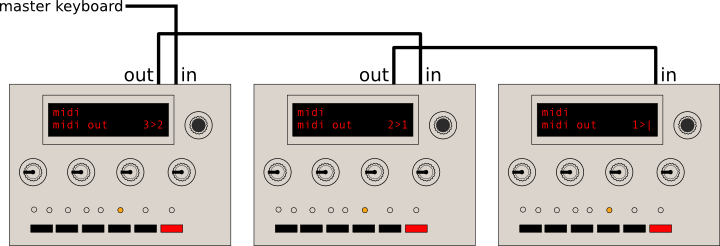

The 3 units obviously have to be sent to a common audio mixer or sound
card.

Some caveats regarding the polychaining mode:

* The arpeggiator and sequencer do not work in polychaining mode ; and the LFOs of each unit won't be synchronized with each other
* There is a latency of up to 2ms between each unit. Thus, this feature works best on small chains.
* Any parameter change done on the first unit in the chain is forwarded downstream, so tweaking is possible (and encouraged). Furthermore, when a patch is loaded on the master unit, it is dumped as a SysEx to each unit of the chain for synchronization purposes. However, this doesn't work the other way round: if you tweak a parameter or reload a new patch on the last unit in the chain, the other units upstream won't be aware of it!

### Updating the Shruthi firmware by MIDI

To update the Shruthi firmware, hold the **S6** switch (or the **OSC 2
SHAPE +** switch on the XT) while the synth is being powered on.

The screen remains empty, and the LEDs **L1**, **L3**, **L5** and **L7**
are lit. The Shruthi is now waiting for SysEx data containing firmware
update commands.

This data is compiled into a MIDI file you can download on the [Mutable
Instruments
website](../static/firmware/shruthi1_1.02.syx).
During the firmware update procedure, the LEDs will light up one by one
- the last LED being lit will also blink as the data is received. The
update takes about 1 minute. If something goes wrong during the update
procedure, the Shruthi is not bricked: it is possible to restart it with
**S6** held down, to retry the update procedure.

If you want to use a dedicated SysEx transfer tool, we recommend
[Elektron's C6 tool](http://www.elektron.se/support-and-downloads)
available for both Windows and OS X, with the following timing settings:

### MIDI implementation

A standard MIDI implementation chart [can be viewed
here](https://docs.google.com/spreadsheet/pub?key=0Ai4xPbRS5YZjdEdaYlhoTVF5Uzg1NFgxM1AzVi0zcUE&output=html).

#### Received messages

##### Note on/off (0x80 and 0x90), aftertouch (0xa0, 0xd0) and pitch-bend (0xe0)

Note that the aftertouch is always global, and that its effect depends
on the patching of the **afttch** modulation source in the modulation
matrix (by default, none).

##### Program change (0xc0)

This loads a patch from the internal or external memory. You can use the
bank MSB CC (0x00) to load patches above 127. Note that the patch
numbers shown in the load/save page are numbered from 1, but the MIDI
patch numbers are numbered from 0, so the first patch is loaded with
program change 0 even if it appears to be \#1 on the load/save page.

##### Control changes (0xb0)

The Shruthi responds to the following system control change messages:

-   All sound off (0x78)
-   Reset all controllers (0x79)
-   All notes off (0x7b)
-   Omni on/off (0x7c, 0x7d)
-   Hold pedal (0x40)

Most synthesis parameters are accessible by non-standard control changes
or NRPNs. Please refer to the [Parameters accessible by MIDI](#param)
section.

##### Clock tick (0xf8)

This advances the system clock when the **bpm** setting is set to
**external** or one of its multiples.

##### Play and stop (0xfa and 0xfc)

The **Play** message must be sent to activate the LFO, arpeggiator or
sequencer when the **bpm** setting is set to **external**. The **Stop**
message kills all notes and stops the sequencer or arpeggiator.

##### System exclusive messages (0xf0).

The Shruthi sends or receives System Exclusive messages for the
following operations:

-   Patch data dump
-   Sequence data dump
-   Wavetable dump
-   Bulk memory dump
-   Firmware update
-   Post firmware-update reset

Please refer to the [SysEx data format](#sysex) section for more
information.

#### Synthesis parameters accessible by MIDI.

Most of the synthesis parameters are accessible by NRPN or CC.

Editing a parameter by CC is fool-proof: send any value between 0 and
127, and it will mapped to the range of the parameter. For example, when
adjusting the oscillator 1 range, the value 0 will be mapped to -24, and
the value 127 will be mapped to +24. There is a bit of resolution loss
for parameters with a large range (eg: tempo).

This is not the case when using NRPN: in this case, the value in the
data entry message will need to be exactly the requested value (no
scaling occurs). Since most parameters have their range in a subset of
0--127, only a data entry LSB message has to be sent. When the maximum
value of the parameter exceeds 127, or when it accepts negative values,
a data entry MSB will have to be sent. Negative values are represented
using 2's complement. For example, the MIDI messages to send to set the
Oscillator 1 range to -12:

    176 99 0 (NRPN MSB set to 0)
    176 98 2 (NRPN LSB set to 2, from the table below: Oscillator 1 range)
    176 6 1 (Data Entry MSB set to 1 -- value above 127 or negative)
    176 38 116 (Data Entry LSB set to 116, because 116 - 128 = -12)

The following table summarizes all the synthesis parameters, with their
NRPN and CC numbers:

| Parameter number | Range | NRPN number | CC number |
| --- | --- | --- | --- |
| Oscillator 1 shape | 0-34 | 0 | 20 |
| Oscillator 1 parameter | 0-127|1|21|
| Oscillator 1 range | -24-24|2|22|
| Modulation operator | 0-13|3|28|
| Oscillator 2 shape | 0-34|4|24|
| Oscillator 2 parameter | 0-127|5|25|
| Oscillator 2 range | -24-24|6|26|
| Oscillator 2 detune | 0-127|7|27|
| Oscillator balance | 0-63|8|29|
| Sub oscillator volume | 0-63|9|30|
| Noise volume | 0-63|10|31|
| Sub oscillator/transient generator shape | 0-10|11|23|
| Filter cutoff | 0-127|12|14, 74|
| Filter resonance|0-63|13|15, 71|
| Envelope-&gt;cutoff modulation amount|0-63|14|102|
| Lfo-&gt;cutoff modulation amount|0-63|15|103|
| Envelope 1 attack|0-127|16|104|
| Envelope 1 decay|0-127|17|105|
| Envelope 1 sustain|0-127|18|106|
| Envelope 1 release|0-127|19|107|
| Envelope 2 attack|0-127|20|108, 73|
| Envelope 2 decay|0-127|21|109|
| Envelope 2 sustain|0-127|22|110|
| Envelope 2 release|0-127|23|111|
| LFO 1 waveform|0-20|24|112|
| LFO 1 rate|0-143|25|113|
| LFO 1 rise time|0-127|26|114|
| LFO 1 master/slave|0-3|27|115|
| LFO 2 waveform|0-20|28|116|
| LFO 2 rate|0-143|29|117|
| LFO 2 rise time|0-127|30|118|
| LFO 2 master/slave|0-3|31|119|
| Modulation n source|0-27|32 + 3 \* (n - 1)|
| Modulation n destination|0-26|33 + 3 \* (n - 1)|
| Modulation n amount|-63-63|34 + 3 \* (n - 1)|
| Operator n source 1|0-31|94 + 3 \* (n - 1)|
| Operator n source 2|0-31|95 + 3 \* (n - 1)|  
| Operator n operation|0-9|96 + 3 \* (n - 1)|
| Sequencer mode|0-2|100|75|
| Tempo|35-248|101| |
| Groove template|0-5|102|76|
| Groove amount|0-127|103|77|
| Arpeggiator direction|0-3|104|78|
| Arpeggiator range|1-4|105|79|
| Arpeggiator pattern|0-15|106|80|
| Sequencer clock division|0-11|107|81|
| Octave transposition|0-11|82|
| Scale/raga|0-32|83|
| Portamento|0-63|84|
| Legato|0-1|68

The following control changes are specific to special filter boards:

|Parameter |CC number|
|----|----|
|SVF Filter cutoff 2      |12|
|SVF Filter resonance 2   |13|
|SVF Filter mode 1        |85|
|SVF Filter mode 2        |86|
|DSP FX param 1           |12|
|DSP FX param 2           |13|
|DSP FX mode              |87|
|DSP FX program           |88|
|Polivoks filter mode     |89|
|Polivoks overdrive       |90|
|Polivoks FM feedback     |91|
|4PM filter mode          |92|
|4PM resonance flavor     |93|
|Delay time               |12|
|Delay level              |13|
|Delay feedback           |94|
|Delay EQ flavor          |95|

### SysEx data format

SysEx messages all share the same format:

    0xf0  (SysEx)
    0x00 0x21 0x02  (Manufacturer ID for Mutable Instruments)
    0x00 0x02  (Product ID for Shruthi)
    Command
    Argument
    Payload
    Checksum
    0xf7  (End of SysEx)

**Command** indicates what the receiver should do with the data in the
**payload** block, and **argument** is a byte that might contain an
additional piece of information about what to do with the data.

**Payload** is a sequence of bytes in nibblized form. For example, the
sequence `0x80 0x56 0x13` is transmitted as
`0x08 0x00 0x05 0x06 0x01 0x03`.

**Checksum** is equal to the nibblized-sum, modulo 256, of the bytes. In
the example above, the checksum is equal to `0x80 + 0x56 + 0x13 = 0xe9`
and is transmitted as `0x0e 0x09`.

#### Patch transfer

For patch transfer, **command** is equal to **0x01** and **argument** is
null. The **payload** is a 92 bytes (184 nibbles) data structure
[described
here](https://github.com/pichenettes/shruthi-1/blob/master/shruthi/patch.h#L75).
Upon reception, the Shruthi checks the patch data, and loads it in
memory, in place of the currently edited patch.

When receiving a patch by SysEx, the received patch is not written to persistent patch memory, it is only temporarily loaded in memory so you can edit it, and if you're happy with it, save it yourself. Since you don't risk overwriting stuff in memory when using SysEx patch transfer, use it and abuse it! For example, embed at the beginning of each of your tracks a dump of the patch, so your Shruthi will always recall the correct patch settings when you play the track back.

#### Sequence transfer

For sequence transfer, **command** is equal to **0x02** and **argument**
is null. The **payload** is a 32 bytes (64 nibbles) data structure
[described
here](https://github.com/pichenettes/shruthi-1/blob/master/shruthi/sequencer_settings.h#L40).
Upon reception, the Shruthi loads the sequence data in memory, in place
of the currently edited sequence.

#### Waveform transfer

For waveform transfer, **command** is equal to **0x03** and **argument**
is null. The **payload** is a sequence of 8x129 bytes (2064 nibbles)
describing 8 single cycle waveforms, each of them being 129 samples
long. The period must be 128 samples - the 129th sample must be equal to
the first one and is used for interpolation wrap-around. The waveform is
described with 8 bits unsigned samples.

#### Storage memory dump

The storage memory of the Shruthi is 2 + 8n kb large: 2kb of internal
eeprom and 8n kb of external eeprom. It is partitioned as follows:

| Logical range | Physical medium | Physical range | Content |
| ---- | ---- | ---- | ---- |
|0x0000 - 0x0010  | Internal eeprom  | 0x0000 - 0x0010  | System settings |
|0x0010 - 0x05d0  | Internal eeprom  | 0x0010 - 0x05d0  | 16 internal patches |
|0x05d0 - 0x07d0  | Internal eeprom  | 0x05d0 - 0x07d0  | 16 internal sequences |
|0x07d0 - 0x0800  | Internal eeprom  | 0x07f0 - 0x0800  | unused |
|0x0800 - 0x1f00  | External eeprom  | 0x0000 - 0x1700  | 64 external patches |
|0x1f00 - 0x2700  | External eeprom  | 0x1700 - 0x1f00  | 64 external sequences |
|0x2700 - 0x2800  | External eeprom  | 0x1f00 - 0x2000  | unused |
|0x2800 - 0x3f00  | External eeprom  | 0x0000 - 0x1700  | 64 external patches |
|0x3f00 - 0x4700  | External eeprom  | 0x1700 - 0x1f00  | 64 external sequences |
|0x4700 - 0x4800  | External eeprom  | 0x1f00 - 0x2000  | unused |

And so on as the external eeprom size increases...

When doing a bulk backup, **command** is equal **0x40**, **argument** is
a block index, from 0 to 127, and **payload** is a 128 bytes (256
nibbles) memory block. Upon reception, the Shruthi copies the received
128 bytes block to the logical address **argument** x 128. Thus, the
first 16384 bytes of memory are addressed by this scheme. The next 16384
bytes of memory are transmitted by using the **0x41** command, and so
on.

#### Transfer request

For a patch transfer, **command** is equal to **0x11** and **argument**
is null. The payload is empty. In other words, the full SysEx string is:
0xf0 0x00 0x21 0x02 0x00 0x02 0x11 0x00 0x00 0x00 0xf7 (the last pair of
0x00 being the checksum). Upon reception, the Shruthi dumps the current
patch to the MIDI out. For a sequence transfer, **command** is equal to
**0x12**.

#### Write request

For a patch write request, **command** is equal to **0x21**,
**argument** is null, and the payload is a 14-bits integer indicating a
memory slot number (0-based indexing). Upon reception, the Shruthi
writes the current patch to the memory location designated by the
number. For a sequence write request, **command** is equal to **0x22**.

For example, to write the current patch to slot 303 (302 in 0-based
indexing, 0x012e in hexadecimal), the message is:

    0xf0  (SysEx)
    0x00 0x21 0x02  (Mutable Instruments)
    0x00 0x02  (Shruthi)
    0x21  (Patch write command)
    0x00  (No argument)
    0x00 0x01 0x02 0x0e  (Patch number nibbles)
    0x02 0x0f  (Checkum)
    0xf7  (End of SysEx)

#### Firmware update

For firmware update, **command** is equal **0x7e**, **argument** is
null, and **payload** contains a 256 bytes (512 nibbles) block of
code/data to be written to flash ROM. Upon reception of this message,
the Shruthi writes the data block in flash ROM at the address pointer,
and increments the address pointer by 256. The address pointer is
initialized at **0x0000**

At the end of the update procedure, a SysEx message with **command =
0x7f, argument = 0x00** and no **payload** is sent. Upon reception, the
Shruthi reboots into the newly updated firmware.

Credits
-------

The following patches have been programmed by Florian Fourmy:

-   Flo bass
-   Follow!
-   ElectroB

The following patches have been programmed by stuartm:

-   woblbass
-   digobass
-   pythagor
-   noleleva
-   ahhparis
-   repliknt
-   pwmstrng
-   dahkand
-   deetoon
-   cowgirl
-   voxelito
-   woodtock

The following patches have been programmed by Trackdriver:

-   bitbass
-   shorty
-   VICdbass
-   sawwy
-   reason
-   puddle
-   blopbass
-   borg
-   fatbass
-   wowwy
-   pulsar
-   stringe
-   bigStrng
-   simplBra
-   pwmBrass
-   arpSynth
-   wasp
-   rendezVo
-   fullbell
-   loFiFlut
-   NESsie
-   noisBell
-   woice
-   wavesurf
-   lazrBird

The remaining patches have been programmed by Émilie Gillet
