Note: this page documents an old version of the SMR4 filter, which is currently not in production!

The SMR-4 board comprises a 4-pole VCF (a jumper can be moved to provide a 2-pole output) with voltage-controlled resonance, a linear VCA, and a +/- 5V regulated power supply powering all those (and the digital section upstairs).

Schematics and PCB
------------------

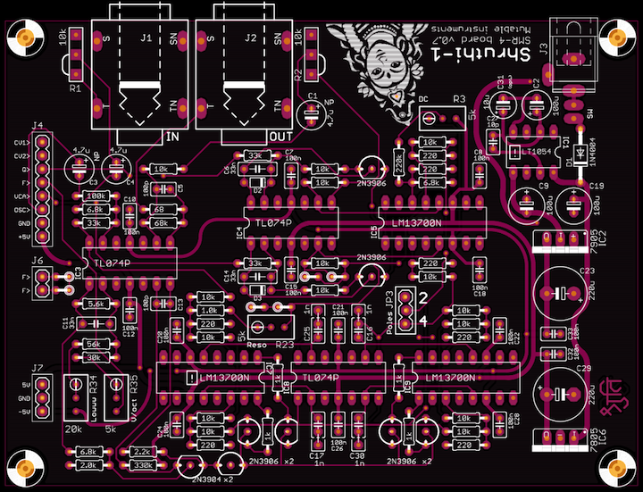

You can find the Eagle files for this board in the shruthi/hardware\_design/pcb directory of the source code hosted on [github](http://github.com/pichenettes/shruthi-1).

The schematics in PDF format are [here](../static/schematics/Shruthi-Analog-SMR4-v08.pdf).

How does it work? You can read an analysis [here](../static/documents/smr4_analysis.pdf).

Bill of materials
-----------------

[Bill of materials](https://docs.google.com/spreadsheet/pub?hl=en_US&hl=en_US&key=0Ai4xPbRS5YZjdHlmMHRxSDFvUG5WVEdVbjFISGVwRnc&output=html).

Some notes:

1.  These small deviations are not critical.
2.  Polystyrene caps might give a better sound.
3.  Filter tuning is improved by using matched, thermocoupled transistor pairs.

Assembly instructions
---------------------

### Getting ready

For reference, during the assembly, you can use the following picture of an assembled board (it is provided with the kit):

Mondrian, oh Mondrian !

Some equipment you'll need:

1.  Soldering iron + solder (nothing fancy, a 15 or 20W will do).
2.  Cutters.

We assume you know soldering. If you don't, look first at [this tutorial](http://www.instructables.com/id/How-to-solder/). We highly recommend you to purchase a simple kit from [adafruit](http://www.adafruit.com) or [sparkfun](http://www.sparkfun.com) to practice on something that you won't regret breaking.

A last word: be patient! we know you're just a couple of hours away from playing your Shruthi-1, but if you do something stupid, those hours will turn into days or weeks.

**DISCLAIMER:** We are not responsible for anything wrong (including electric shocks, malfunctions, fires, accidents involving a soldering iron) that might happen during the assembly of the kit. Everything you do while assembling the kit is at your own risks.

### Step 1: power supply, part 1

Let's start with the power supply section (the "column" of parts on the right of the board). Building the power supply first will allow you to test it early and check that you won't be damaging other parts because of incorrect voltages.

First, let's populate the board with:

1.  the fourteen 100nF ceramic caps (labelled 104).
2.  the 10pF ceramic cap (labelled 100).

Ceramic capacitors are not polarized.

### Step 2: power supply, part 2

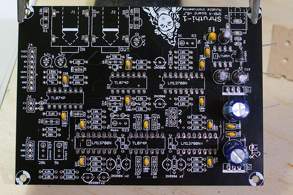

Now, add:

1.  The 3 100uF electrolytic caps (C2, C9, C19).
2.  The 2 220uF electrolytic caps (C23, C29). 470uF can also be used there.
3.  The (optional) 10uF tantalum cap (C31).
4.  The protection diode D1

All of them are **polarized**. The white stripe on the side of the electrolytic capacitors indicate which of their lead is negative. The negative lead is the shortest one. The long lead must go in the hole marked with a plus sign. Here is another view of the capacitors:

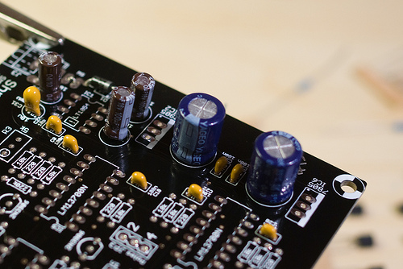

C31 is optional. Adding C31 in parallel to C2 lowers the ESR of the pair, while having a moderate impact on the capacitance. C31 is **polarized**. The positive lead is marked with a **+** and a band (see [this picture](../static/images/tantalum_cap.jpg))

Finally, D1 is **polarized**, the white ring around it must match what is printed on the PCB.

### Step 3: power supply, part 3

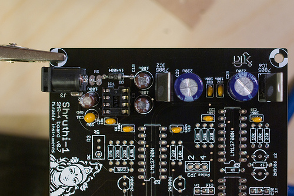

If you don't want to use a main on/off switch, add a piece of wire (I use the leads of parts I have just cut) to make a permanent connection between the pads labelled SW. Otherwise, solder two pieces of wire to the rocker switch. The switch has no polarity.

You can now solder the voltage regulators (LM7905 and LM7805). They are **polarized**. The metallic plate with the hole should be on the same side as the bold line of the part drawing on the PCB. The kit might include another part compatible with the LM7805, labelled KA7805 or TS7805.

Now check one last time the orientation of everything before continuing!

Finally, add the DC power socket.

### Step 4: power supply, part 4

Insert IC1 (LT1054). Be careful with the **orientation**, this IC is not oriented like most of the other ICs on the board! The LT1054 does not have a notch, but a round mark to indicate its first pin. This round mark must be near the IC1 marking on the PCB.

The power supply is now ready to be tested. Connect a DC supply (unregulated, any voltage between 7.5V and 12V, center pin positive) and check the voltages at the following points of the PCB:

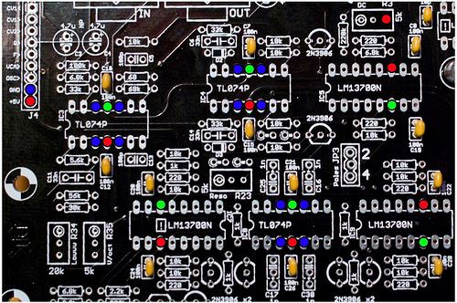

Put the COM probe of your meter on the blue point on the far left (near the connector labelled GND). Test, with the other probe, that all the blue points are at 0V, all the red points at 5V, and all the green points at -5V. A difference of 0.1V is acceptable (I often get -5.1 and 4.9V, this is OK).

If there's something wrong, check the regulators and capacitors polarities.

### Step 5: Resistors and diodes

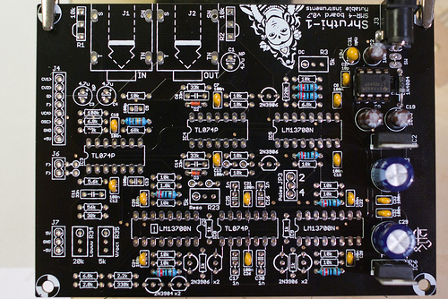

Add:

1.  2x 1N4148 diodes. They are **polarized**, the black ring on the diode should be in the direction of the power supply.
2.  1x 68R resistor (blue, grey, black, gold)
3.  7x 220R resistors (red, red, black, black). Note that previous of the board (v0.5) uses only 6 of them.

### Step 6: Resistors again

Add:

1.  5x 1k resistors (brown, black, black, brown)
2.  1x 2.0k resistor (red, black, black, brown)
3.  1x 2.2k resistor (red, red, black, brown)
4.  1x 5.6k resistor (green, blue, black, brown)
5.  3x 6.8k resistor (blue, grey, black, brown).

### Step 7: Resistors, the trilogy

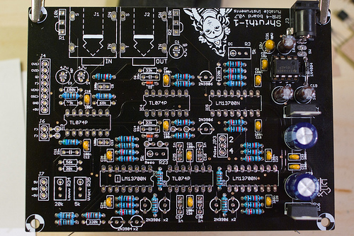

Add 15 10k resistors (brown, black, black, red). The previous version of the board (v0.5) has 14 of them.

### Step 8: Resistors, the prequel

If you have a v0.7 of the board, add the following resistors:

1.  1x 30k resistor (orange, black, black, red)
2.  3x 33k resistors (orange, orange, black, red)
3.  1x 56k resistor (green, blue, black, red)
4.  1x 68k resistor (blue, grey, black, red)
5.  1x 100k resistor (brown, black, black, orange)
6.  1x 220k resistor (red, red, black, orange)
7.  1x 330k resistor (orange, orange, black, orange)

If you have a v0.8 board, some resistor values have changed (68k to 33k ; 220k to 330k):

1.  1x 30k resistor (orange, black, black, red)
2.  4x 33k resistors (orange, orange, black, red)
3.  1x 56k resistor (green, blue, black, red)
4.  1x 100k resistor (brown, black, black, orange)
5.  2x 330k resistor (orange, orange, black, orange)

### Step 9: Sockets

Add 3x DIP14 IC sockets and 3x DIP16 IC sockets.

### Step 10: Capacitors

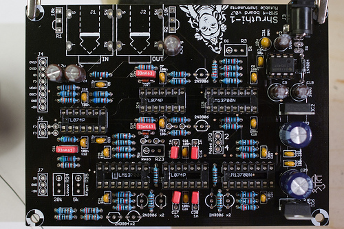

Next, the capacitors. For these ones, **polarity/orientation does not matter**:

1.  2x 100pF ceramic caps (labelled 101).
2.  3x 4.7uF NP electrolytic caps. Audio is going through them, so their quality is important!
3.  3x 33nF film caps. They smooth the control signals from the MCU. There's a trade-off between envelope response time and "purity" of the audio output - these values can be reduced a bit for more aggressive envelopes.
4.  4x 1nF film caps near IC8. They are responsible for the actual filtering. You might want to put there something a little fancier (polystyrene), which might not have the same size as the standard 5.08mm lead spacing. Some 1nF poly/film cap also come in a 2.54mm spacing package. That's why there are 3 holes there... Ignore the middle one when using a capacitor in a 5.08mm spaced package, and ignore the outer hole when using a capacitor in a 2.54mm spaced package (such as those provided with the kit).

### Step 11: Transistors

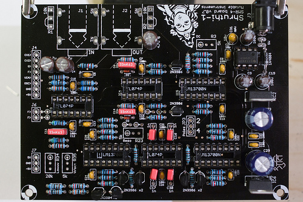

**Transistors are polarized**. Make sure that the "flat" and "round" sides of the transistors follow what is printed on the PCB. **Be careful and don't mix up 2N3906 with 2N3904**!

### Step 12: Connectors and trimpots

Add the connectors and the trimpots:

1.  1x 20k trimpot (W203) labelled lowwwww.
2.  3x 5k trimpots (W502) at the positions labelled reso, DC and V/oct.
3.  8x1 female connector for stacking the boards.
4.  3x1 male connector for pole selection.
5.  The two audio connectors

**Don't forget putting a jumper on the poles selector!** (JP3). 4 is the default, standard, reasonable value. Also, make sure that the conducting piece of the jumper touches the two pins of the 3x1 connector...

If you intend to house your Shruthi in the standard acrylic case, you don't need to solder the volume pots - instead, you'll have to "bridge" two of the pots' solder pads as printed on the PCB.

### Step 13: IC time!

You can now insert the ICs! (3x TL074 and 3x LM13700). All are looking "left" instead of IC7. **IC7 looks in the opposite direction**. The board should look like this:

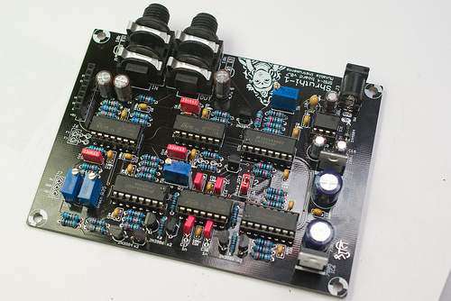

### Pause: Ain't I missing something?

You might have noticed 4 locations where one could solder a part with a 2.54mm pitch -- below IC4, and near the Resonance trimpot. These pads can be used to solder parts (Zeners, diodes, LEDs...) to tame/shape the sine wave the filter will emit when it self-oscillates.

### Step 14: Tuning

To operate correctly, the filter needs to be tuned. The following symptoms indicate that the filter is not tuned optimally:

-   Loud "plop" at note starts
-   No self-oscillation when resonance is set to 63
-   Heavily distorted resonance at self-oscillation
-   Dull sound even when cutoff = 127
-   Weird sounds heard when resonance = 63

#### Board connection

First, you'll need to connect the two boards without stacking them. Here's how my setup looks like. Cables for doing that are now provided with the kit.

\
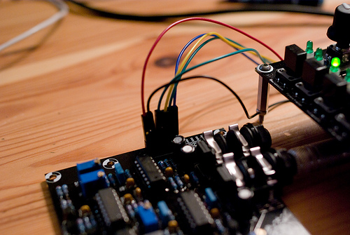

Some general notes regarding trimming:

-   Trimmers are 22 turns. Once you've reach one of the extremities of their range, you'll still be able to turn the screw but it won't have any effect. You'll hear a small click or notice a slight change in torque required to turn the screw.
-   Don't get crazy over trimming. There's no setting that will magically make everything sound like the original Minimoog of your dreams.

#### Resonance setting

The first step consists in setting up the feedback gain so that the filter plays a nice sine wave when resonance is set to a high value.

1.  Set the 2 oscillators to **none**, the resonance to 63 and cutoff to 50. Disable the envelope-&gt;filter modulation. The second line of the filter page on the LCD should display @ 50 63 0 0@
2.  Press and hold the E4 key on a MIDI keyboard, or send this note from your sequencer (MIDI note \#64).
3.  Turn the **Reso** trimmer counterclockwise until you can't hear any sound.
4.  Then turn it clockwise until you start hearing the self-oscillation. If you continue turning, the self-oscillation will get louder and eventually distort. Move back to the point where it starts appearing.

The equilibrum point is the one for which the resonance doesn't take too long to come when a note is played, but is not heavily distorted.

#### V/Oct response tuning

Now we'll tune the **V/oct** trimmer, which allows the filter cutoff (and thus, the sine wave emitted by the filter at auto-oscillation) to follow musical intervals played on the keyboard. With cutoff set to 50 and resonance to 63, try playing C1, C2, C3, C4: the four notes should be one octave apart from each other. If this is not the case, adjust **V/oct** to achieve the right tuning. This process is a bit different from tuning a guitar: it doesn't matter whether pressing C1 will play a C1 - what matters is whether playing C1, C2 will play two sounds one octave apart. If they sound more like 11 semitones apart, rotate **V/Oct** clockwise. If they sound more like 13 semitones apart, rotate **V/Oct** counterclockwise.

#### DC offset tuning

This trimpot compensates the DC offset at the output of the filter, before it is sent to the VCA. If a signal with a DC component goes through a VCA, the envelope signal will "bleed" into the VCA output, resulting in clicks or pops with fast envelopes.

1.  With the oscillators still set to none, set the resonance to 0 and the cutoff to 0.
2.  Play a note on the keyboard, you'll just hear a short "plop" and then silence.
3.  Adjust the **DC** trimpot until you find a position that minimizes the loudness of the "plop".

Note that the "sweet spot" for this setting is somewhere in the middle (11 turns away from the extremities).

#### Cutoff range tuning

This setting modifies the maximum cutoff frequency of the filter. When resonance is set to the maximum value (63), the oscillations can get instable for high settings of the cutoff value and high notes played on the keyboard (above E4). When this occurs, the auto-oscillation sine wave is at a very high frequency, but some of its undertones can be heard. You might choose to ignore this glitch and use the full range of the filter, or trim the **Lowww** trimpot to lower the frequency response of the filter and avoid hitting the instability region.

1.  Set the resonance to 63.
2.  Press and hold E4 on the MIDI keyboard (note \#64).
3.  Set the cutoff to a value of 80.
4.  Adjust the **Lowww** trimpot to move up or down the pitch of the sound.
5.  To check how this affects the filter, sweep the cutoff until you reach high values above 112.

If you change the **Lowww** so that a high pitched sound is heard for cutoff=80, the filter cutoff frequency will reach higher frequencies, with a greater risk of hitting the instability zone when resonance = 63. If you turn **Lowww** in the other direction, in such a way that cutoff=80 yields a lower pitched sound, the range of the cutoff will cover lower frequencies, resulting in a more damped sound when cutoff = 127, but you won't risk entering the instability zone.

Kudos
-----

-   [Todd Bailey](http://narrat1ve.com/) for tons of board layout tips!
-   [Aaron D. Lanterman](http://users.ece.gatech.edu/lanterma/) for his awesome class material.

Releases
--------

### v0.6, v0.7

-   Removed middle spacers holes.
-   Self-oscillation in 2-poles mode.
-   Increased hole sizes for audio and DC connectors.
-   Added pads for external CV sources on cutoff.

### v0.5

-   Original release.
