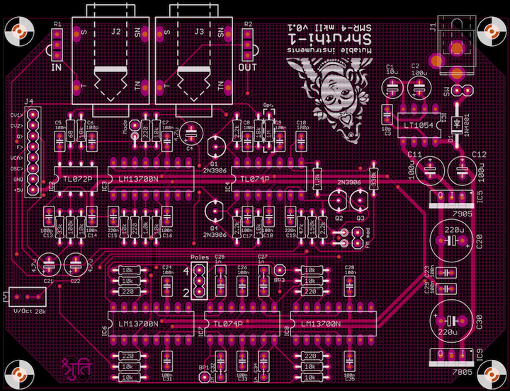
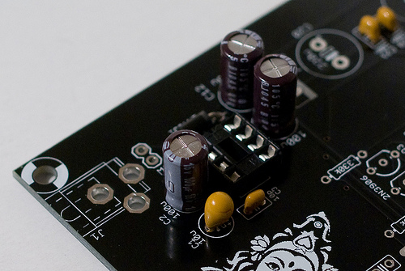
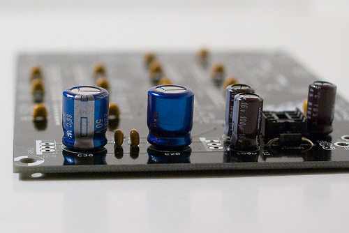
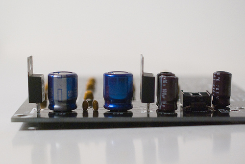
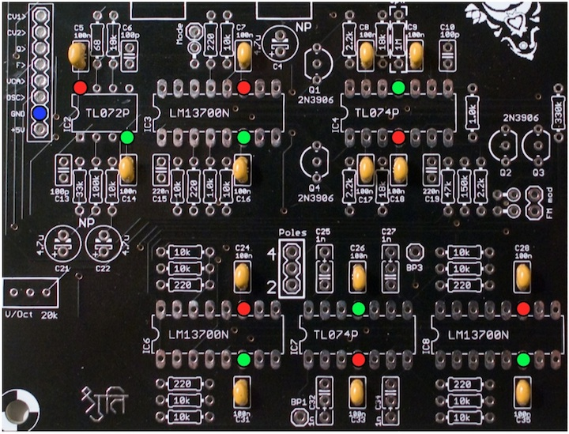
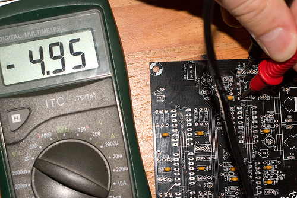
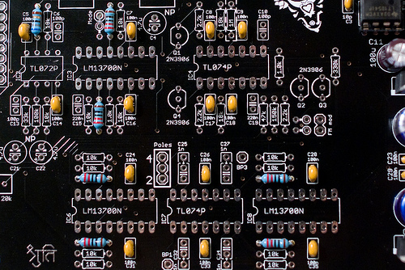
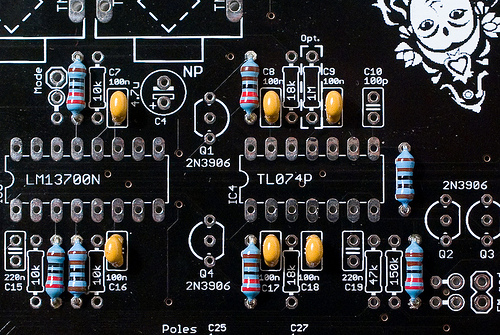
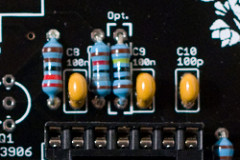
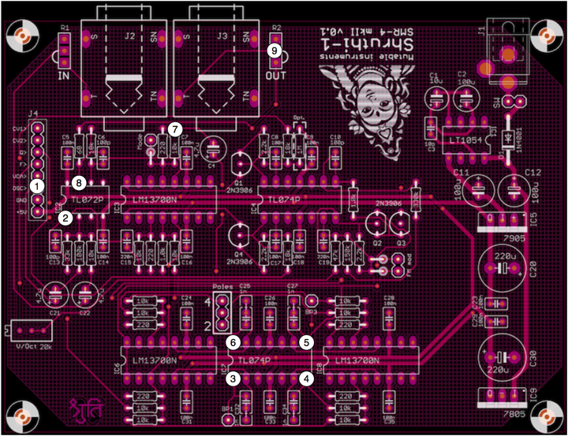

The SMR-4mkII is a revision of the classic 4-pole VCF / VCA board shipped with the Shruthi-1 kits. It keeps the "solid" sound of the original version -- actually the core filter circuit is unchanged -- but its part count has been reduced thanks to a few optimizations in the circuit. Another of its distinctive features, compared to its predecessor, is the reduced number of trimmer adjustments (from 4 to 1) that need to be done.

You can find the Eagle files for this board in the `shruthi/hardware_design/pcb` directory of the source code hosted on [github](http://github.com/pichenettes/shruthi-1).

The schematics in PDF format are [here](../static/schematics/Shruthi-Analog-SMR4-mkII-v02.pdf).

How does it work? You can read an analysis [here](../static/documents/smr4mkII_analysis.pdf).

Bill of materials
-----------------

<a href="https://docs.google.com/spreadsheet/pub?hl=en_US&hl=en_US&key=0Ai4xPbRS5YZjdElzSGpFRENkbWVRR25yR1NHS3FaMnc&output=html">Bill of materials.</a>

Note that the resistors from Digikey have minor differences in value (E48 vs E24 series). These differences are not critical.

Assembly instructions
---------------------

### Getting ready

For reference, during the assembly, you can use the following picture of an assembled board (it is provided with the kit):

Mondrian, oh Mondrian !

Some equipment you'll need:

1.  Soldering iron + solder (nothing fancy, a 15 or 20W will do).
2.  Cutters.

We assume you know soldering. If you don't, look first at [this tutorial](http://www.instructables.com/id/How-to-solder/).  We highly recommend you to purchase a simple kit from [adafruit](http://www.adafruit.com) or [sparkfun](http://www.sparkfun.com) to practice on something that you won't regret breaking.

A last word: be patient! we know you're just a couple of hours away from playing your Shruthi-1, but if you do something stupid, those hours will turn into days or weeks.

**DISCLAIMER:** We are not responsible for anything wrong (including electric shocks, malfunctions, fires, accidents involving a soldering iron) that might happen during the assembly of the kit. Everything you do while assembling the kit is at your own risks.

### Step 1: power supply, part 1

Let's start with the power supply section. Building the power supply first will allow you to test it early and check that you will not be damaging other parts because of incorrect voltages.

First, let's populate the board with:

1.  the sixteen 100nF ceramic caps (labelled 104). Most of those are "bypass capacitors" acting as local charge reservoirs near each IC.
2.  the 10pF ceramic cap (labelled 100).

Ceramic capacitors are not polarized.

### Step 2: power supply, part 2

Add:

1.  The protection diode D1. D1 is **polarized**, the white ring around it must match the symbol silkscreened on the PCB.
2.  A DIP8 socket.

### Step 3: power supply, part 3

Now, add:

1.  The 3 100uF electrolytic caps (C2, C11, C12). Note that the caps that come with your kit might have a different color or voltage. What matters is the value printed on it. If it is labelled 100uF, it's good!
2.  The (optional) 10uF tantalum cap (C1).
3.  The 2 220uF electrolytic caps (C20, C30). 470uF or higher can also be used there ; but the higher the capacity, the bulkier the caps get.

All of them are **polarized**. The white stripe on the side of the electrolytic capacitors indicates which of their lead is negative. The negative lead is the shortest one. The long lead must go in the hole marked with a plus sign. Here is another view of the capacitors:

C1 is optional -- it is shipped with the kit, but if you are building this yourself and cannot source cheap Tantalum caps, you can ignore it (it would be required if the power supply had to deliver more than the &lt;20mA required by the SMR4 mkII circuit). C1 is **polarized**. The positive lead is marked with a **+** and a band (see [this picture](../static/images/tantalum_cap.jpg))

### Step 4: power supply, part 4

You can now solder the voltage regulators (LM7905 and LM7805 ; though they can be labelled MC7805, KA7905 etc depending on which manufacturer they come from). They are **polarized**. The metallic plate with the hole should be on the same side as the bold line of the part drawing on the PCB.

Solder the DC connector. The best way to solder it is to heat the exposed copper "ring" on the PCB, and then to let the solder melt around it. It will form a "lake" of solder around the leg of the connector. Solder one leg, adjust the connector into the right position, then solder the other legs.

Finally, if you don't want to use a main on/off switch, add a piece of wire (I use the leads of parts I have just cut) to make a permanent connection between the pads labelled SW. Otherwise, solder two pieces of wire to a rocker switch. The switch has no polarity.

### Step 5: power supply, testing

You can now insert IC1 (LT1054). Be careful with the **orientation**, this IC is oriented unlike the other ICs on the board! The LT1054 does not have a notch, but a round mark to indicate its first pin. This round mark must be near the IC1 marking on the PCB.

The power supply is now ready to be tested. Connect a DC supply (unregulated, any voltage between 7.5V and 9V, center pin positive) and check the voltages at the following points of the PCB:

Put the COM probe of your meter on the blue point on the far left (near the connector labelled GND). Test, with the other probe, that all the red points are at 5V, and all the green points at -5V. A difference of 0.1V is acceptable (I often get -5.1 and 4.9V, this is OK).

\

If there's something wrong, check the regulators and capacitors polarities.

### Step 6: Resistors

Add:

1.  1x 68R resistor (blue, grey, black, gold)
2.  6x 220R resistors (red, red, black, black).

### Step 7: Resistors again

Add:

1.  2x 1k resistors (brown, black, black, brown)
2.  3x 2.2k resistor (red, red, black, brown)

### Step 8: Resistors, the trilogy

Add 12x 10k resistors (brown, black, black, red). **Be careful**, there are spots for 18k resistors and the 0 and 8 look a bit similar!

### Step 9: Resistors, the prequel

Add:

1.  3x 18k resistor (brown, grey, black, red)
2.  1x 33k resistors (orange, orange, black, red)
3.  1x 47k resistor (yellow, purple, black, red)
4.  1x 100k resistor (brown, black, black, orange)
5.  1x 150k resistor (brown, green, black, orange)
6.  1x 330k resistor (orange, orange, black, orange)

You will be left with a 1M resistor. If you plan to use the SMR4 mkII board with a Shruthi-1 control board, solder it. See more about this in the **hacks and mods** section.

### Step 10: Small caps

Add:

1.  3x 100pF ceramic caps (labelled 101).
2.  2x 220nF ceramic caps (labelled 224).

These caps are not polarized.

### Step 11: Sockets

Add 1x DIP8, 2x DIP14 and 3x DIP16 IC sockets.

### Step 12: Taller parts

Add 4x 1nF film caps near IC7. Film capacitors can come in two sizes: 2.54mm (small) and 5.08mm (larger), that's why the PCB footprint has 3 holes while the part has only 2! The photo shows how to insert the 2.54mm caps - the outer hole is left empty. When a 5.08mm cap is used, the middle hole is left empty.

Add 4x 2N3906 transistors. **Transistors are polarized**. Make sure that the "flat" and "round" sides of the transistors follow what is printed on the PCB.

Add 3x 4.7uF NP electrolytic caps. They are not polarized, so please ignore the +/- marking on the PCB.

### Step 13: Connectors and trimpot

Add the connectors and the trimpot:

1.  1x 20k trimpot (labelled 203).
2.  8x1 female connector for stacking the boards.
3.  3x1 male connector for the **Poles** selector.
4.  The two audio connectors.

**Don't forget putting a jumper on the poles selector!** 4 is the recommended position (After all it's not an SMR2!).

If you intend to house your Shruthi in the standard acrylic case, you will not have much room to add gain pots -- so instead, you'll have to "bridge" two of the pots' solder pads as printed on the PCB.

### Step 14: IC time!

You can now insert the ICs! (1x TL072, 2x TL074 and 3x LM13700). All are looking "left". The board should look like this:

You have finished building the board; You can already play with it, but it is highly recommended to continue and tune the filter.

### Step 15: V/Oct Tuning

The tuning procedure consists in making sure that the cutoff frequency of the filter follows a musical scale: increasing the cutoff setting on the Shruthi by 12 (or playing a note 1 octave = 12 semitones higher) should double the cutoff frequency.

First, you'll need to assemble the filter and control boards. Maybe you can start screwing them together onto the bottom plate of the enclosure or you can just temporarily sandwich a female 1x8 connector between the boards just for testing.

Dial the following settings on the Shruthi-1:

-   Oscillator 1 shape: **none**
-   Oscillator 2 shape: **none**
-   Filter cutoff: **64**
-   Filter resonance: **63** (maximum value)
-   Filter envelope and LFO modulations: **0**

Play on the keyboard. You should hear a pure tone (sine wave), which does not come from the Shruthi-1 oscillators but from the filter self-oscillating. Adjust the V/Oct trimmer so that the **intervals** are respected - that is to say, when you play C3 then C4, you should hear two notes, maybe not C3s and C4s, but they must be one octave apart. If you do not have a good sense of pitch, you can try a software tuner like Tuna Pitch on OS X. If the filter is correctly tuned, you should be able to play the filter "self oscillation tone" across roughly 4 octaves with correct tuning.

### Step 16: Congratulations!

You have finished building and tuning your SMR4 mkII filter board. Have fun with it... and come back here in a few weeks if you want to push its limits!

### Mods and hacks

#### VCA bleed fix for use with the Shruthi-1 digital control board

The CVs generated by the Shruthi-1 control board cannot swing as low as ground -- there is always a tiny bit of residual voltage. This will prevent the VCA to be completely silenced. Most of the time this is not a problem, because the Shruthi-1's digital oscillators switch themselves off when the VCA envelope reaches 0. But this slight bleed can be heard when resonance is set to its maximum value.

To prevent this bleed, solder the optional 1M resistor. This will shift the VCA CV down by a few mV.

#### Pole selector switch

You can connect those three points to the 3 terminals of a SPDT switch. This will allow you to switch between the 2 and 4 pole modes with the switch.

#### Additional filter modes

Solder a 10k resistor vertically below the pad labelled **Mode** on the PCB.

Connecting the point labelled **Mode** to the points labelled **BP1** and **BP3** will give different flavors of band-pass filtering. It is recommended to use a SP3T switch (pole to **Mode**, throw1 to **BP1**, throw2 to **BP3**, throw3 left floating) to easily control this extra connection. This graph shows the 6 different responses that can be obtained by switching the pole selector to either positions (LP2 or LP4) and by patching BP1 or BP3 to the "Mode" pad (or leaving it unpatched in the first row).

#### Extra CV inputs for filter cutoff control

Each row is for an extra CV input controlling the filter cutoff. A resistor should be mounted vertically across the first two pads (try 15k to 68k... depending on your CV source!), and the last pad in the row is the CV input itself.

Interesting FM effects can be obtained by feeding audio signals at these points, when the filter resonance is high!

Troubleshooting
---------------

### The left/right channel is missing

The Shruthi is a mono synth. The jack near the "OUT" text is a monophonic output, which needs to be hooked to a sound interface/mixer. The other jack is an input.

### I have connected an external audio source but I can't hear it.

The SMR-4 board has a VCA, which needs to be opened to let the filtered audio signal go out. You need to either:

-   Hold a note (for example, hold S1 to trigger a test note – and set the two oscillators to none if they are bothering you)
-   Disconnect the envelope 2 from the VCA in the modulation matrix, by setting to 0 the modulation amount of en2 to vca (9th entry in the modulation matrix for most patches).

The patches 125-128 are good examples of how to setup the Shruthi-1 for external signals processing.

### The output signal sounds ring-modulated or there's some buzzing/humming on the output.

The "ring-modulated" sound is due to the DC adapter/supply not generating enough current. This can be verified easily by observing the +5V rail on a scope – if you see some periodic drops, something is wrong with the supply. We recommend a 300mA or 400mA supply if you stick to the parts used in the kit, and a 500mA in the event you have soldered a high-brightness LCD module different from those shipped with the kits (such as those sold by CrystalFontz).

Another symptom of a poor quality DC adapter is the presence of low-frequency hissing/humming in the output.

### I get no sound or a a distorted sound. How do I know at which stage the problem is located?

You can "probe" the circuit with an audio jack connected to a mixer/amp. The tip of the audio jack should be connected to the point you want to probe ; the sleeve should be connected to any point of the ground at ground potential (points marked "GND").

On the SMR4mkII, the audio path is the following:

You should hear:

1.  Raw audio signals
2.  Raw audio signal with a 0.33 gain + audio input
3.  Audio signal filtered by 1 pole
4.  Audio signal filtered by 2 poles
5.  Audio signal filtered by 3 poles
6.  Audio signal filtered by 4 poles
7.  Audio signal filtered by 2 poles or 4 poles depending on the position of the Poles selector
8.  Filtered audio signal, with VCA applied to it
9.  Final audio signal
10. Look for cold solder joints, swapped parts in the area around the point where the signal chain breaks.

Releases
--------

### v0.2

-   Rounded corners and text revision.

### v0.1

-   Original release.
