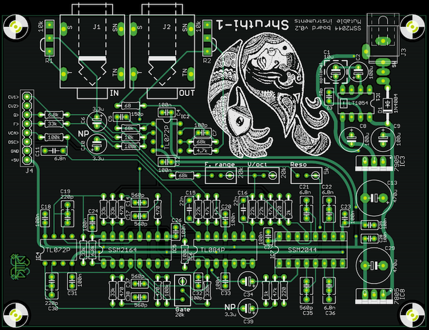

This filter board is based on the classic SSM2044 filter chip, which is still available in surplus online shops. Providing a VC 4-pole LPF (with VC resonance), the SSM2044 was used in the PPG Wave, the Korg PolySix and MonoPoly ([nice reference here](http://www.electricdruid.net/index.php?page=info.ssm2044)), but also in the SP1200. Its sound is very warm and "juicy".

To complete this filter, a linear VCA based on the high-quality SSM2164 quad-VCA chip is added. Don't be fooled by the magical SSM letters: this one is a modern, widely available (and classy!) chip. The VCA cells on the SSM2164 have an exponential response curve and need to be linearized. One such cell is used in a feedback configuration to convert the linear CV into a logarithmic CV (the little man in the op-amp can find the inverse of functions!), and a second cell is used for the actual amplification, using the inverse CV. This design is due to Mike Irwin.

It would have been very unfortunate to leave the 2 remaining VCA cells on the SSM2164 unused, so we decided to wire them into a 2-pole low-pass, the cutoff frequency of which is controlled by CV1. Yet another low-pass? No, because the SSM2044 has two inputs: an inverting one and a non-inverting one. The original signal is sent to the inverting input, and the low-passed signal is sent to the non-inverting input. The SSM2044 will thus process the difference of both signals, which will sound like a high-pass filtered version of the original signal, with cutoff controlled by CV1. Why didn't we go with a high-pass? The circuit was a bit-simpler this way, and it sounded like an interesting use of the inverting and non-inverting inputs of the SSM2044.

Note that this filter board will only be distributed as a PCB (no kit).

Schematics and PCB
------------------

You can find the Eagle files for this board in the `shruthi/hardware_design/pcb` directory of the source code hosted on [github](http://github.com/pichenettes/shruthi-1).

The schematics in PDF format are [here](../static/schematics/Shruthi-Analog-SSM2044-v02.pdf).

Bill of materials
-----------------

[Bill of materials](https://docs.google.com/spreadsheet/pub?key=0Ai4xPbRS5YZjdHJicHVWTmZ6eGNUQ282TXFTQktzYXc&single=true&gid=0&output=html).

The SSM2044 is a bit finicky to use. It produces some noise when the cutoff is swept too abruptly, and the output may have a massive DC offset dependent on the resonance and cutoff frequency -- causing CVs to "bleed" in the output signal. The first problem is solved by low-pass filtering the cutoff CV by the R23/C16 pair. You can smooth the response even more by increasing C16, but beware of groovy, wobbly envelopes if there's too much filtering! The second problem is solved by the high-pass filter realized by R39 and C34. Increase R39 to boost a bit the low-end of the signal, at the cost of more thumps/pops when the envelope moves fast.

Assembly notes
--------------

Here's an image of an assembled board:

Some random notes:

1.  I have used posh polystyrene caps for the high-pass filter.
2.  For the low-pass, my 6.8nF polystyrene caps were a bit massive so I ended up using standard film ones - the filter works perfectly and I have not noticed any impact on the sound. I might change the layout a bit in a future revision to allow for bigger caps.
3.  The LT1054 is not socketed simply because I ran out of DIP8 sockets!
4.  The V/Oct trimpot is in the same direction as the other ones contrary to what is printed on the PCB. This has no impact.

Usage
-----

### Trimming and tuning

#### Filter

First, **Reso** should be adjusted so that the filter enters in auto-oscillation (with all oscillators set to **none** ) when the value of resonance approaches 63. Then, **V/oct** must be adjusted so that a melody played by the auto-oscillation sine wave is in tune. Finally, **F. range** (aka **Lowwww** on the other filter boards) should be adjusted so that the high pitched sine wave produced with cutoff = 127, resonance = 63 and all oscillators off is at the limits of your hearing range.

#### VCA silencing

Set the Envelope 2 sustain value to 0 and press a key. Adjust the **Gate** trimmer until you hear something (you might have to boost the gain a lot on your amp/speakers to actually notice the change). Then slowly turn the trimmer in the other direction and stop as soon as you stop hearing the sound. What is going on? **Gate** is offsetting the envelope CV up and down a tiny bit so that when the envelope reaches a value of 0, the VCA has a null gain, rather than a "low but audible" gain of -60dB.

### Using the High-pass filter

The high-pass filter setting is not exposed in the Shruthi-1 interface, since some other filter boards do not contain a HP! To control it, connect modulation source **offset** to **CV1**, and control the modulation amount to sweep the high-pass filter.

Kudos
-----

-   **Seppoman** for some hints on dealing with the SSM2044 quirks.

Releases
--------

### v0.2

-   Removed middle spacers holes.
-   Increased VCA gain bias range.
-   Increased hole sizes for audio and DC connectors.
-   Added more space for capacitors (so that styroflex caps can be mounted).

### v0.1

-   Original release.
