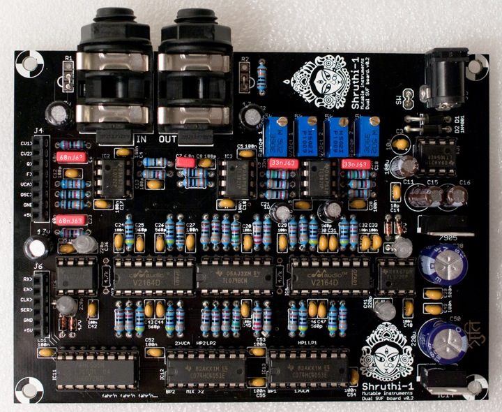

Note: if you are looking for the assembly instructions of the latest version (included in the Midnight edition), [check this page!](../svf2)

Tired of all those boring 4-pole low-pass filters? This filter board is for you! It features 2 independent 2-pole filters with low-pass, band-pass and high-pass modes, which can be routed in serial or parallel. The routing and mode switching is digitally controlled - this can be stored with patch data and modified from the Shruthi-1 digital board menus (Shruthi-1 digital board v0.6 and firmware v0.93 or above).

Using this filter board
-----------------------

Please make sure that both the analog (CV1 to +5V) and digital (RX to +5V) ports of the filter and control boards are connected.

Beware! Only the Shruthi-1 firmware v0.93 (or above) generates the digital signals required to control the mode selection and routing matrix. In addition, it is not possible to use simultaneously the SVF filter board and the Programmer since they will be both accessing at the same time the digital extension port. To activate your SVF board, select **svf** in the system settings page. If you don't do so, it is likely that it will emit glitchy filtered sounds everytime you navigate through the pages.

When pressing the **S2** switch (Filter page) a second time, a new page is displayed allowing you to configure the filter routing and the cutoff/resonance of the secondary filter.

     Cut res md1 md2
     110   0 lpf +hp

The parameters are the following:

1.  **cut (cutoff)**: Cutoff frequency of the secondary filter.
2.  **res (resonance)**: Resonance of the secondary filter.
3.  **md1 (mode 1)**: Mode of the main filter. The modes are **lpf** (low-pass), **bpf** (band-pass), and **hpf** (high-pass).
4.  **md2 (mode 2)**: Mode of the secondary filter. The modes are **lp** (low-pass), **bp** (band-pass), and **hp** (high-pass). The first character indicates the filter topology. **+** is for the parallel mode ; **>** is for the serial mode.

The CV1 and CV2 buses are used to transmit the cutoff and resonance settings of the secondary filter. Thus, you can use these as modulation destinations in the modulation matrix to route envelopes, LFOs, etc to the cutoff and resonance of the secondary filter. For example, if you want the second filter to track the note played on the keyboard, just like the main filter does by default, this can be done with the following modulation patch:

    Mod src dst amt
      1 not cv1 63

If for any specific reason you don't want to digitally switch between the modes, but rather want to build your own modeswitchamatron (one such reason would be that you want to use the programmer and like knobby and switchy things), remove the two 4053s and manually patch your favorite filter topology with wires between the pins of IC12 and IC13. The labels on IC12 and IC13 indicate which signals are available at those pins:

-   MIX: oscillators + audio input mix
-   BP1: output of filter 1 BP mode
-   HP1: output of filter 1 HP mode
-   LP1: output of filter 1 LP mode
-   1&gt;VCA: contribution of filter 2 to the final output.
-   &gt;2: filter 2 input
-   BP2: output of filter 2 BP mode
-   HP2: output of filter 2 HP mode
-   LP2: output of filter 2 LP mode
-   2&gt;VCA: contribution of filter 2 to the final output.

Schematics and PCB
------------------

You can find the Eagle files for this board in the shruthi/hardware\_design/pcb directory of the source code hosted on [github](http://github.com/pichenettes/shruthi-1).

The schematics in PDF format are [here](../static/schematics/Shruthi-Analog-SVF-v02.pdf).

If you are wondering how it works, [this document](../static/documents/svf_analysis.pdf) provides an analysis and some design notes.

Bill of materials
-----------------

[Bill of materials.](https://docs.google.com/spreadsheet/pub?key=0Ai4xPbRS5YZjdDRvamp3ZTFPNGJyTk53MFJhWTdLOEE&output=html)

1.  Not required. Check the SSM2164 datasheet to learn about the difference in noise/distortion between class A and class AB operation and decide wisely.
2.  Do not populate the diodes for a harsh, clipped resonance.

License
-------

This circuit and PCB layout is made available under a **cc-by-sa-3.0** license.

Releases
--------

### v0.2

-   Added label with Zener value.
-   Fixed bad routing of audio connector trace.
-   Changed a few gains along the audio path to minimize clipping when using vanilla TL072 (breadboard proto used TLV272s).

### v0.1

-   First prototype.

Kudos
-----

David Dixon and Tom Wiltshire for precious discussions on SSM2164 SVF design.
