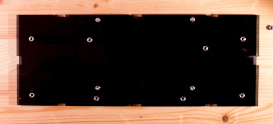
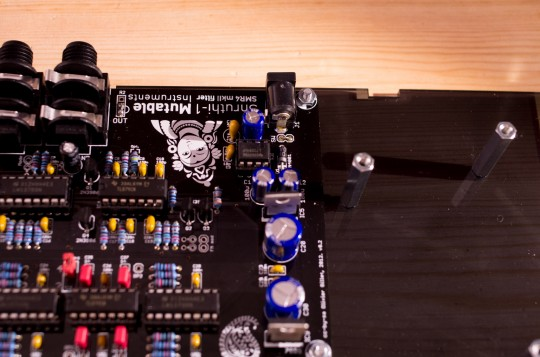
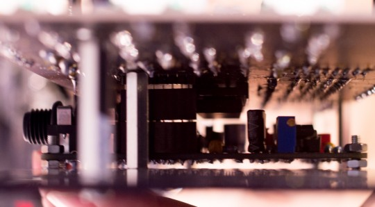
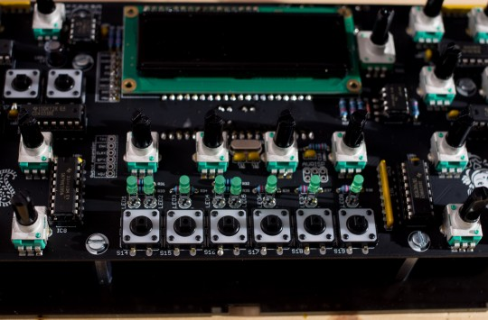
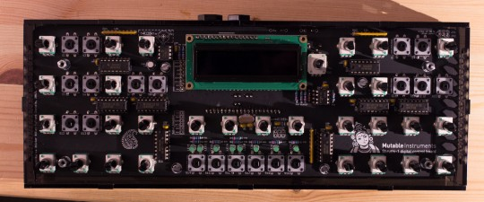
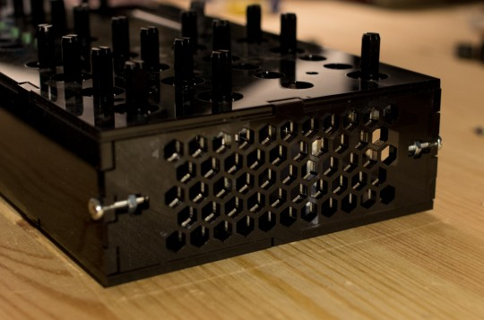
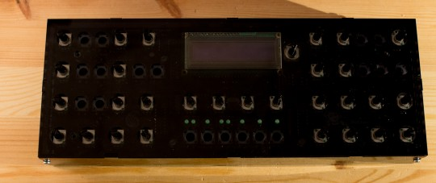

Assembly instructions
---------------------

Peel the protective foil from the plexiglas panels. Remove, if necessary, the remaining little pieces of plexiglas left in the holes. 

The filter board will lie on 4x M3 12mm screws, fastened to the bottom panel with 4x M3 nuts. The nuts keep the filter board elevated 2mm above the bottom panel. The control board will lie on 8x M3 F/F 25mm spacers, fastened to the bottom panel with 8x M3 6mm screws. Observe that the bottom panel is not symmetrical. Make sure that you get it right just like on this photo: 

Put the filter board in place and fasten it with 4x M3 nuts. If you want the power switch at the back of the case to be more than just decorative, cut the SW jumper near the power inlet. Solder two long pieces of wires on each pad. 

Put the control board in place, with the female "arduino-style" connector sandwiched between the filter and control board. You will need to cut its legs (and the legs of the connector on the control board) to reach the right height. At this stage, it's a good thing to check that there is no bad connection between the two boards - power the Shruthi on and give it a quick test run. 

Fasten the control board to the 4x 25mm spacers in the center using 4x 6mm M3 screws. 

Fasten the control board to the remaining 4x 25mm spacers using 4x M3 9mm M/F spacers. You can now put the side panels in place. The back panel is held in place with the 2 plastic nuts on the audio jack. If you plan to use the main power switch, grab the two pieces of wires soldered at the previous step through the power switch hole in the back. Solder them to the switch. Push the power switch in the hole. The springs on the side of the switch will keep it in place. 

Attach the side panels using 4x 12mm M3 screws and 4x M3 nuts. 

Put the top panel and the 3mm thick window for the display. The case is provided with 1mm, 2mm and 3mm thick windows in case you use a different type of display. 

Put the aluminium panel on top of the plexiglas top panel. Fasten it using 4x 8mm M3 hex screws. Not too tight! Flip the case and stick the 4 rubber feet on the bottom panel. Drop the switch caps in the holes. If a switch cap does not fit, remove the aluminum panel and file the edges of the plexiglas panel - you might also need to check that the two top panels are correctly aligned. If the switch caps are too loose and do not stay in place when the case is flipped, you can either: use a drop of glue; or use long-nose pliers to tighten the plastic bit inside the cap that snaps onto the tactile switch. The final step is to push the knobs. Think twice before, because they are damn hard to remove! Spend some time with the synth. Is everything alright? Ready to go? It's knob time! Note that you can use silicone grease if you want to make removing them later easier. 

Yeah! Now eat your candy!

Documents
---------

Aluminium panel design ([illustrator](https://github.com/pichenettes/shruthi-1/raw/xt/shruthi/hardware_design/enclosures/shruthi_xt.ai) and [Draftsight](https://github.com/pichenettes/shruthi-1/raw/xt/shruthi/hardware_design/enclosures/shruthi_xt.dwg)). The files are released under a **cc-by-sa** license.
