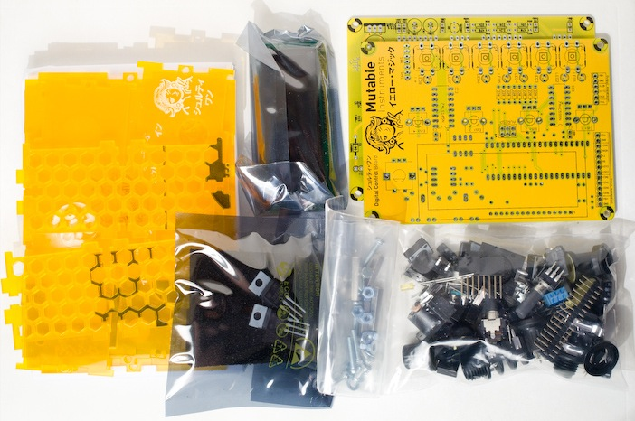
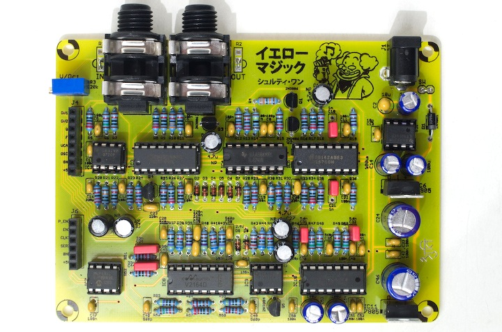
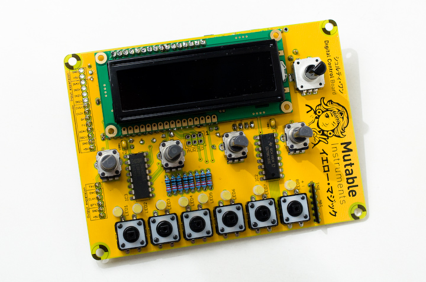

Contents of the kit
-------------------

The kit contains:

-   Yellow control board and filter board PCBs
-   Yellow semi-opaque case
-   Yellow/Orange LCD module
-   8 yellow flat top LEDs
-   Case hardware
-   Board stacking hardware
-   Switches, potentiometers, encoders with knobs/caps ; trimmers and resistor networks
-   Quartz, audio capacitors
-   Connectors (Audio, MIDI, DC power, board-to-board)
-   Integrated circuits, including flashed MCU and 464 memories eeprom.
-   Extra candy!

The kit **does not** contain:

-   Capacitors
-   Resistors
-   Semi-conductors (diodes, transistors)
-   IC sockets

The [following document](https://docs.google.com/spreadsheet/pub?key=0Ai4xPbRS5YZjdG53eU16Wk5ZMk5tSnFwZmpJTmRWUHc&output=html&widget=true) shows the BOM of the control board and the filter board. Parts to be purchased are in blue, parts included are listed in pale green.

The parts not included in the kits can be purchased at:

-   [Reichelt Elektronik](http://www.reichelt.de/?ACTION=20;AWKID=631855;PROVID=2084) for European customers, for **9.53€**. Note that Reichelt's minimum order amount is 10€, so spoil yourself with 0.47€ worth of electro-goodies!
-   [Mouser](http://www.mouser.com/ProjectManager/ProjectDetail.aspx?AccessID=ea0e2f28c0) (EZ access code: ea0e2f28c0) for US customers, for **\$20.97 USD**. Mouser does not have a minimum order quantity but the shipping fees to Europe might be high.
-   Farnell, Digikey, using the listed references.

Assembly
--------

\

-   [Filter board assembly instructions](../delay)
-   [Control board assembly instructions](../digital). Note that a 6.8 ohm resistor should be used instead of 68 (R20 in the schematics) to increase the brightness of the display. And don't forget to solder the 1x6 "expansion connector" on the bottom left of the control board!

Kudos
-----

-   Case design by [Frank Daniels](http://daniels-cards.de/).
-   Illustrations by [Hannes Pasqualini](http://www.papernoise.net/).

